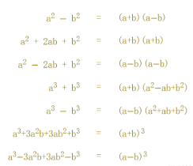

# 微积分

微分是把整体分拆为小部分，导数可以求解函数的  极值点，凹凸性，拐点等

积分是把小部分组合到整体，积分可以求解函数的 面积，体积，曲线长度，最大小值等

#### lim极限

函数Q(x) = y：对于一个函数Q(x)，当x取某些值时不能得到返回值

可以近似表示结果：(x->a) lim f(x) = L，当x趋近于a时，函数Q(x)极限是L

**求极限的方式：**

一、代入法

直接带入x / 带入x的临近值不断逼近答案

二、因式分解

可以将Q(x)转化为因式形式，从而带入求极限

因数：两个正整数相乘，那么这两个数都叫做积的因数，或称为约数。

因式分解：将表达式Q(x)转化为因式形式：

恒等式

比如：Q(x) =  4x^2  -  9  = (2x)^2 - (3)^2   

->根据(a+b)(a-b) = a^2 - b^2  = (2x+3)(2x-3)

直到不能再分解为止

三、共轭

共轭：是把两个项之间的正负号倒转：3x + 1 -》 3x - 1

如果Q(x)是分式形式，上下都乘以 分子/分母 的共轭

四、无穷大

当x->∞时，求极限的方法：

* 非分数形式（看多项式Q(x)的最高指数项）
  * 如果指数>=0,极限/ -∞（最高指数项的正负号）
  * 如果指数<=0,极限 0
* 分数形式
  * 如果分子 < 分母指数，极限为0
  * 如果分子 > 分母指数，极限 / -（最高指数项的正负号）
  * 如果分子 == 分母指数，极限为最高指数的项的系数相除

#### 导数

**一次导数 / 微分：**

（Δy,Δx,dy,dx->0）

极限表示：当Δx趋近于0时，函数（y的增量 / x的增量）的极限

导数表示：f’(x)= dy/dx ,f(x) 的导数等于 dy / dx，' 也可以记为d / dx

几何意义：

* 函数某一点的局部变化率

* 表示函数值随自变量x变化的快慢程度，是切线的斜率：dy/dx，而非两点斜率：(y2 - y1) / (x2 - x1)

**求导：**

f(x)的表达式已知，可以将x替换为x + Δx，获得新的表达式

将两个表达式带入极限公式，当Δx趋近于0是，表达式的值

**常见函数的导数：**

**导数法则：**

**二次导数 / 二次微分:**

二次导数:是函数的导数的导数

f''(x)   d(dy / dx) / dx

**求导：**

先求函数的导数，再求导数的导数

**可微分，不可微分**

可微分：存在导数-》转换为lim形式有极限-》左边极限 == 右边极限

几何意义上是否可微分：切线方向是确定的，且函数是连续的

**极大值，极小值**

一阶导数：==0时，为极点

二阶导数：小于 0 是极大值，大于 0 是极小值，==0检测失败

例子：

函数f(x) = 5x^3 + 2x^2 − 3x,求极大值和极小值

一次导数f'(x)（根据导数法则）：15x^2 + 4x − 3

当导数==0即，15x^2 + 4x − 3,==0时，x = −3/5 或= +1/3，

二次导数 f''(x) （再次求导） ： 30x + 4

在 x = −3/5：小于 0，为极大值，在 x = +1/3：大于 0，为极小值

**上凹下凹，拐点**

从直观上看：

下凸：开口向上的曲线，称为上凹，或称为下凸，形状为 ∪；

上凸：开口向下的曲线，称为下凹，或称为上凸，形状为 ∩；

从切线角度：

下凸：过任一1点的切线都在曲线弧之下

上凸：过任一1点的切线都在曲线弧之上

从割线角度：

下凸：在区间(a，b)对应内的曲线弧上任意两点的割线线段都在该两点间的曲线弧之上

上凸：在区间(a，b)对应内的曲线弧上任意两点的割线线段都在该两点间的曲线弧之下

用线性插值表示割线： ta + (1−t)b,（t 的值是从 0 到 1的集合，即线段的所有点）

从导数角度：

一次导数：

若导数连续增大，函数是 下凸

若导数连续减小，函数是 上凸

二次导数：

下凸：二次导数大于0

上凸：二次导数小于0

拐点：在下凸（上凸）变成上凸（下凸）的一个点

#### 积分

**基本定义：**

定积分主要研究如何由 积分区间（被积函数）来求取一个数值，它可以代表面积或体积

不定积分主要研究如何由已知的函数（被积函数）来求取另一个函数 ，常用于计算曲线长度，最大小值等

相反关系
​​​​​
已知一个函数2x，求积分，已知x^2 的导数是2x，所以2x积分为x^2

∫  2x  dx  = x^2

∫ f(x)  dx  =  g(x)  +  C  

∫ ：积分符号，f(x):被积函数，dx积分的方向是 x-.>0，g(x)：积分结果函数，C是积分常数（因为有很多函数的导数都相同）

**常见函数的积分**

**积分法则**

**分部积分法**

∫u v dx = u∫v dx −∫u' (∫v dx) dx

**换元积分法**

∫ f(g(x)) g'(x) dx  -> ∫ f(u) du

**求面积**

如何求定积分/给定区间函数面积？

给定函数，先求出不定积分，然后将ab分别带入不定积分中，求b的结果  - a的结果
