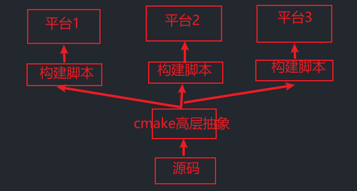

# CMake

CMake 是一个 跨平台的构建工具，可以根据不同的平台、不同的编译器，生成相应的构建文件



源文件想要在各个平台各个编译器运行：

* 考虑没有cmake的情况：需要考虑低级构建脚本的差异
* 考虑用cmake的情况：通过高层抽象cmake，将它编译成特定平台的低级构建脚本（Makefile 、.vcxproj、bat、.sh）

### 使用Cmake生成VS工程文件

* 新建英文项目路径
* 添加源文件写入测试代码并保存

```c++
cmake_minimum_required (VERSION 2.8)//使用 CMake 的最低版本号
project (……)//指定项目名
add_executable(……)//指定可执行文件名 相关源文件…….cpp
```

* 编写CmakeLists.txt文件（上述最基本格式）
* 生成工程
  * 命令行构建方式
    
    ```c++
    mkdir build//创建文件夹build
    cd build//进入文件夹
    cmake -G "Visual Studio 15 2017 Win64" ../ // -G指定编译器（可选。否则使用默认编译器），指定CmakeLists.txt所在目录
    ```

    * 构建工程文件
  * GUI构建方式
    * 选择源码目录
    * 选择输出目录
    * 点击Configure，选择要构建的目标，等待配置，done……，生成Makefile
    * 点击Generate，done……，生成工程文件

### cmake构建运行
  
  ```c++
  //打开Developer Command Prompt for VS 2022
  cd……//到源码目录
  mkdir build//创建文件夹build
  cd build//进入文件夹
  cmake -G "NMake Makefiles" ..//仅生成Makefile
  cmake --build .//构建项目
  Main.exe//运行可执行文件
  ```