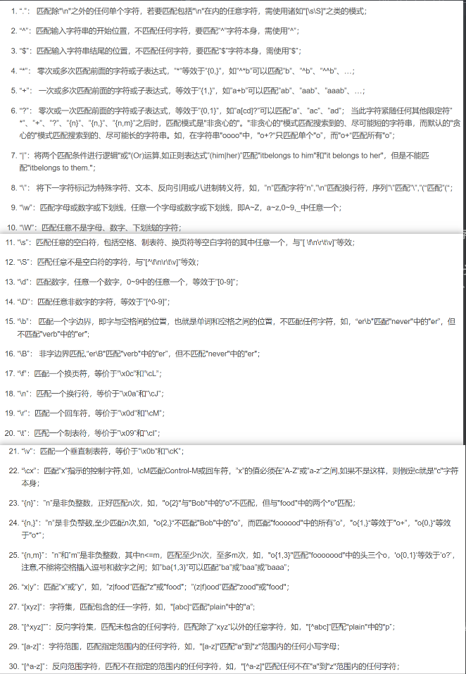
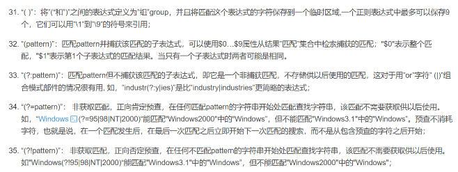

# 成员访问修饰符

**作用**

控制着类成员的访问权限

**分类：**

* public公共（struct默认）：在类内，类外（类定义外），派生类，友元，都可以访问，通常存放对外公开的接口
* protected受保护：在类内，派生类，友元可以访问，通常存放在继承体系中可以访问的部分
* private私有（class默认）：只能在类内，友元，可以访问，通常存放对类外隐藏实现的部分

# 继承访问修饰符

**作用**

控制派生类对象对基类成员的访问权限

**分类**

private部分由于对派生类没有访问权限所以我们直接忽略

* public 继承：基类的 public 和 protected 成员在派生类中保持原有访问权限
* protected 继承：基类的 public 和 protected 成员在派生类中变为protected
* private 继承（默认）：基类的 public 和 protected 成员在派生类中变为private

# 函数隐藏、重写……概念区分

* 函数签名：函数名、参数类型、参数个数、参数顺序、const、volatile……属于函数签名，返回类型、virtual、override、final……不属于函数签名
* 不同函数：同作用域中，函数名不同（其余函数签名特性可相同可不同）
* 重复定义：同作用域中，函数签名相同
* 重载：同作用域中，函数名相同，其余函数签名特性至少有一项不同
* 继承体系专有：
  * 继承：派生类没有同名函数（特殊成员函数不会继承，会生成类的特有定义）
  * 新增：基类没有同名函数
  * 隐藏：（不支持多态）
    * 派生类有同名函数，其余函数签名至少有一项特性不同，且基类可有可没有virtual
    * 派生类函数签名相同，且基类没有virtual
  * 重写：（支持多态）
    * 派生类函数签名和返回值都要相同，基类有virtual
    * 协变: 派生类函数签名相同，派生类函数返回类型是基类函数返回类型的派生类型，基类有virtual
  * 不合理情况: 派生类函数签名相同，返回类型不同且非协变，基类有virtual，编译错误

* 示例

  ```c++
  class Base {
  public:
      void func() {}
      void func1() {}
      void func1(float x) {}  
  private:  
      void func(int x) {}
      void func1(int x) {}  
      virtual void func2() {}
  };

  class Derived : public Base {
  public:
      void func1() {}
      void func2() {}
  };
  ```

  * func:
    * base中定义了2个重载版本
    * 被derived继承，但不能调用
  * func1:
    * base中定义了3个重载版本
    * 被derived隐藏
  * func2:
    * base中定义了1个版本，
    * 会被Derived重写

# 友元

**作用：**

通过friend声明为友元，允许某个外部函数/类访问当前类的 private 和 protected 成员

**分类：**

```c++
class Box;//前置声明
void printWidth(Box box);

class Box {
public:
    Box(int w) : width(w) {}
    // 声明友元函数
    friend void printWidth(Box box);
    // 声明友元类
    friend class Printer;
private:
    int width;
};

void printWidth(Box box) {
    cout << "Box width: " << box.width << endl;
}
class Printer {
public:
    void printWidth(Box box) {
        cout << "Box width: " << box.width << endl;
    }
};
```

**特点：**

* 友元关系是单向的,如果 A 是 B 的友元，B 是 C 的友元，A 不会自动成为 C 的友元
* 不能继承，基类的友元不是派生类的友元
* 不受成员访问修饰符影响
* 如果友元函数在类前有声明，那么应该在此声明前包含类的前置声明

# enum

默认值：默认情况枚举值从0开始，依次+1，也可以手动指定值，枚举值不一定唯一

指定enum成员类型： enum  enumName : type {};

不限定作用域：

* enum enumName{};
* 成员作用域和enum本身作用域相同，外部可以直接访问，可能引发名称冲突
* 可以使用枚举成员/整数/其他枚举对象，初始化枚举对象
* 默认类型由编译器决定，但足够容纳
* 前置声明：必须指定成员类型
* 使用时可以隐式转换为整数

限定作用域（枚举类）：

* enum class/struct enumName{};
* 成员作用域在枚举外不可直接访问，外部需要::访问，访问更安全
* 可以使用枚举成员/其他枚举对象 初始化，对于整数需要显示转换
* 默认类型是int
* 前置声明：可以指定成员类型，也可以使用默认的
* 使用时需要显示转换为整数

使用场景：状态、选项

作用：将整形赋予含义，提高可读性

# 异常处理

```c++
抛出异常：异常发生的地方
void  function( ){
  //... ...
    throw 表达式;
  //... ...
}
捕捉异常
try{
        //程序
        function();        把function至于try中
        //程序
}catch(error类型){        比如只写一个int
        //... 异常处理代码 ...
}catch(error类型){       形参将会取得抛出的值
        //... 异常处理代码 ...
}catch(...){               抛出的其它异常类型，可以接收任意类型
        //
}
```

* 异常：程序运行时发生的错误情况，足以破坏指令流程，会造成崩溃……后果
* 作用：函数调用是栈结构，普通错误处理会一层层返回，异常可以直接传给调用者信息
* throw后接任何表达式（bool，int，string，char，float，类对象（全局，局部，动态））

# regex

* 正则表达式：用于匹配文本，以便测试查找替换……操作



