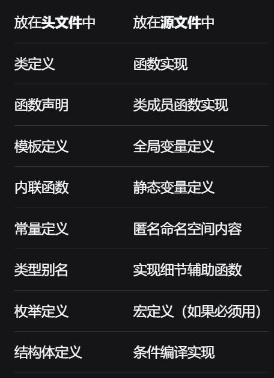

# 类型别名

作用：将复杂的类型自定义别名，以便简化使用

```c++
#define intPtr int * 
```

#define 宏 类型，对于连续声明的指针类型变量，之后的变量不是指针

```c++
typedef int * IntPtr;
typedef char mysize[10];
typedef struct m_struct
{
char c;
}s;
typedef int func(int a,int b);
typedef int (*ptr)(int a,int b);
template <typename T>
struct strMap
{
typedef map<string, T> type;
};
strMap<int>::type m_map;

//注意
typedef char *pstring;
const pstring cstr = 0;
//const char* cstr = 0;直接替换错误
//char* const cstr = 0; //cstr是常量指针，指向char类型对象
const pstring *ps;
//const char* *ps;直接替换错误
//char* const *ps; //ps是二级指针，它指向常量指针，此指针指向char类型
```

typedef 类型 别名，另外要注意当指针别名和const结合时，要注意先后顺序

```c++
using intPtr = int *;
using func = int (int a, int b);
using func = int(*)(int a, int b);
template <typename T>
using strMap = map<string, T> type;
strMap<int> m_map;
```

using 别名 = 类型

# 自动类型推断

```c++
auto b = 0;
decltype（ci）x = 0；
```

auto：
  
* 定义变量时必须指定初始值，基于这个初始值推导
* 推断结果并不总是和等式右边类型 一致
* 如果有多个变量，初始值的类型需要一致，使得auto推断结果一致（&和*只属于某个标识符，和auto推断的类型无关）
* 当推断引用类型时，结果是引用绑定对象的类型，也就是忽略&符号
* 推断对象地址，结果是指针，指向的类型是对象类型
* 会忽略顶层const，保留底层const
* 可以手动在auto前后加const/&
* 如果推断为指针/设置了引用，对象的const则为底层const被保留
* 作用：简化复杂类型声明

decltype：

* 基于传入的参数推导
* 通常会完全保留被推导的类型
* 不会忽略顶层const，引用&符号不会忽略
* 从表达式/函数推断类型，但不实际计算表达式的值/ 调用函数
* 如果是解引用，获取指针指向的对象类型的引用
* 如果变量加了一层/多层括号，会将它当作表达式，返回它类型的引用
* 作用：精确推导类型

# 命名空间

```c++
namespace name{

}
name::

namespace {}

namespace company {
    namespace project {
        namespace module {
            void function() { /* ... */ }
        }
    }
}
namespace company::project::module {
    void function() { /* ... */ }
}
company::project::module::function();
```

能在全局空间中定义的，都可以放在命名空间中

在内部定义成员无需前缀，在外部定义需要前缀（所属命名空间名）

和类外定义一样，外部定义内可以直接使用命名空间成员名，无需前缀

外部定义只能在命名空间外定义（全局命名空间/外层命名空间），而不能在其他作用域内

作用：

* 解决命名冲突问题(特别是大型项目会有独立开发的库，非常容易命名冲突)
* 版本控制
* 使代码模块化

可以是不连续的，可以分解为多个部分，从而有利于模块性（头文件的接口，和源文件的实现分离）

#include通常不会放在命名空间内，这样会把头文件所有内容定义为命名空间的成员，这样可能会将std命名空间嵌套到这个命名空间内，会出错

全局命名空间：全局作用域定义的都被隐式的添加到全局命名空间中

嵌套命名空间；如上

内联命名空间：内部的名字可以被外部命名空间直接使用，inline namespace

匿名命名空间：

* 不能跨越多个文件，因此不同文件中的匿名空间属于不同的命名空间，含有匿名空间的文件被include到不同文件中，这也属于不同的命名空间，有各自的独立副本
* 成员可以直接使用，不用：：，
* 成员作用域和命名空间所在作用域相同，都是文件作用域（对于.h中定义的可以通过#include访问），要注意和全局空间的命名冲突
* 和static一样，在链接阶段无论在.h中还是.cpp中都不会造成重复定义，编译器会对匿名命名空间中的标识符进行特殊的名称修饰，确保每个符号都有唯一的名称，并且最好放在.cpp中定义
* 作用：限制标识符的作用域到当前文件（static也有相同的作用，但它不用一个一个声明，可以看作static的加强版）

别名：namespace 别名 = nameSpaceName

简化使用：

* using声明：using nameSpace :: MemberName; 引入一个空间成员，有效范围从using声明开始，到using声明所在的作用域结束为止，using不可以出现在全局作用域，对于类作用域只能指向基类成员,外部作用域同名隐藏，内部作用域也可以使用
* using指示：using namespace nameSpaceName;引入所有空间成员，using不可以出现在全局作用域和类作用域

在使用不同空间中标识符，可能名称一致，无法确定使用哪一个，解决方法是明确指定

# std::chrono

一个用于处理时间和日期的库

```c++
#include <chrono>

auto start = std::chrono::steady_clock::now();
//……
auto end = std::chrono::steady_clock::now();
std::chrono::duration<double> diff = end - start;

```

steady_clock：单调时钟，时间无法后退

* steady_clock::now()返回现在的时间
* steady_clock::time_point()返回更精确的时间点

high_resolution_clock：提供最高精度的时钟

# this

this指针:

* 指向调用该成员函数的对象实例
* 它只能在非静态成员函数内使用
* 指针为className* const ptr，常量指针，不能修改它的指向

作用：

* 解决名称冲突：比如函数的形参和成员变量的名称一致，用this->member name，表示此为类成员，否则默认将使用形参
* 返回当前对象，return *this

# inline

内联变量：定义前加inline关键字，允许在头文件中定义变量而不会导致重复定义错误

内联函数: 函数定义前加inline关键字，如果是类成员，类内定义默认内联可加可不加inline，类外加inline定义的

编译单元：一个源文件和包含的所有头文件

注意：

* 函数/变量定义需要在每个编译单元可见，因此要放在头文件（不会导致重复定义错误）
* 递归函数/复杂函数（条件/迭代/跳转/指令很多）不会被内联，尽管声明为inline（它只是给编译器的建议，最终是否内联由编译器决定）

作用：在函数调用位置替换展开，避免函数调用开销

使用场景：小型工具函数

问题：

* 因为占用缓冲，当超出缓存空间，降低缓存效率
* 因为替换展开，使得可执行文件增大
* 由于在构建时处理，会增加构建的时间

# 作用域、生命周期、链接性、定义、声明、初始化、赋值：

#### 变量：

**作用域**（5类）：可被访问的范围（空间）

* 全局：全局空间定义的（在命名空间、类、函数外）在整个程序可见，不过其他文件要包含#include/extern才能访问
* 文件：全局空间定义的（在命名空间、类、函数外），用static/const限制，从而其他文件不可以通过extern访问它（但可以通过#include访问）
* 命名空间：在命名空间内定义的（在类、函数外），在内部直接访问，外部可以通过作用域解析运算符Namespace::name 访问
* 类：在类内定义的，类内可以直接访问，类外通过 类对象/指针/引用/作用域解析运算符 :: 访问（具体是否可以被类外访问取决于成员访问修饰符），普通类成员取决于类对象的作用域，静态类成员取决于类定义的位置（局部类定义不能定义静态成员）
* 局部：局部空间定义的（函数/代码块{}内），仅在内部访问,且会隐藏外部的同名变量

**生命周期**（3类）：在内存中存在的时间，即创建到销毁（时间）

* 自动（栈）：局部空间定义的，从定义时创建，到离开作用域时销毁
* 静态（静态存储区）：全局空间/命名空间/被static修饰的，程序启动时创建，程序结束时销毁
* 动态（堆）：从 new 分配内存时创建，调用 delete 时销毁

**链接性**（3类）：能否跨文件访问

* 外部链接：可被其他文件访问
* 内部链接：仅当前文件可见
* 无链接：仅当前作用域可见

```c++
dataType variableName;//变量
returnType functionName(parameterList){functionBody}//函数
class/struct className{memberData};//类
```

**定义**：分配内存空间，并为其分配初始值，定义位置与关键字共同决定作用域、生命周期、链接性

```c++
extern dataType variableName;//变量(仅用于全局变量)
returnType functionName(parameterList);//函数
class/struct className;//类
```

**声明**：不分配内存空间，声明不会扩展作用域，只会让它在自己的作用域下正常访问（编译器可见），声明可以多次，定义只能一次

**初始化**：首次为内存块设置值，只能在定义时初始化

**赋值**：修改已有值叫做赋值

#### 函数：

**作用域**：由其定义位置决定，函数没有局部作用域，不可以定义在其他函数/代码块({})中

**生命周期**: 无论定义在哪里都是静态的

# 前置声明

* 和include的类定义有差异，不能创建类对象，不能调用成员（因为不知道类布局），不能获取大小，不能继承它，可以声明为指针/引用复合类型，可以作为参数类型/返回值类型
* 作用：减少编译依赖从而降低耦合度，提高编译速度
* 使用场景：不需要创建类对象/访问成员时尽量用前置声明，优先于#include

设计模式：在头文件前置声明，并创建指针，在cpp include，并调用成员

# include

include：查找 -> 打开 -> 文本替换（拷贝）-> 递归（如果这个文件include其他文件）

**解决重复定义**

重复定义：比如当include了含有定义的文件时，由于发生拷贝文件操作，在链接阶段会发生重复定义问题



头文件：提供声明接口，变量声明，函数声明，类定义（完全相同不会导致重复定义），模板定义（非实例化版本不会生成具体函数）

源文件：提供具体实现

include头文件，而非源文件

**解决重复包含**

重复包含：同一个文件中直接/间接包含多次，比如a，b，c这3个文件，b包含a，c包含a、b，那么c包含一次a，b间接包含一次a，这样导致c包含了两次a，因此出现错误

```c++
#ifndef _A_H_
#define _A_H_
//……
#endif

#pragma once//在vs中等同于上面
```

预处理宏的作用域在文件内部，因此不会出现一个文件访问过，另一个文件无法访问的情况

# static

static静态：用来修改变量/函数的作用域、生命周期、链接性，主要作用修改生命周期为静态

```c++
#include <iostream>
using namespace std;

int n = 1; //全局变量

void func()
{
	static int a = 2; // 静态局部变量
	int b = 5; // 局部变量
	a += 2;
	n += 12;
	b += 5;
	cout << "a:" << a
		<< " b:" << b
		<< " n:" << n << endl;
}

void main()
{
	static int a; // 静态局部变量
	int b = -10; // 局部变量
	cout << "a:" << a
		<< " b:" << b
		<< " n:" << n << endl;
	b += 4;
	func();
	cout << "a:" << a
		<< " b:" << b
		<< " n:" << n << endl;
	n += 10;
	func();

	system("pause");
}
```

示例：

* a初始为0，
  * func中内部作用域a隐藏了外部作用域a，输出4，
  * 回到外部局部作用域结束，返回0，
  * func，由于生命周期为静态，局部作用域再次可见，定义并非再次创建，而是返回静态内存中的a，返回6
* b初始为-10，
  * 进入内部隐藏外部，返回10，
  * 返回外部，由于+4返回-6
  * func，由于生命周期自动，上一次的销毁重新创建，返回10
* n初始为1，
  * func没有定义同名的变量，不会隐藏，直接修改，返回13
  * 返回外部，由于被修改返回13，
  * +10，进入func，再次+12，返回35

全局静态变量：

* static修饰全局变量，作用域变为文件作用域，生命周期不变，链接性变为内部
* 不同文件（.h拷贝到不同文件后各自独立（普遍想法是共同操纵头文件的这个变量，但由于各自独立副本，会修改副本的值，导致和预期结果不一致，因此static修饰全局变量通常不会放在.h中） / .cpp各自独立）的同名定义，不会导致重复定义

局部静态变量：局部作用域用 static 修饰的变量，作用域局部，生命周期静态（但是它是在首次执行才会分配内存）, 再次执行定义指令时不会再次分配内存，而会从静态区直接查找已创建的对象

```c++
class Example {
public:
    static int count;  
    static const double PI; 
    static void printCount();
};
//类外定义
int Example::count = 0;   
const double Example::PI = 3.14; 
void Example::printCount() {
    std::cout << "Count: " << count << std::endl;
}
```

静态成员（变量，函数）特点：

* 作用域：类作用域（可以理解为从类对象提升为类定义）
* 具有静态生命周期
* 访问方式改变:可以通过作用域解析运算符 :: ，而不是创建类对象
* 必须在类外定义，定义时不添加static关键字，需要在cpp中，并且必须初始化
* 没有隐藏的this指针，不能直接访问任何非静态成员（可以通过类对象间接访问）
* 遵守访问修饰符的原则

# 局部类

```c++
void fun()
{
　　static int s;
　　class A
　　{
　　　　public:
　　　　void init(int i) { s = i; }
　　};
　　A m;
　　m.init(10);
}
```

* 局部类：类可以定义在某个函数的内部
* 此类类型只在当前局部作用域可见
* 只能访问外层作用域的 全局变量/静态生命周期，不能访问局部变量
* 不能定义静态成员变量
* 作用：作为辅助工具函数
* 被lambda取代了

# extern

```c++

//1.cpp
int global_var = 42; 
void print_hello() {
  std::cout << "Hello!";
}
int a = 10;//定义a
//extern int a = 20;//定义a，重复定义错误

//2.cpp
extern int global_var; 
extern void print_hello(); 
//extern int a = 20;//定义a，重复定义链接错误

```

* extern仅可以修饰全局变量/函数，不能修饰局部变量
* 并非扩展作用域，而是让其在作用域下可以访问
* 如果在extern的时候给变量赋值，则变为了定义不再是声明
* extern相比#include同样引入外部文件内容，但防止引入无关内容，会加速程序的编译

# const

* 常量对象：
  * const关键字声明常量：表示内存存储的值不能被修改，是只读的即不可赋值操作，否则将发生编译错误
  * 使用场景：当不希望某内存存储的值被修改时，防止程序员意外修改
  * 定义常量时必须初始化，否则会编译错误
  * 常量定义通常应放在头文件中，以便被不同源文件访问，和static由于是文件作用域，include后会产生独立副本，不会出现重复定义错误

    ```c++
    // file1.cpp
    const int x = 10;  //定义时必须初始化
    extern const int y = 10; 

    // file2.cpp
    extern const int x;  // ❌ 错误
    extern const int y;  // ✅ 正确
    ```

  * const对变量的作用域、链接性的影响：
    * 对于全局作用域常量，限制为文件作用域、内部链接性，也就是其他文件无法通过extern访问
    * 如果想要保持外部链接性，必须在定义时加extern，这样表示常量为全局作用域、外部链接性

    ```c++
    const int a = 7;
    int main(){
      int *p = (int *)(&a);//使用C风格强制转换去除常量性
      *p = 8;//❌ 运行时触发断言
      
      const volatile int b = 7;
      p = (int *)(&b);
      *p = 8;// ✅ 运行没有问题
    }
    ```

  * （VS测试）const volatile 用非const指针修改，是未定义行为（c++标准未做出规定的行为，具体取决于编译器的处理，造成不同的编译器会出现不同的结果）
* 顶层const：对象本身是常量（包括const对象，常量指针）
* 底层const：所指向/绑定的对象是常量（对常量的指针/引用）
* 修饰指针
  * 顶层const：常量指针，不可以修改指向的对象
  * 底层const：对常量的指针，不可以修改指向对象的值
* 修饰引用
  * 引用不是对象，不可以被const修饰，所以仅有对常量的引用，不可以修改绑定对象的值
* 常量类对象：
  * 表示该对象内的任何类成员数据都不能被修改
  * const类对象只能调用const成员函数，而非const类对象可以调用任意的成员函数，如果const类对象允许调用非const成员函数，则类成员数据可以被修改，违背了常量类对象性质
* 常量 类成员数据：
  * 必须在构造函数的成员初始化列表中设置初始值，但对于静态常量数据成员，需要在类外设置初始值
  * 不可以被赋值
* 常量 类成员函数：

  ```c++
  returnType func() const;
  ```

  * 不可以修改类成员数据，无论它是否具有const性质
  * 常量成员函数 和 非常量成员函数 都可以访问类的const成员和非const成员
  * 常量成员函数的定义和声明都要含有const关键字
  * const版本和non-const版本，是属于函数重载
  * 如果const成员函数想修改某成员变量值，可以用mutable修饰目标成员变量

# mutable

mutable: 只能修饰类的非静态非常量的数据成员, 表示它可以在const成员函数中修改这个成员，提高常量成员的灵活性

# volatile

```c++
volatile int p = 0;
const volatile int p = 0x1234;
```

volatile：说明被修饰的变量可能会在程序控制之外被改变（硬件、其他线程……），每次读取，必须从内存中读取，不能使用寄存器和三级缓存中的缓存值，每次写入，必须立即写入内存

与const结合使用：并不是矛盾的，const表示变量在程序内不可修改（不能对p赋值），volatile表示可能被外部修改

# constexpr

* 表达式
  * 运算符分类：
    * 算术运算符(+、-、*、/、%)；返回数值
    * 逻辑运算符(!、&&、||)；返回bool
    * 关系运算符(<、<=、>、>=、==、!=)；返回bool
    * 赋值运算符(=、+=、-=、*=、/=、%=、<<=、>>=、&=、|=、^=)；返回左操作数的引用
    * 递增、递减运算符(++、--)；前置先自增减再返回，后置先返回再自增减，前置返回操作数引用，后置返回操作数原值副本
    * 位运算符(~、<<、>>、&、|、^)；二进制位运算，返回数值
    * 条件运算符(? \:)；返回冒号左侧或右侧表达式的值
    * 成员访问运算符(. 、->)；
    * 指针运算符：（*）（&）
    * 求字节数运算符：（sizeof）；
    * 逗号运算符：（,）；用于把若干表达式组合成一个表达式，返回最右侧表达式的值
    * 特殊运算符：（( )、[ ]、-> ）
    * ……
  * 求值顺序
    * 赋值：从右侧开始计算，比如a = b = c,先计算 b = c,再计算 a = (b = c)
    * &&：先求左侧表达式如果为真继续求右侧表达式，返回bool值
    * ||：先求左侧表达式如果为假继续求右侧表达式，返回bool值
    * 条件： 求？左侧表达式，条件为真求：左侧表达式，条件为假求：右侧表达式
  * n元运算符：需要n个操作数的运算符
  * 表达式：运算符和操作数的组合，操作数：>= 1 个, 运算符：>= 0 个
  * 字面值：只有一个操作数的表达式，其中操作数不是变量，是数值，形如'a'， "ab"， 4， false， 1.0……

* 常量表达式:

  ```c++
  //非常量表达式
  const int c = 3;
  const int d = c + 2;

  //非常量表达式
  int staff_size = 27;
  const int sz = get_size();
  ```

  * 一种特殊的表达式，它的值是常量
  * 形式：
    * 字面值常量，
    * 字面值常量和运算符的组合，
    * 被const修饰的变量并且初始化值是常量表达式
    * 被constexpr修饰的变量/函数
    * 常量表达式和常量表达式的组合
* constexpr
  * constexpr用于声明编译期常量/函数，它们将在编译器计算，用于加快运行速度
  * 编译期常量：它的初始值需要是常量表达式，否则发生编译错误

  ```c++
  constexpr int factorial(int n) {
      return (n <= 1) ? 1 : (n * factorial(n - 1));
  }
  ```

  * 编译期函数：函数需要满足：返回类型和形参类型都要是基本数据类型，函数体中必须有且只有一条return语句，不能有条件/迭代/跳转语句，不能包含变量声明，如果不满足条件编译错误
  * 优点：编译器计算降低运行时开销
  * 缺点：有大量的限制条件，增加编译时间，无法断点调试

# 数据类型

数据类型决定内存分配的存储空间的大小

```c++

数据类型分类（C++）
├── 内置类型（Built-in Types）: C++语言本身直接支持的数据类型
│   ├── 基本数据类型（Fundamental Types）: 不可再分解的最小数据类型
│   │   ├── 算术类型（Arithmetic Types）: 支持算术运算的基本数据类型
│   │   │   ├── 整型（Integral Types）
│   │   │   │   ├── 字符类型
│   │   │   │   │   ├── char 1字节
│   │   │   │   │   ├── wchar_t 宽字符2字节
│   │   │   │   │   ├── char8_t 1 字节，明确表示 UTF-8 编码的 Unicode 字符
│   │   │   │   │   ├── char16_t 2 字节，表示 UTF-16 编码的 Unicode 字符
│   │   │   │   │   └── char32_t 4 字节，表示 UTF-32 编码的 Unicode 字符
│   │   │   │   ├── 布尔类型：bool
│   │   │   │   └── 整数类型
│   │   │   │       ├── short 2 字节
│   │   │   │       ├── int 4 字节
│   │   │   │       ├── long 4/8 字节 L 或 l 后缀
│   │   │   │       └── long long 8 字节 LL 或 ll后缀
│   │   │   └── 浮点类型（Floating-point Types）
│   │   │       ├── float 4字节
│   │   │       ├── double 8字节
│   │   │       └── long double 8字节
│   │   └── void 类型：表示无类型或空类型
│   └── 复合类型（Compound Types）: 可再分解的最小数据类型
│       ├── 指针（Pointer）: T*
│       ├── 数组（Array）: T[N]
│       ├── 引用（Reference）
│       │   ├── 左值引用：T&
│       │   └── 右值引用：T&& 
│       ├── 函数类型（Function Types）
│       └── 限定类型（Qualified Types）
│           ├── const限定：const T
│           └── volatile限定：volatile T
│
├── 标准库类型（Standard Library Types STL）: C++标准库提供的数据类型
│   ├── 容器类（Containers）
│   │   ├── 序列容器
│   │   │   ├── vector
│   │   │   ├── array (C++11)
│   │   │   ├── deque
│   │   │   ├── forward_list (C++11)
│   │   │   └── list
│   │   ├── 关联容器
│   │   │   ├── set
│   │   │   ├── map
│   │   │   ├── multiset
│   │   │   └── multimap
│   │   └── 无序关联容器 (C++11)
│   │       ├── unordered_set
│   │       ├── unordered_map
│   │       ├── unordered_multiset
│   │       └── unordered_multimap
│   ├── 字符串类：string, wstring
│   ├── 智能指针 (C++11)
│   │   ├── unique_ptr
│   │   ├── shared_ptr
│   │   └── weak_ptr
│   ├── 工具类
│   │   ├── pair
│   │   ├── tuple (C++11)
│   │   └── variant (C++17)
│   └── 其他
│       ├── optional (C++17)
│       ├── any (C++17)
│       └── function (C++11)
│
└── 自定义数据类型（User-defined Types）：C++中允许我们定义自己的数据类型
    ├── 类类型（Class Types）：自定义数据类型
    │   ├── class
    │   └── struct
    ├── 枚举类型（Enumeration Types）：自定义整数常量集合
    │   ├── 无作用域枚举：enum
    │   └── 有作用域枚举：enum class (C++11)
    └── 联合体：union：多个数据共享同一内存
```


# 变量 初始化方式

**隐式初始化：**

```c++
int x; 
int* p;
int* p1 = new int;
func(){
  static a;
}
class B{
  int a;
  int* p = new int;
};
```

默认初始化：

* 定义变量时未显示初始化就会执行默认初始化
* 非类对象
  * 静态生命周期
    * 初始化为0、
    * 指针为nullptr
  * 自动/动态生命周期
    * 值未定义（如果访问和使用未定义的对象，程序将发生错误）
    * 指针未定义，
    * 堆内存未定义
* 类对象：
  * 调用默认构造函数（合成/自定义），如果没有默认构造函数，会导致编译错误
  * 对类成员详见\<特殊成员函数_构造>

```c++
func(){
  int* p1 = new int;
}
```

* _注意: 指针和堆内存应该分开来看：指针内存在栈内存->自动生命周期 / 静态内存->静态生命周期，堆内存在动态内存->动态生命周期_
* 如上所示，func结束后p指针作为局部对象内存释放掉，而通过new分配的堆内存未被释放

```c++
int x(); 
int* p1 = new int();
func(){
  static a();
}
class B{//合成默认构造函数
  int a();
  int* p = new int();
};
struct A {
    int x, y;
    A(): x(), y(1) {}//自定义的默认构造函数
};
```

值初始化：

* 非类对象，进行零初始化：
  * 使用空小括号或空花括号进行的初始化
  * 初始化为0
  * 指针为nullptr
  * 堆内存初始为0
* 类对象：
  * 如果没有自定义默认构造函数，不会调用合成默认构造函数（合成会让成员产生垃圾值，而是进行成员零初始化），如果有自定义默认构造函数，调用自定义的默认构造函数，如果没有默认构造函数，会导致编译错误
  * 对类成员详见\<特殊成员函数_构造>

**显式初始化：**

```c++
std::string s("hello");
std::string s2(5, 'a');
```

直接初始化：
  
* 使用有参小括号初始化
* 非类对象，直接使用参数初始化
* 类对象：
  * 调用匹配的非默认自定义构造函数，如果没有匹配的非默认自定义构造函数，会导致编译错误
  * 对类成员详见\<特殊成员函数_构造>

```c++
int i = 1;
int j = i;
std::string s1 = "hello"; 
```

拷贝初始化：

* 使用=号初始化
* 非类对象，直接使用参数初始化
* 类对象：
  * 调用拷贝构造函数，如果没有拷贝构造函数，会导致编译错误
  * 对类成员详见\<特殊成员函数_构造>

```c++
int arr1[] = {1, 2, 3, 4, 5};
int matrix[2][3] = {
    {1, 2, 3},
    {4, 5, 6}
};

struct Point {
    int x;
    int y;
    double z;
};
Point p1 = {10, 20, 3.14};
Point p2 = {30, 40};  //剩余成员初始化为0

struct Address {
    std::string street;
    int number;
};
struct Person {
    std::string name;
    int age;
    Address addr;
};
Person person = {
    "John Doe", 
    25, 
    {"Main Street", 123}  // 嵌套初始化
};
```

聚合初始化：

* 使用={有参}初始化 数组、结构体、联合体等
* 对于未初始化成员使用零初始化
* 需要满足聚合类型条件（数据集合体）：非静态数据成员必须都是公有的，没有自定义构造函数，没有基类，没有虚函数

```c++
struct A {
    int x, y;
    A(int x, int y): x{x}, y{y} {}
};
A a{1, 2};  // 直接初始化，调用构造函数
A b{a};     // 拷贝初始化
std::vector<int> v{1, 2, 3};//vector类重载了std::initializer_list\<T>构造函数
```

列表/万能初始化：

* 使用有参花括号进行的初始化，
* 它有严格的类型检查（比如不允许精度丢失），检查失败不会通过编译
* 它非常通用，可以调用自定义构造/拷贝构造函数（取决于是否类型匹配，且唯一），当列表为空调用默认构造
* 初始化列表的类型为std::initializer_list\<T> ，如果有相关重载的构造函数，优先调用