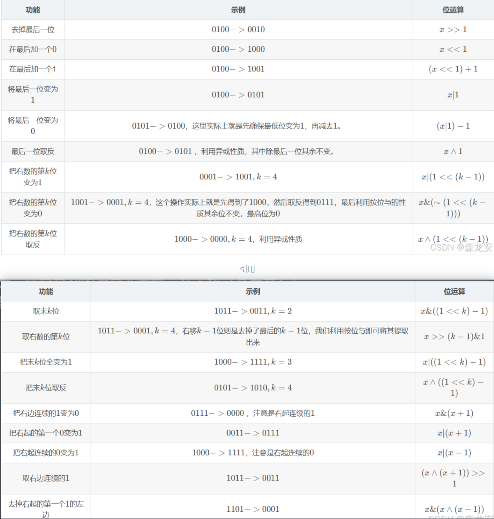

# 进制

**基础**

* 最小到的传输单位bit位/比特
* 最小的存储单位是byte字节 == 8位
* 左边高位，右边低位
* 2,8,10,16表示范围：0——1，0——7，0——9，0——9 + A——F
* 前缀：0b/0B,0o/0O,无,0x/0X
* 后缀：b/B,o/O,d/D,h/H
* 0x00:0000 0000 ,0xff:1111 1111
* ACSII码（有128个字符，包括数字，字母，特殊符号），将字符与整数对应, 以便将这些字符转换为计算机可以理解的二进制码

**数据范围**

* 有符号数可以表示的范围是：-2^(bit-1)  ——  2^(bit-1) - 1
  * 比如8位：1111 1111 —— 0111 1111 ：-2^7  ——  2^7 ：-127 —— 127
  * 1000 0000 == -0 ，0没有负数，我们用它表示-128 ：-128 —— 127
* 无符号数可以表示的范围是：0 —— 2^(bit) - 1
  * 比如8位：0000 0000 —— 1111 1111 ：0  ——  2^8 : 0 —— 255

**溢出处理：**

* 整数超过所能表示的范围，会被高位截断（首先转换成二进制）
* 浮点数（包含整数和小数）
  * 
  * IEEE754格式标准：对于float32位来说，1 位符号码S + 8 位阶码T + 23 位尾数码M（隐含尾数最高位1，实际尾数24位）

**原码，反码，补码**

用二进制表示数字和字符，如何正负性和运算呢?

```c++
正数1的原码为： 0 0000001
负数-1的原码为：1 0000001
```

原码：二进制的首位当作符号位，[ 0 ]表示正数，[ 1 ]表示负数

```c++
就像10进制运算，超过9要进制一样，进制val/10, 保留val%10
val/2，val%2
2进制加法运算 ：0+1=1，1+0=1，0+0=0，1+1 = 0（进制1，保留0）
12 + 2 = 14
    1010
+   0010
=   1100
```

加法运算：

```c++
3 + (-5) = -2
    0 0000011 原
+   1 0000101 原
=   1 0001000 原 == -8
```

减法运算：将减法转换为加法（例如3 - 5 = 3 + (-5)），但直接用原码计算的结果是错误的

```c++
-5的原码为：1 0000101
-5的反码为：1 1111010

3 + (-5) = -2
    0 0000011 反
+   1 1111010 反
=   1 1111101 反
    1 0000010 原 == -2
```

反码
* 为了保证结果正确，数学家规定所有参与运算的数均以反码形式存储和计算
* 正数反码与原码相同,负数的反码除符号位不变其余位取反
* 运算结果应再次转为原码
  *  正数原码：与反码相同
  *  负数原码：反码除符号位不变其余位取反 

```c++
1 + (-1) = 0
   0 0000001 反
+  1 1111110 反
=  1 1111111 反
   1 0000000 原 == -0
```

* 但是它有时会出现问题，比如上面的用例，0没有负数

```c++
（-1）1 0000001 -> 1 1111110 -> 1 1111111

1 + (-1) = 0
   0 0000001 补
+  1 1111111 补
= 10 0000000 补 这里溢出了，最高位会被丢弃
   0 0000000 原 == 0

(-1) + (-1) = -2
  1 1111111 补
+ 1 1111111 补
=11 1111110 补 这里溢出了，最高位会被丢弃
  1 1111110 -> 1 0000001 -> 1 0000010 原 == -2
```

补码

* 补码正是用来解决+0和-0的问题，数学家规定所有参与运算的数均以补码形式存储和计算
* 正数补码与原码相同，负数的补码为反码再加上1
* 运算结果应再次转为原码
  * 正数原码：与补码相同
  * 负数原码：补码除符号位不变其余位取反,再加1

```c++
(-127) 1 1111111 -> 1 0000000 -> 1 0000001

-1 + (-127) = -128
   1 1111111 补
+  1 0000001 补
= 11 0000000 补 这里溢出了，最高位会被丢弃
   1 0000000 -> 1 1111111 -> 10 0000000 原 这里溢出了，最高位会被丢弃
   0 0000000 原 == 0//结果错误
```

* 但是它有时会出现问题：

```c++
(-127->)

-1 + (-127) = -128
   1 1111111 补
+  1 0000001 补
= 11 0000000 补 这里溢出了，最高位会被丢弃
   1 0000000 -> 0 1111111 -> 1 0000000 原 == -128
```

* -128是特殊的，数学家想出了一种统一的新方式去求补码
* 对于 1000 0000 这个特殊值，全部取反(非反码)加1

**进制转换**

* 

* 2，8，16  -> 10进制整数，小数
  * 
  * 整数：从后往前，依次（每位）* 进制（2，8，16） ^ (0++)，最后求和
  * 小数：从前往后，依次（从小数点后每位）* 进制（2，8，16） ^ (-1- -)，最后求和
  * 最后整体求和
* 10 ->2，8，16进制整数，小数
  * 
  * 
  * 整数：不断除进制（2，8，16），直到商为0，反向读取余数
  * 小数：不断乘进制（2，8，16），向下取整，正向读取，写在小数点后，每次执行都获得一个精度，直到小数部分为0
  * 和整数部分同时输出
* 2 -> 8，16进制
  * 2 -> 8从后往前，每3位求和为一个位，不足应该在高位补0
  * 2 -> 16从后往前，每4位求和为一个位
* 8，16  -> 2进制
  * 8  -> 2每一个八进制位转换为3个二进制（10->2）
  * 16  -> 2每一个十六进制位转换为4个二进制
* 8，16进制
  * 通过10进制间接转换

**内存基础**

字长：CPU一次并行处理的二进制数据的最大位数，通常为32位和64位，体现计算效率
地址总线：物理线路，体现寻址能力，地址总线的个数，通常为32个和64个
寻址范围：最大可支持内存，2的N次方，n为地址总线的个数，2^32 = 4GB
按字编址：意味着以字节为单位对存储单元进行编号，也就是每个地址对应一个字节
存储容量 == 总内存

**CPU，GPU区别**

* CPU
  * 25%的ALU(运算单元)、有25%的Control(控制单元)、50%的Cache(缓存单元)
  * 特点：计算量小，计算复杂的运算较快，10个核左右
  * 使用场景：少量的复杂计算（并不是说CPU不能处理图形，GPU不能处理计算，只是谁更适合哪个）
* GPU
  * 90%的ALU(运算单元)，5%的Control(控制单元)、5%的Cache(缓存单元)
  * 特点：计算量大，计算复杂的运算非常慢，几千核（高度并行）
  * 使用场景：大量的简单运算，不适合循环/分支

# 位运算

**运算符**


**位操作**



**常见位运算**

```c++
a << 1 ≡ a ∗ 2
a >> 1 ≡ a / 2 
```

乘除法

```c++
void swap(int &a,int &b){
    a ^= b;
    b ^= a;
    a ^= b;
}
```

交换

```c++
a & 1
```

判断奇偶

```c++
~ a + 1
```

对负数取绝对值

```c++
bool fun(int n) {   
    if (n <= 0) return false;  
    return (n & (n - 1)) == 0;  
}
```

判断是否是2^n