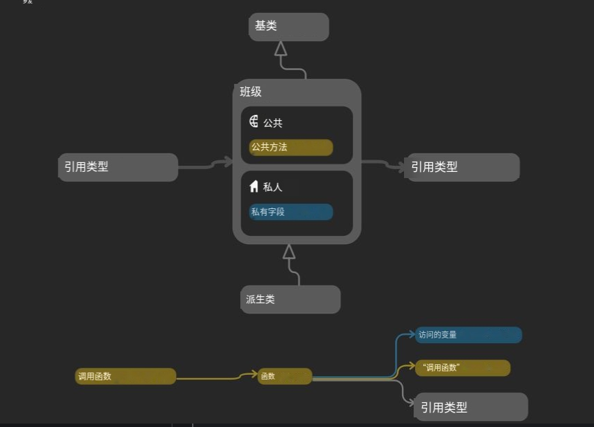
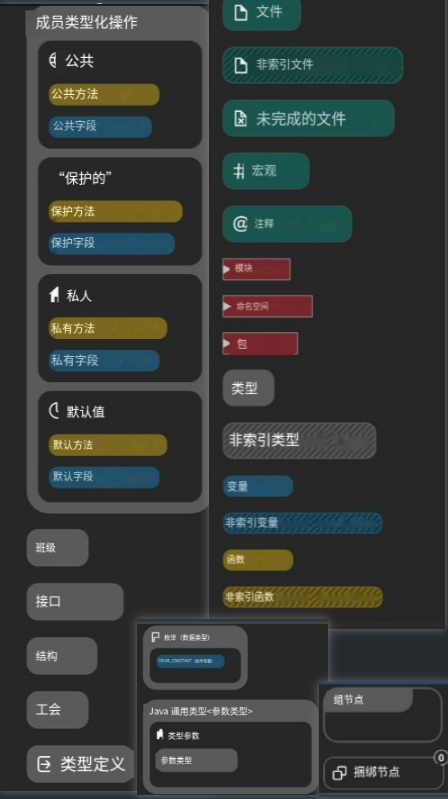
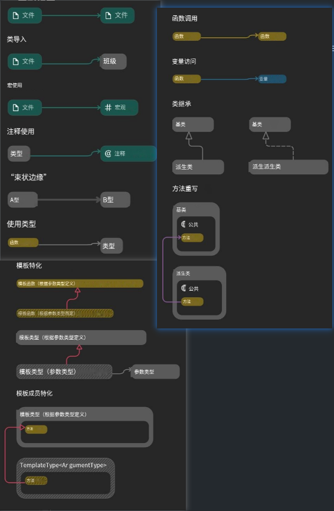

# UML

#### 作用

Unified Modeling Language，可视化建模语言

作用：直观的表示系统结构, 便于开发者、设计师和客户之间的沟通

#### 分类

UML图可分为两大类：

结构型图（静态图）

* 类图（Class Diagram）描述系统的静态结构
* 对象图（Object Diagram）	展示某一时刻的对象实例及其关系
* 组件图（Component Diagram）	描述系统的物理组件及其依赖关系
* 部署图（Deployment Diagram）	展示软件在硬件上的部署方式
* 包图（Package Diagram）	描述系统的模块化组织（包、命名空间）

行为型图（动态图）

* 用例图（Use Case Diagram）	描述系统的功能需求（用户与系统交互）
* 活动图（Activity Diagram）	描述业务流程或算法流程
* 状态图（State Machine Diagram）	描述对象的状态变化
* 顺序图（Sequence Diagram）	展示对象之间的交互（时间顺序）
* 通信图（Communication Diagram）	展示对象之间的协作关系
* 时序图（Timing Diagram）	描述时间约束下的对象交互

#### UML类图

**基本组件：**

类名、属性、方法

**可见性修饰符：**

* '+' 公有（Public）
* '-' 私有（Private）
* '#' 受保护（Protected）

#### 关系


注：图中大雁和雁群的关系画反了，大雁和企鹅不能构成双向关联，企鹅不能拥有气候

* 泛化（Generalization）
  * 实线三角: 继承关系（独立存在，从一个类泛化出）,指向基类
  * 例子：鸟继承动物
* 实现（Realization）
  * 虚线三角：实现关系（对接口的实现），指向接口
  * 例子：大雁实现飞翔

* 关联（Association）
  * 实线箭头: 关联关系（独立存在，不会彼此包含，一个类知道另一个类的属性和方法，比依赖更持久），指向被关联者
  * 例子：气候对企鹅有影响
* 依赖(Dependency)
  * 虚线箭头：使用的关系（一个类的实现需要另一个类的协助），指向被使用者
  * 例子：动物依赖于氮气和水

* 聚合（Aggregation
  * 空菱形：整体与部分的关系，且部分可以离开整体而单独存在，菱形指向整体
  * 例子：雁群包含燕子，燕子可以单独存在
* 组合(Composition)
  * 实心菱形：整体与部分的关系，但部分不能离开整体而单独存在，菱形指向整体
  * 例子：鸟包含翅膀，但翅膀不能单独存在

# draw.io使用

UML绘图工具之一

1. 画板平移：鼠标右键/中键
2. 框选：鼠标左键
3. 创建：从左侧UML节点模板，拖拽出来 / 直接点击（出现在画板中心）
4. 移动节点：在className方框上拖拽 / 框选（拖拽多个）
5. 改变节点大小旋转：点击className方框，通过出现的蓝色实心原点缩放，拖拽右上的旋转图标旋转
6. 隐藏：节点左上点击-号可以隐藏，+号可以展开
7. 编辑：双击text可以编辑
8. 添加属性/方法：单击节点的属性/方法，左右会出现箭头，选择添加
9. 删除属性/方法：单击节点的属性/方法，按下delete键
10. 添加关联:点击空白处取消选择，鼠标悬停在节点上，出现数个空心小圆形在外轮廓上，拖拽添加关联，
11. 修改关联：单机关联，右侧样式面板改变关联样式，关联上的蓝色实心原点改变线条位置
12. 添加关联节点：点击空白处取消选择，鼠标悬停在节点上，上下左右出现箭头，选择添加

# 伪代码

伪代码是介于自然语言和编程语言之间的一种描述语言, 不依赖于语法，通过简洁，逻辑清晰，统一的描述，突出算法流程/逻辑结构，让使用不同编程语言的程序员理解思路

```c++
algorithm: 二分查找
author: ……
date: ……
Input: 有序数组 arr, 目标元素 tar
Output: 目标元素 tar 在数组 arr 中的下标 index

function binary_search(arr, tar)
    left <- 0, right <- arr.length - 1
    while left <= right do
        mid <- (left + right) / 2;
        if arr[mid] == tar then
            return mid;
        else if arr[mid] < tar then
            left <- mid + 1;
        else
            right <- mid - 1;
        end if
    end while

    return -1;
end function
```

* 说明信息：作用，作者，时间，输入：Input，输出：Output……

* 规范
  * 每一条指令占一行，指令后不跟任何符号
* 注释：
  * //C++ 风格的注释
* 算法名称
  * 函数（Function） + < funcName > (args……) ，return ……，end function
* 变量：
  * 定义：单个字符
  * 赋值
    * :=
    * <-
    * =
  * 交换：a <-> b
* 运算
  * ^ 幂运算
  * mod 取模
  * and 逻辑与
  * or 逻辑或
  * not 逻辑非
  * xor 逻辑异或
  * == 等于
  * != 不等于
  * / 除号
  * '*' 乘号
  * ++ 自增
  * -- 自减
* 分支
  * if语句 / if else语句, then,end if
* 循环
  * 计数式循环（for循环）+ end for
  * 条件式循环（while循环）+ do + end while
  * 遍历 for each i in A do ，+ end for

# everything

* 不显示：在工具->选项->强制重建

# Ninja忍者

* 概念：
  * MSBuild：cl.exe
    * 通过-G "Visual Studio 17 2022"生成Visual Studio 工程 xxx.sln 文件
    * Visual Studio 2022” 是一个 Generator，其实是VS2022 安装目录下的一个名为 msbuild.exe 的可执行文件
    * msbuild.exe 所在位置：cmake正常构建后存在build/CMakeFiles/CMakeConfigureLog.yaml文件，里面写了msbuild.exe的路径
    * msbuild.exe创建时机：在安装 Visual Studio 是创建的
  * Ninja: clang，gcc, cl.exe
    * 生成的目录中， 没有 .sln， 也没有 .vcxproj 文件
    * 生成 build.ninja 文件
    * 优势
      * 速度：极快
      * 更精确的依赖跟踪
* 下载：
  * [仓库](https://github.com/ninja-build/ninja/releases)
  * 下载ninja-win.zip，解压后只有一个exe文件
  * 添加到环境路径即可
  * ninja --version 验证
* 构建错误：
  * CMake was unable to find a build program corresponding to "Ninja".
    * Cmake找不到环境变量，通过带有环境变量的Developer Command Prompt for VS 2022启用vscode

# sourcetrail源追踪

* 核心：可视化代码阅读工具，它支持多种编程语言包括 C、C++、Python 和 Java
* 作用：帮助开发者理解复杂的代码库
* 生成project：
  * 获取完整编译指令：
    * 对于CMake项目，cmake -DCMAKE_EXPORT_COMPILE_COMMANDS=1 -B build -S .，生成项目，同时会生成compile_commands.json，如果已经构建完成，可以直接cmake -DCMAKE_EXPORT_COMPILE_COMMANDS=1 .
      * 如果使用msbuild生成器，会忽略不会生成json文件，它仅支持在Makefile生成器和Ninja生成器，因此我们使用Ninja生成器
    * 非cmake项目，有官方的插件，比如Visual Studio的sourtrail extension扩展
  * 创建new project:指定project name，project location（这里应为源码的根目录）
  * 建立代码索引：
    * 添加元组source group：选择compilation database编译数据库：它会读取json文件解析C++源文件，提取所有信息：类、函数、变量、宏、继承关系、调用关系等，存储到本地数据库中
    * 选择json文件，点击创建
  * 等待一会出现Finished Indexing就完成了
* 使用：
  * 快捷键
    * 后退Alt + ←
    * 前进Alt + →
    * 新建标签页Ctrl + T
    * 关闭标签页Ctrl + W
    * 切换标签页Ctrl + Tab
    * 新建项目Ctrl + N
    * 打开项目Ctrl + O
    * 搜索视图
      * 搜索Ctrl + F
      * 查找文本Ctrl + Shift + F
      * 打开收藏夹Ctrl + B
      * 刷新索引F5
    * 图形视图：
      * ctrl+滚轮：缩放
      * 左键：拖拽
  * 搜索视图：左上视图
    * 后退，历史记录，前进，刷新（重新索引），回初始界面，过滤器（支持正则匹配），创建收藏（将当前），收藏夹（可以快速跳转）
  * 代码视图
    * 操作:
      * 不同文件可以展开折叠
      * 单机变量可以跳转
    * 上面：
      * 引用可以跳转
      * 展示错误（用不到）
      * 右侧可以展开折叠所有文件
  * 图形视图
    * 操作：
      * 单机节点/边可以跳转
      * 右上角可以展开折叠节点
    * 左侧
      * Custom Trail：
        * from指定想要搜索的节点，可以指定all referenced查看所有引用
        * maxdepth指定搜索深度，layout布局方式（水平，垂直）
        * nodes，edges包含哪些类型的节点和边
      * hierarchy：基类
      * derived hierarchy：派生类
      * 滑动条（调整后退的距离，回退几步）
    * 左上
      * ground命名空间：将节点按照此方式组织排列
      * ground文件：将节点按照此方式组织排列
    * 左下缩放视图
    * 右下问号：教程
      * 上面是类，类成员（按照访问修饰符划分）
      * 左下是节点，右下是边
    * 
    * 
    * 
