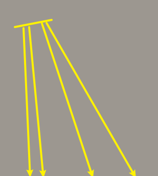

# 测试与混合

* 模板测试
  * 模板测试也有模板缓冲和模板值，通过clear清楚后所有模板值归0
  * 测试时机：发生在深度测试的前一个阶段
  * 流程：在drawcall前设置测试规则和模板值如何更新，在模板测试阶段，遍历所有片元，如果模板测试通过，设置保留片元，设置像素模板值，否则丢弃片元，不更新像素模板值
  * glStencilMask(0x00);启用写入，glStencilMask(0xFF);禁用写入
  * 模板函数：
    * 定义测试规则；glStencilFunc（比较方式（缓冲中存储的模板值，和参考值），参考值，掩码（和模板值、参考值在测试前AND运算））
    * 定义如何更新模板值：glStencilOp（测试失败时采取的行为，模板测试通过但深度测试失败时采取的行为, 模板测试和深度测试都通过时采取的行为）

* Alpha测试
  * 自定义比较规则（alpha< 某值 / uv<0>1），如果满足条件就在shader中执行discard指令来丢弃片元，否则保留片元

* 颜色混合
  * 线性混合：新颜色 * 自身alpha值 + 缓冲中颜色 * （1 - alpha）
  * 混合函数：设置两个因子值
  * 有半透明物体时渲染顺序
    * 假设有2个半透明物体ab在前，不透明物体c在后，预期目标3种颜色混合，
    * 一下考虑是drawcall 3次，如果要实现半透明立方体，可能要drawcall 6次
    * 先绘制所有不透明的物体（假设先绘制ab，计算颜色后绘制c，深度测试的原因，c会直接丢弃）
    * 按照从后往前的顺序绘制半透明的物体（如果先绘制a再绘制b，深度测试的原因，b会被直接丢弃）

* 为什么是 Alpha测试，模板测试，深度测试，颜色混合 的顺序
  * 代价是依次提升的，测试可以丢弃片元，这样可以获得最好的性能，避免不必要的片元计算

# 阴影

* 阴影：
  * 形成：光的直线传播沿途经过的物体，后面所有物体被首个物体遮挡，不能被光直接照射，没有光反射到人眼，形成阴影
  * 作用：更好体现物体位置关系
  * 微积分中的不等式在cg中可以使用，因为cg中只关心近似越等，对于LFcosV 4项积分，可以将V的积分拆分出来，两个函数乘积的积分 ≈ 两个函数积分的乘积，结果和光照结果相乘，这就是shadow mapping的基本思想
  * 平行光阴影_实现方式：
    * pass1：从光的视角渲染一张深度纹理，和摄像机渲染不同的是使用光的V矩阵（平行光源的位置和方向），使用帧缓冲离屏渲染获得深度纹理
    * pass2：从摄像机视角渲染场景，根据之前渲染的深度纹理，由于fs中实际不需要我们自己对每个片段做计算（opengl内部实现插值做计算），和vs一样仍只需要考虑每个顶点，我们可以根据顶点数据MVP变换、/w，获得顶点在NDC光空间位置，使用的深度值是NDC空间的，比较点在光NDC空间的z，和经过视口变换得到的uv坐标获取深度值，如果>这个深度值，表面点处于阴影中，否则不在阴影中（本质就是转换到同一空间下比较）
  * 阴影失真
    * 摩尔纹（通常是带有条纹的纹理，形成干扰图案，比如弧形、螺旋线……）
      * 
      * 成因：一个深度贴图像素的范围，会覆盖场景的一片区域，而这片区域统一使用像素中心采样点的位置计算深度值（重心插值），而颜色缓冲像素采样点变换到3D场景位置，不一定位于深度贴图像素采样点投射的位置，相邻的颜色缓冲像素有的判断为阴影，有的判断为非阴影，出现黑白交替
      * 
      * 特点：通常出现在非阴影区域，因为深度值差异较小，而阴影区域深度值差异较大
      * 
      * 解决方式：阴影偏移，对当前NDC.z深度-偏移值，让表面看起来比实际位置更高一点，这样很大一部分错误的认为深度更高的位置会得到正确的结果
      * 
      * float bias = max(0.05 * (1.0 - dot(normal, lightDir)), 0.005);
      * 动态偏移：越垂直于光线的表面，应用偏移越小，角度差异越大的表面，应用偏移越大，这是因为越垂直，像素覆盖的区域就越小，如果偏移过大会产生不正确的结果
    * 悬浮
      * 成因：物体被遮挡形成阴影，如果这个遮挡物体的深度和被遮挡物体的深度差异不大，那么应用较大偏移后，在深度差异不大的位置，原本应该形成阴影，但错误的判断为非阴影
    * 阴影边界
      * 成因：超出光平截头体的范围，默认被判断为阴影，就会在场景形成明显边界
      * 解决方式：修改深度贴图的环绕方式，并判断如果深度值超过1，返回阴影值0（没有阴影）
  * PCF阴影抗锯齿
    * 
    * 成因：当阴影贴图分辨率较低，多个屏幕像素和同一个深度值比较，有一部分区域像素位于阴影，有另一部分像素位于非阴影，就会形成明显的区块划分即锯齿边界
    * 解决方式：PCF，为了产生柔和的过渡，一个屏幕像素的采样，不仅仅依赖于一个深度贴图像素，还依赖周围8个像素（3*3-1），把结果取平均值
  * 线性深度
    * 透视投影的深度值是非线性，应该转变为线性深度值，使得远近精度统一
  * 点光源阴影——实现方式：
    * pass1：
      * 准备6个方向的V矩阵，和cubemap
      * 正常来说需要6n（n为物体数量）次drawcall每次渲染到立方体贴图的一个面上，但这样非常耗费性能
      * gs：使用gs把顶点变换到6个光空间，这样只需要n次drawcall渲染到6个面上，将一个图元的3个顶点变换为18个，for18次，转换到6个光空间下，通关gl_Layer它指定EndPrimitive送到立方体贴图的哪个面
    * pass2：从摄像机视角渲染场景，现在使用片段（根据顶点坐标插值获得）和光的方向向量采样深度值（世界空间的线性深度），由于是0——1范围的，将它*far变换到世界空间，和片段和光距离比较
  * PCF：
    * 由于现在变为点光源，PCF的过滤应该变为3个维度（4\*4\*4 = 64次），这非常消耗性能

    ```c++
    vec3 sampleOffsetDirections[20] = vec3[]
    (
      vec3( 1,  1,  1), vec3( 1, -1,  1), vec3(-1, -1,  1), vec3(-1,  1,  1), 
      vec3( 1,  1, -1), vec3( 1, -1, -1), vec3(-1, -1, -1), vec3(-1,  1, -1),
      vec3( 1,  1,  0), vec3( 1, -1,  0), vec3(-1, -1,  0), vec3(-1,  1,  0),
      vec3( 1,  0,  1), vec3(-1,  0,  1), vec3( 1,  0, -1), vec3(-1,  0, -1),
      vec3( 0,  1,  1), vec3( 0, -1,  1), vec3( 0, -1, -1), vec3( 0,  1, -1)
    );
    ```

    * 优化：三维泊松圆盘采样，是经过精心挑选或生成的，以确保它们在球体表面上分布得相对均匀, 并且用较少的采样提高性能