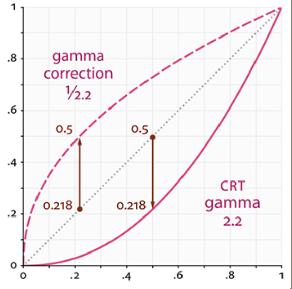
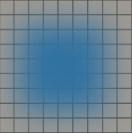

## Gamma伽马校正(ga ma jiao zheng)

* 物理亮度即光子数量，光子数量翻倍时是真实的物理亮度翻倍，线性亮度
* 人眼感知，对暗部变化更敏感（暗部只需要较少的光子数增幅，就会感到明显的变化）
* CRT显示器正好符合人眼感知，非线性亮度即\^2.2
* 
* 图中，横轴光子数量，纵轴颜色/亮度值，它们都以归一化表示,中间是线性的物理亮度，下方\^2.2，上方\^1/2.2 ~= 0.45
* 观察发现，\^2.2比\^1的整体要暗，但0和1颜色是相等的
* Gamma校正：应用Gamma倒数（1/2.2），线性颜色\^1 -> 显示器\^2.2 -> Gamma\^1/2.2 颜色变回最初设置的线性颜色
* sRGB颜色空间：gamma2.2
* 在opengl中使用Gamma校正：

  * 内建的sRGB帧缓冲：glEnable(GL_FRAMEBUFFER_SRGB);（注意：我们应在最后的颜色计算应用校正，否则将使用不正确的颜色值）
  * 手动在每个fragment shader中校正，更加简单的方式新增一个后期处理shader，仅在quad上校正一次
* sRGB纹理：在sRGB中制作的纹理
  * 不使用校正时没有问题：纹理在sRGB空间创作和显示，这是统一的
  * 但应用了gamma后，纹理颜色就会很亮，因为我们在sRGB空间制作纹理，会通常将它的颜色设置的更亮，以便达到预期颜色（比如0.5的颜色值），经过gamma后它的颜色变为了线性颜色，会超出预期颜色
* 为了解决这个问题，有几种方案：

  * 在线性空间工作：线性颜色\^1 -> 显示器\^2.2 -> Gamma\^1/2.2 颜色变回最初设置的线性颜色
  * 每次使用前\^2.2，opengl中提供了内置的纹理格式GL_SRGB和GL_SRGB_ALPHA，它们会自动校正为线性空间

## 均值模糊，高斯模糊

* 使用滤波函数，生成卷积核对应的权重
* 卷积核的范围越大，图像就越模糊
* 均值滤波函数：1/width*height，width以及height分别为卷积核的宽与高，因此每个权重值都相等
* 
* 高斯滤波函数：高斯模糊基于高斯曲线（一个钟形曲线，符合正太分布），中间的值达到最大化，随着距离的增加，值不断减少,如上权重值
* 两步高斯模糊（优化）
  * 想象对于32×32的卷积核，要对每个像素做1024次采样计算，计算量非常庞大
  * 由于高斯模糊符合正太分布，它可以拆分成一维卷积操作，数学原理，总共只需要32+32次计算
  * 使用两个帧缓冲，每个帧缓冲有一个颜色纹理附件（卷积要一个纹理读，一个纹理写，不能同时读写同一个纹理） / 一个帧缓冲，2个颜色纹理附件（这种方式技术上不太可行，同一个帧缓冲的颜色纹理附件没法一个读一个写）
  * 权重值在代码怎么计算的
    * 没有计算，直接使用的特定数值
  * 文章中为什么amount = 10
    * 每2次是一次水平+一次垂直，10次相当于做了5次的高斯模糊，模糊次数越多越模糊

## 抗锯齿/反走样

* 形成原因：像素分辨率和栅格化的底层实现
* 先模糊再采样（要注意顺序，反过来达不到理想效果），模糊通常用卷积实现，在信号学中又叫滤波，但这种方式较难实现，并且计算量巨大
* 提高采样点数量
  * 假设为每个像素新增4个采样点，片段\==像素==采样点，每个图元对应1组片元，假设最坏情况，有n个三角形图元xy重叠，覆盖m个像素，从后往前绘制
  * SSAA
    * 光栅化阶段：会对每个采样点执行覆盖判断，fs，深度测试（其他阶段忽略）
    * 降采样：将采样点颜色平均值作为像素颜色
    * 时间：没有采样点，每个阶段是m\*n,总共是m\*n\*3，在增加到3n采样点4m\*n\*3
    * 空间：在depth_buffer和color_buffer数组大小扩充4倍
  * MSAA
    * 
    * 光栅化阶段：会对每个采样点执行覆盖判断，（每个像素执行1次）fs，深度测试（其他阶段忽略）
    * 降采样：再次按照渲染顺序遍历图元，对于那些通过测试阶段被保留的片元，将对应的像素颜色拷贝给它，最后将采样点颜色平均值作为像素颜色
    * 时间：4m\*n\*2 + m\*n，但考虑fs最耗费性能，实际将极大优化性能
    * 空间：在depth_buffer和color_buffer数组大小扩充到4n
  * SSAA vs. MSAA
    * MSAA比SSAA开销低很多，每个像素在每个图元时做一次fs，之后拷贝给被同一图元覆盖且通过深度测试的像素
    * MSAA比SSAA效果略微差，MSAA根据中心采样点计算的颜色值拷贝过来，SSAA根据具体采样点位置计算
* 后期处理方式
  * FXAA
    * 不同于上面的方式，它通过后处理方式，检测边缘，对其颜色混合处理
    * 优点：集成比较方便，只需要新增一个阶段来实现抗锯齿
    * 缺点：画面会略微有些模糊，高频(颜色变化剧烈)的地方会不稳定，并且在不断改变视角时，有可能会导致一些闪烁
    * 原理：
      * Quality版本(注重质量)：

        

        * 排除内部点：计算 当前处理的像素点 和 周围像素点 的亮度对比值，当对比度值超过一定阈值，被判定为边界，需要进行接下来的抗锯齿处理

          ```c++
          float MaxLuma = max(N, E, W, S, M);
          float MinLuma = min(N, E, W, S, M);
          float Contrast =  MaxLuma - MinLuma;
          if(Contrast >= _Threshold)
          ```

          * 确定水平和垂直方向上5个像素点的亮度差（MaxLuma - MinLuma），如果为了结果更精确可以计算对角总共9个像素点，3X3 像素块
          * 亮度值使用亮度公式计算 L = 0.213 * R + 0.715 * G + 0.072 * B，其中绿色对亮度贡献最大
        * 计算混合系数：计算 当前处理的像素点 和 周围像素点的平均亮度 的差值

          ```c++
          float Filter = 2 * (N + E + S + W) + NE + NW + SE + SW;
          Filter = Filter / 12;//加权颜色混合值
          float PixelBlend = abs(Filter -  M);//差值，混合系数
          ```

          * 权重卷积核：距离越远权重越小
          * 变化越剧烈，混合系数越大
        * 确定混合方向：

          ```c++
          //确定混合方向
          float Vertical = abs(N + S - 2 * M) * 2+ abs(NE + SE - 2 * E) + abs(NW + SW - 2 * W);//水平亮度变化幅度
          float Horizontal = abs(E + W - 2 * M) * 2 + abs(NE + NW - 2 * N) + abs(SE + SW - 2 * S);//垂直亮度变化幅度
          bool IsVertical = Vertical > Horizontal;
          //确定步长大小
          float2 PixelStep = IsVertical ? float2(0, _MainTex_TexelSize.y) : float2(_MainTex_TexelSize.x, 0);
          //确定步长方向
          float Positive = abs((IsVertical ? N : E) - M);
          float Negative = abs((IsVertical ? S : W) - M);
          if(Positive < Negative) PixelStep = -PixelStep;
          ```

          * 锯齿边界通常不会是刚好水平或者垂直的，我们要寻找一个最接近的方向
          * 如果水平方向的亮度变化较大，锯齿边界就是垂直的，沿水平方向进行混合；如果垂直方向的亮度变化较大，锯齿边界是水平的，按垂直方向进行混合
          * 确定步长方向，取变化剧烈的那个方向
          * 约定：当在垂直方向时，我们约定向上为正，向下为负。在水平方向时，向右为正，向左为负
        * 混合：

          ```c++
          float4 Result = tex2D(_MainTex, UV + PixelStep * PixelBlend);
          ```

          * 当前处理的像素点颜色，为当前纹理坐标 + 混合方向 * 混合系数，的偏移坐标采样
      * 混合系数优化：

          ```c++
          //阈值
          float Positive = abs((IsHorizontal ? N : E) - M);
          float Negative = abs((IsHorizontal ? S : W) - M);
          float Gradient, OppositeLuminance;//当前像素对应的梯度值，混合方向的像素
          if(Positive > Negative) {
              Gradient = Positive;
              OppositeLuminance = IsHorizontal ? N : E;
          } else {
              PixelStep = -PixelStep;
              Gradient = Negative;
              OppositeLuminance = IsHorizontal ? S : W;
          }
          float EdgeLuminance = (M + OppositeLuminance) * 0.5f;//M和混合方向像素的平均值
          float GradientThreshold = EdgeLuminance * 0.25f;//再乘0.25

          //相对方向
          float2 EdgeStep = IsVertical ? float2(_MainTex_TexelSize.x, 0) : float2(0, _MainTex_TexelSize.y);

          //计算边界距离
          int i;
          for(i = 1; i <= _SearchSteps; ++i) {//搜索步长
              PLuminanceDelta = Luminance(tex2D(_MainTex, UVEdge + i * EdgeStep)) - EdgeLuminance;//边界采样（两侧像素平均值） - 中心的两侧像素平均值，即平均值的差
              if(abs(PLuminanceDelta) > GradientThreshold) {//abs(平均值差值) > 阈值
                  PDistance = i * (IsVertical ? EdgeStep.x : EdgeStep.y);//获得边界距离
                  break;
              }
          }
          if(i == _SearchSteps + 1) {//如果超出搜索步长
              PDistance = EdgeStep * _SearchSteps;//限制到边界
          }
          //沿着相反方向搜索，计算NDistance
          for(i = 1; i <= _SearchSteps; ++i) {
            //NDistance……
          }

          //计算混合系数
          if (PDistance < NDistance) {
            EdgeBlend = 0.5f - PDistance / (PDistance + NDistance);//归一化到0——1，反转到0.5—— -0.5
          }else{
            EdgeBlend = 0.5f - NDistance / (PDistance + NDistance);
          }

          //计算最终混合系数
          float FinalBlend = max(PixelBlend, EdgeBlend);
          ```

        * 计算边界距离：
          * 沿着混合方向的相对方向的两侧搜索（沿着锯齿边界方向）
          * 方法一：
            * 梯度值：当前处理的像素和混合方向的像素的亮度差值
            * 阈值：当前梯度值 * 0.25作为阈值 + 当前梯度值
            * 比较：如果abs(梯度值差值) > 阈值，则认为是到达了锯齿的边界
          * 方法二：
            * 阈值：当前平均亮度值 * 0.25作为阈值 + 当前梯度值
            * 比较优化：比较时可以不用分别对两个像素采样平均，可以利用线性过滤，在边界处采样，既两侧像素的平均亮度值
        * 计算混合系数：根据正负边界距离动态调整混合系数，左右边界差距越大，混合系数越大
        * 计算最终混合系数：和之前PixelBlend取最大值
      * Console版本(注重速度)：
        
        

        ```c++
        //亮度对比值
        float MaxLuma = max(NW, NE, SW, SE);
        float MinLuma = min(NW, NE, SW, SE);
        float Contrast =  max(MaxLuma, M) -  min(MinLuma, M);
        if(Contrast >= _Threshold)

        //计算混合方向
        Dir.x = -((NW + NE) - (SW + SE));//水平亮度
        Dir.y = ((NE + SE) - (NW + SW));//垂直亮度
        Dir = normalize(Dir);//构成向量，获取方向

        //沿着混合方向采样平均
        float2 Dir1 = Dir * _MainTex_TexelSize.xy;
        float4 N1 = tex2D(_MainTex, UV + Dir1);
        float4 P1 = tex2D(_MainTex, UV - Dir1);
        float4 Result = (N1 + P1) * 0.5f;

        //优化
        float DirAbsMinTimesC = min(abs(Dir.x), abs(Dir.y));//越水平，结果越小
        float2 Dir2 = clamp(Dir1 / DirAbsMinTimesC, -2, 2) * 2;//分母越小，值越大

        float2 Dir2 = Dir2 * _MainTex_TexelSize.xy;
        float4 N2 = tex2D(_MainTex, UV + Dir2);
        float4 P2 = tex2D(_MainTex, UV - Dir2);
        float4 Result2 = Result * 0.5f + (N2 + P2) * 0.25f;//和上次结果加权混合

        if(Luminance(Result2.xyz) > MinLuma && Luminance(Result2.xyz) < MaxLuma) {//检测是否在亮度范围中
            Result = Result2;
        }
        ```
        
        * 采样点：M像素的四个顶点位置，是圆点所有覆盖像素的亮度平均值
        * 排除内部点：……同上
        * 计算混合方向和系数
        * 计算像素结果：沿着混合方向采样平均
        * 优化混合系数：
          * 上述对于水平/垂直锯齿不友好
          * 对Dir两个分量的最小值的倒数对Dir1缩放，获得Dir2
          * 如果切向方向越接近水平或者垂直方向，那么采样的距离缩放值就越大
          * 和上次结果加权混合
          * 检测是否在亮度范围中，否则丢弃
