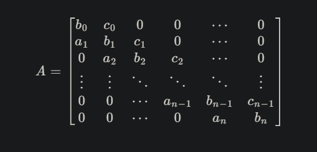
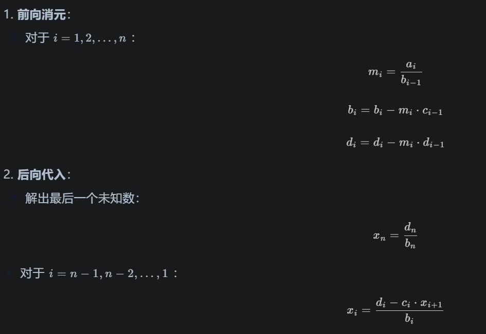

# 线性代数
  
* 区别：
  * 点：数值，一维二维三维，（x,y,z,1），受位移影响
  * 矢量（向量）：数值和方向，一维二维三维，（x,y,z,0），不受位移影响
  * 标量：数值，一维
  * 矩阵：在程序中通常用2维数组表示，每个元素是数值, 用矩阵表示变换因为易组合分解
* 三角函数——直角三角形：
  * 单位圆（半径r==1）圆心在xy二维坐标系的原点o，在圆弧上取任意点p，op作为斜边，op在x轴投影作为临边，垂线作为对边，对角为90
  * 夹角θ：斜边和对边，0——360 （斜边和+x轴的夹角）
  * cosθ余弦：临/斜，1—— -1
  * sinθ正弦：对/斜，1—— -1
  * tanθ正切：对/临，-∞ —— +∞
  * 正：根据输入的角度，计算边比值，sin(θ) = 对边 / 斜边
  * 反：根据输入边比值，获取角度，sin^-1 (对边 / 斜边) = θ
  * 正函数图：y = cosθ，x是θ
  * 反函数图：x = cosθ，y是θ
* 矢量运算：
  * 取反：
    * -a = (-x,-y,-z)
    * 模长不变，方向取反
  * 模长：
    * |a(x,y,z)| == sqrt(x^2 + y^2 + z^2)
    * 获取长度
    * 作用：
      * 仅关心长度
  * 归一化：
    * a / |a|
    * 使得模长==1，方向不变
    * 作用：
      * 仅关心方向
  * 右手螺旋定则: 给定两个向量ab，右手掌心从a转向b，比赞
  * 正交向量：两个向量垂直
  * 向量与标量运算：
    * 四则运算：向量每个分量分别加/减/乘/除一个标量
  * 向量与向量运算：
    * 加法:
      * ax+bx，ay+by， az+bz
      * 四边形法则：向量ab起点对齐，向量c为构成平行四边形的对角线
      * 三角形法则：向量a终点和向量b起点对齐，向量c为a的起点到b的终点
      * 作用：
        * 一个物体向某方向移动多长到达的坐标
    * 减法:
      * ax-bx，ay-by， az-bz
      * a - b == a + (-b)
      * 四边形法则：向量a，-b起点对齐，向量c为构成平行四边形的对角线
      * 三角形法则：向量ab起点对齐，向量c为b的终点到a的终点，终点 - 起点
      * 作用：
        * 一个物体指向另一个物体的方向向量
        * 两个物体之间的距离
        * 物体相对位置
    * 点乘:
      * a ` b == axbx + ayby + azbz
      * |A||B|cosθ（θ为ab向量夹角）
      * 结果：数值
      * 作用：
        * 当ab归一化，点乘结果为cosθ，1—— -1，点乘结果仅和ab夹角有关
          * 平行/垂直：1/-1，0
          * 同向/反向：1，-1
          * 是否接近：
            * abs越接近0，夹角越大，abs越接近1，夹角越小（0——1范围内）
            * abs越接近-1，夹角越大，abs越接近1，夹角越小（1——-1范围内）
    * 叉乘:
      * a * b == (aybz - azby, azbx - axbz, axby - aybx)
      * 结果：向量
      * 作用
        * 判定左右，根据右手螺旋定则:拇指指向正轴，a在b左，拇指指向负轴，a在b右
        * 判定内外，点在三角形的内外，任意一点p，如果(crossproduct(AB, AP) > 0 && crossproduct(BC, BP)  > 0 &&  crossproduct(CA, CP) > 0 ) 则p点在三角形内，否则在三角形外
        * 定义坐标系，向量c的方向垂直于ab
        * 求面积，向量c的模 == ab组成的平行四边形面积
  * 投影：
    * 向量a在向量b上的投影 == a · b · b / |b|^2
    * 推理：
      * a ` b == |a||b|cosθ 点乘
      * 投影长度d == [a]cosθ 三角函数 == a · b / [b] 点乘的移项
      * 已知投影和b同向，投影向量 == d * b/[b] == a · b / [b] * b / [b]
    * 当ab为单位向量时，(a·b) == cos, 分母为1，投影公式(a·b) · b/|b|^2可以简化为：(a · b) · b
    * 作用：
      * 向量分解
  * 反射方向计算：
    * 
      * 根据向量加法i+r = 2p的移项
      * 向量加法i+s = p
      * 投影公式求得和N逆向的s，所以要取反
      * 由于|n|==1，所以分母可以省略，化简得
      * 带入公式
    * 
      * r平移延长n，ior构成等腰三角形
      * 向量加法，r = i + 2s
      * 再次根据投影公式和化简（注意由于N是单位向量，这里N不是用的延长后的，是延长前的）
      * 带入得
    * 
      * 向量相加 = 2s，s根据投影公式（单位向量）
  * 折射方向计算
    * 
    * 斯内尔定律：ni入射折射率，nt出射折射率，sinthetai入射光和法线夹角
    * 全反射现象：costheta的值，根据折射公式，可以转换为这种形式，根号下>0才有意义，也就是1-后面部分需要<1，第2个括号内部为sin范围为-1——1，所以不可能>1, 所以可能导致结果没意义的仅会是第一个括号部分，当它>1时即入射折射率>出射折射率，有可能导致没有意义，也就是全反射现象
* 矩阵
  * 向量 == 1行矩阵 / 1列矩阵
  * 矩阵乘向量：左乘，列向量
  * 矩阵与标量运算：
    * 四则运算：矩阵每个分量分别加/减/乘/除一个标量
  * 矩阵加法遵守交换律与结合律，矩阵乘法只遵守结合律
  * 矩阵乘法：
    * A(a,b) * B(c,d) == C(a,d)，其中b == c
    * A的每行分别与B的每列做运算（对应元素相乘求和），求值结果写在i,j位置
  * 单位：
    * 主对角线（左上到右下）上的元素全部为1，其余元素全部为0的方阵
    * A * E/I == A
  * 转置：
    * A^T 横读竖写，A矩阵从上到下，从左往右读，A^T矩阵从左到右，从上到下写
  * 余子式：
    * 对于矩阵A(i,j)(i==j)，元素aij的余子式Mij == 所在的i行j列划去后，剩余元素按原序排列组成的矩阵的行列式
  * 代数余子式：
    * 对于矩阵A(i,j)，元素aij的代数余子式Cij == (-1)^ i+j  Mij
    * 符号规律：+号-号交替，偶数次方为正数，奇数次方为负数
  * 伴随矩阵：
    * A* 为由Cij组成的矩阵
  * 共轭矩阵
    * 在实数矩阵的情况下，共轭矩阵和伴随矩阵是相等的，在复数情况下，不一定相等
  * 行列式：
    * det(A) == |A|
    * 矩阵行==列
    * 三角行列式：
      * 上三角行列式，主对角线下方的元素全为 0
      * 下三角行列式，主对角线上方的元素全为 0
      * 三角行列式的值等于其主对角线元素的乘积
    * 对角行列式
      * 若一个行列式既是上三角又是下三角
      * 同样等于其主对角线元素的乘积
    * 对角线法：仅适用于二阶和三阶行列式
      * 将前n-1列拷贝平移到右侧(对于二阶不用)
      * 主对角线（左上到右下）开始，向右平移至结束（保证对角线上有n个元素），每次对角线上的元素相乘，最后求和
      * 副对角线（右上到左下）开始，向右平移至结束（保证对角线上有n个元素），每次对角线上的元素相乘取反，最后求和
      * 两次结果相加
    * 代数余子式法：（消元法）
      * 每个aij元素的Cij的和，比如求3阶行列式，分解为多个2阶行列式（Mij）的组合（用对角线法） 
    * 等价转换：
      * 基本性质：
        * 将某行（或列）的所有元素加上另一行（或列）对应元素的*k*倍（可以为正负），行列式的值不变
        * 某行（或列）的公因子可以提取到行列式外
      * 转换为三角行列式
        * 
        * 如上所示，第一步将r1行分别加上其他3行的1倍，第二部将第一行的公因子提取，第三步将后3行分别加上r1行的-1倍
  * 逆：
    * A^-1
    * A * B == C,( A == C / B ==> A == C * 1/B)  A == C * B^-1, 矩阵没有除法，除法等价于乘以倒数，A^-1相当于A的倒数
    * 作用：
      * 取消应用矩阵效果，A^-1 * A * a  == a， 相当于 x * y * 1/y == x
    * 待定系数:
      * 利用 A * A^-1 == E/I 性质
      * 设A^-1中每个元素为未知数/标识符a,b,c……
      * 根据矩阵乘法可以得到方程组
    * 伴随矩阵：
      * A^-1 ==  A* / det(A)  伴随矩阵/行列式 
  * 正交矩阵
    * 正交向量组：把正交的向量，按行/列向量的形式放进一个花括号内2
    * 正交基：构成空间的正交向量组，即坐标系
    * 标准正交基：向量长度均为1
    * 正交矩阵
      * 方阵
      * 如果矩阵中的每行（或列）若视作向量，则这些向量均两两相互垂直，并且长度为1
    * 正交矩阵性质
      * A^−1 == A^T
      * 行列式只有两种可能（1）或（-1）
  * 线性方程组
    * 方程：含有未知数的等式，一般用x表示
    * 线性方程：将形如a1x1+a2x2+a3x3……+anxn = b的方程称为线性方程, 
      * 常数bi系数ai都是已知的，xi是未知数,
      * xi的次数是1，
      * xi间只能加减，不能乘除开根号……
      * 图像永远是直线
    * 线性方程组：
      * 
      * 由两个及以上包含相同变量的线性方程组成，
      * 解有三种情况，
        * 无解：多条直线平行但不重合
        * 有唯一解：多条直线相交于一点
        * 有无穷多解：多条直线重合
      * 解线性方程组：
        * 
        * 矩阵消元法：
          * 一个线性方程组有什么样的解，完全取决于它的系数和常数项，因此只需关心它的系数和常数，因此将线性方程组的系数和常数按照它原本的相对位置组成增广矩阵
          * 方程组的初等变换
            * 交换：可以交换两个行
            * 乘：一个方程左右同时乘以一个非0数，最后等式仍相等
            * 加减：通过将两个方程相加或相减，消去其中一个未知数
            * 带入；求得某个未知数的值带入方程，求得另一个未知数
      * 三对角矩阵
        * 
        * 只有ai主对角线、bi次对角线、ci超对角线上的元素是非零的
        * 解此种矩阵可以用Thomas托马斯算法
        * 对于Ax = d，A矩阵的每个元素和d已知，想要求xi列向量的每个元素
        * 
        * 从前往后消元
        * 从后往前带入