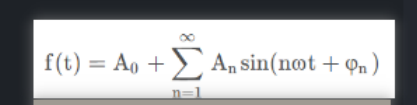
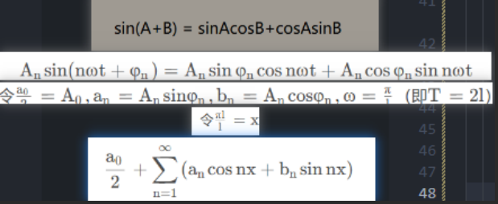
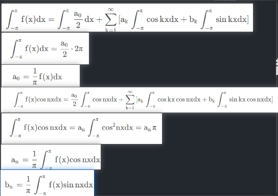
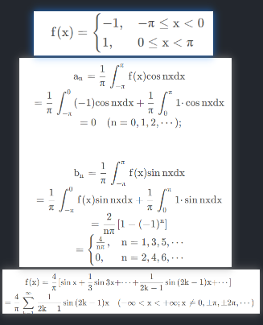
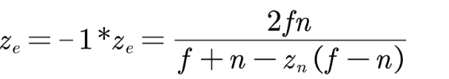

# 光栅化

* 通过MVP变换，得知了世界空间中物体点映射到屏幕空间的什么位置
* 光栅化将图元（点/线/三角形……）转换为片元（像素）
* 采样法：遍历屏幕内每个像素中心的采样点，进行覆盖性测试，利用叉乘判断是否在图元内部
* 优化：根据顶点确定包围盒范围，仅遍历包围盒范围内的采样点
* Aliasing走样问题：锯齿，摩尔纹（moire Patterns）（水波纹），车轮效应（分不清顺逆时帧旋转）……
* 抗锯齿：SSAA,MSAA,FXAA,TAA……详见其他章节

# 傅里叶级数变换

* 周期函数
  * 函数：y = f(x)
  * 周期函数：若存在一非零常数T，对于定义域内的任意x，都有f(x)=f(x+T) 恒成立，则f(x)叫做周期函数，T叫做这个函数的一个周期，形如正弦、余弦
  * 振幅：从中线（x）到最高点/最低点的高度（y）,也是从最高点到最低点的距离除以2
  * 相移: 函数水平向右移动多远
  * 垂直位移：函数垂直向上移动多远
  * 频率：1/周期
  * y = A sin(Bx + C) + D
    * 振幅是A
    * 周期是2π/B
    * 相移是−C/B
    * 垂直移位是D
* 数列和级数
  * 数列：以非负整数集为定义域（每项用f（x）表示，x>=0）的一列有序（随着x递增f（x）的顺序）的数,每一个数都叫做这个数列的项，著名的数列有斐波那契数列，杨辉三角……
  * 级数：将数列的项依次用加号连接起来的函数
  * 函数项级数：将函数项依次用加号连接起来的函数
  * 三角级数：将三角函数（正弦余弦）项依次用加号连接起来的函数
* 傅里叶级数展开：微积分中的函数展开方法之一
  * 三角级数展开：
    * 展开式：
      * 
      * 把一个f(t)以t为周期的非正弦函数，用一系列以t为周期的sin函数，组成的级数表示
        * ω = Π/l，周期T = 2l，l = T/2，
        * 直流分量：常数项
        * 谐波次数：n
        * 一次谐波：求和部分，n\==1称为一次谐波，n==2时称为二次谐波
        * 常数系数：Ai φi
    * 周期映射推导：
      * 
      * 按照三角公式展开
      * 再一系列替换
      * 再替换x,即g(x)
        * 将x + 2Π，
        * 常数项不变
        * cos(n(x+2π))=cos(nx+2nπ)=cos(nx)
        * sin(n(x+2π))=sin(nx+2nπ)=sin(nx)
        * 因此满足g(x+2Π) = g(x)
        * 这就把T为周期的三角级数转换成以标准2π为周期的三角函数,这样方便统一方式计算
    * 三角函数系的正交性：
      * 三角函数系：1,cosx,sinx,cos2x,sin2x,⋅⋅⋅,cosnx,sinnx,⋅⋅⋅
      * 区间[−π,π]上正交：指在三角函数系中，任何不同的两个函数的乘积，在区间[−π,π]上的积分等于零，两个相同函数的乘积，在区间[−π,π]上的积分等于Π
    * 傅里叶系数公式推导：
      * 
      * 将左右同时积分，根据三角函数系的正交性，等式右端除第一项外，其余各项均为零，由于在-Π——Π对常量c的积分=2Π*C，因此可以转为乘法形式，移项得，这里少写了积分符号
      * 左右积分并同时*cosnx，等式右端除k=n的一项外，其余各项均为零，根据三角函数系的正交性结果为Π，移项表示an
      * bn同理，左右同时*sinnx
    * 傅里叶级数收敛；
      * 周期为2π的函数f(x)，如果在周期可积，那么一定可以作出f(x)的傅里叶级数
      * 傅里叶级数是否能收敛（n趋近于无穷函数结果）？是否一定收敛于函数f(x)？函数需要满足以下条件——狄利克雷条件：
        * 在一个周期内连续或只有有限个第一类（左、右极限都存在，第二类间断点	至少有一个极限不存在）间断点(函数在xi时不连续)
        * 在一个周期内至多只有有限个极值点
      * 当x是f(x)的连续点时，级数收敛于f(x)
      * 当x是f(x)的间断点时，级数收敛于1/2[f(x^−)+f(x\^+)],左极限右极限的算数平均值
    * 傅里叶级数展开示例：
      * 
      * 由于函数有有限个第一类间断点，由收敛定理得到收敛于0
      * 根据不定积分求值方法，可以得到anbn结果
      * 将傅里叶系数带入函数得到傅里叶级数
    * 正弦级数和余弦级数
      * 也有一些函数的傅里叶级数只含有正弦项/只有余弦项，这时由于函数奇偶性有关的
      * 偶函数关于y轴对称，基函数关于原点对称
      * 当f(x)为奇函数时，f(x)cos nx是奇函数，f(x)sin nx是偶函数，故an==0
      * 当f(x)为偶函数时，f(x)cos nx是偶函数，f(x)sin nx是奇函数，故bn==0
* 傅里叶级数变换：把一个函数经过复杂变换为另一函数，还可以逆变换为原函数

# 裁剪

* 裁剪发生在裁剪空间；
  * 世界空间/视图空间 都没有定义可视范围
  * 在平截头体中，检测点是否在内部，消耗性能
  * 在裁剪空间，计算简单，如果点在范围-w <= x,y,z <= w，则保留，如果不在则剔除，如果一个三角形ab保留，c剔除，那应该生成新点p在边缘，还要根据ab为它插值顶点属性
  * 在NDC空间，/w透视校正经过非线性压缩，在此空间为P点顶点属性插值将不准确

# 深度测试

* 作用：3D-遮挡关系
* 深度值计算时机：在NDC空间知道顶点的深度值，在光栅化阶段后，生成片元，获得像素深度值
* 深度值计算方式：根据图元3个顶点深度值，和当前像素位置做重心插值
* 深度值使用NDC.z：
  * 世界空间不可用，因为要看摄像机方向的遮挡，
  * 视图空间可用：是线性深度值
  * 裁剪空间可用：是线性深度值
  * NDC.z可用：是非线性深度值，
* 深度值存储：计算完成将存储在寄存器中，供之后适用
* 什么导致深度值非线性？透视校正
* 透视校正后z值为(n+f)/2的点会挤向n还是f？通过具体值带入方式，求得物体向f移动
* 什么叫做非线性深度值？非线性向f压缩，近处物体的距离/深度值差异较大，远处物体的距离/深度值差异较小
* 非线性->线性推导
  * 正向看：设透视投影矩阵第3行最后两项为AB，则视图坐标Aze + Bwe = zc裁剪，由于视图空间中we为1，所以Aze + B裁剪空间，转到NDC (Aze + B)/wc,裁剪空间中wc = -ze，NDC空间zn = (Aze + B)/-ze
  * 反向看：
    * 深度值0——1，转换到-1——1的NDC空间，只需要*2-1
    * 
    * 转到视图坐标
      * 已知zn = (Aze + B)/-ze，已知AB zn，带入求得ze = 
    * 利用视图坐标手动计算线性深度：(z - n) / (f - n)
  * 如果在vs中用pos * MV，在计算深度值，计算的值传给fs，也应该可行
* 非线性深度作用：
  * 深度测试：像素深度值用有限精度的浮点值存储，近处物体深度值差异加大，减少深度冲突，远处物体由于在画面占比较小，减少深度值差异
* 线性深度作用：
  * 需要3D位置信息
* 深度缓冲：通常分辨率和颜色缓冲一致，每个像素存储float类型深度值，限制到0——1之间，深度越近越接近0黑，越远越接近1白
* 默认深度测试（必须）：发生在fs之后，根据比较规则和寄存器中的深度信息更新深度缓冲和颜色缓冲
* 提前深度测试（可选）：发生在fs之前，Early-Z深度测试依赖于上一次drawcall的late-z的结果，不会更新深度缓冲，将未通过深度测试对应的片段丢弃
  * 优势：让未通过深度测试的片段不必fs计算
  * 注意：Early-Z不会更新深度缓冲，默认深度测试的存在是必须的
    * 开启Alpha测试
    * 假如有2个物体ab，a为完全透明，b不透明，且b在a后，先渲染a，预期结果为呈现b
    * 如果只存在late-z：
      * ab覆盖的片元都被fs计算，Alpha测试后a未通过丢弃，b通过，与预期结果相符
    * 如果只存在early-z并允许更新深度缓冲：
      * 丢弃b片元，保留a，fs：计算a片元颜色值，Alpha测试：丢弃a，结果ab都被丢弃，和预期不符
    * Early-Z不更新深度缓冲，late-Z更新深度缓冲
      * Early-Z：深度缓冲区初始为1.0，ab通过Early-Z，fs：计算a片元颜色值，Alpha测试：丢弃a，late-z：b通过，与预期结果相符
* 深度冲突
  * 由于深度缓冲的精度有限，可能会发生深度值相同的情况，此时会造成画面闪烁
  * 解决方法
    * 尽量不要物体靠太近
    * 使用更高精度的深度缓冲
    * 近平面设置远一些，近处精度高

# 着色
  
* 原理
  * 不同表现效果：光的不同作用方式
  * 作用方式：散射（反射（漫反射，镜面反射），折射）吸收，被吸收的颜色，微表面方向、自遮挡……
  * 颜色：未被吸收的物体颜色传入人眼，使得我们看到物体颜色
  * 反射：
    * 笼统角度：漫反射向周围四面八方反射，镜面集中在一个镜面波瓣的反射，通常物体越粗糙越接近于漫反射
    * 微观角度：物体越粗糙，微表面越不平整，光线反射方向偏差大，微表面越平整，光线总是趋近于同一方向反射
  * 高光：镜面反射由于光线反射的聚集性，亮度很高
  * 阴影：光的直线传播中被物体阻挡，从而照射不到的物体形成阴影
  * 夹角：光线方向和法线方向夹角越大，物体接收到的光能量就越小，颜色越暗
  * 各项异性材质：微表面存在一定的方向性
  * 能量守恒：光线传播越远每个角度的能量越小
* Blinn-Phong着色模型(近似计算场景颜色的算法模型)
  * 视线方向v，光线方向i，法线方向n，光源位置l，着色点位置o，物体颜色c，反光度s……其中inv为单位向量
  * 未被吸收/物体颜色：定义为变量
  * 不考虑折射，阴影，粗糙度……
  * 定义漫反射是均匀的
  * 漫反射：Ld = kd(I/r^2)max(0,i*n); 吸收 + 接收 + 反射，kd表示未被吸收的颜色，I为光线强度，r为光与点的距离，0限制到0——90°，不考虑从平面下方照射
  * 镜面反射：Ls = ks(I/r\^2)max(0,n*h)^s, 吸收 + 接收 + 反射，ks表示未被吸收的颜色，指数反光度s越大cos曲线越陡峭，控制高光范围越小变换越剧烈
  * 半程向量h：
    * v+i的单位向量，vi两个方向的平分向量，原本比较v和r反射向量接近程度，现在比较n和h接近程度
    * 解决断层：当物体较粗糙，反光度越小，高光区域会很大，会看到很大的断层，因为vr超过了90度点乘为负数取0，通过转换到hn点乘，相当于从0——180°夹角范围约束到了0——90°范围，使得视线在平面上方任何角度观察，结果都>=0
    * nh夹角通常比vr夹角更小，表现为亮度更高，范围更广，可以通过增大反光度来达到和冯氏光照一样的效果
  * 环境光：kaIa，颜色，强度假设对于所有位置都相同
* 投光物：
  * 上述把光源假设为空间中的一个点，但现实生活中光源并非一个点，通常是有体积的
  * 向着色模型一样，依旧对真实光源做近似简化处理，把光源分为3类
  * 平行光：
    * 模拟太阳光，由于太阳距离我们极远，每条光线近似于平行，我们假设它是平行光
    * 因此光照方向对任何位置都一致，点乘结果也一致
  * 点光源
    * 模拟灯泡，假设光源从一个点向四周均匀发射光线，
    * 衰减模型：
      * r^2：
        * 非线性，物理真实，
        * r距离
        * I光照强度/r^2
      * F = 1.0/Kc+Kl∗d+Kq∗d2：
        * 非线性，经验模型，方便调参应用不同衰减效果，
        * 常数1保证保证分母永远不会比1小，一次项线性，二次项非线性，kck1kq是系数根据d距离查表确定
        * I光照强度 * F
  * 聚光灯
    * 模拟手电筒，假设光源从一个点向锥形区域均匀发射光线
    * 聚光强度：
      * 定义聚光所指方向，指定切光角, 落在这个角度之外的物体都不会被照亮
      * 如果光源和物体的向量 和聚光所指方向 的夹角 < 切光角，则说明点在聚光灯范围内，被照亮
      * 软化：定义ϕ（内光切）γ（外光切），如果在内圆锥内，强度为1，在内外圆锥的差集部分做渐变处理，强度为0——1，在外圆锥外，强度为0
      * 对于渐变部分：I = (θ−γ) / ϵ, θ是光源和物体的向量和聚光所指方向向量的点乘结果，y是外光切的点乘，ϵ 内光切点乘-外光切点乘，I聚光的强度
* 着色频率
  * 按顶点，像素根据顶点的fs结果插值，开销更小，效果略次
  * 按像素，像素根据顶点的数据插值，用fs计算，开销更大，效果更好
  * 两种方式顶点数量越多，效果越好

# 笛卡尔/直角坐标、极坐标、球坐标

极坐标（r,θ）：二维空间，点和原点的距离r，与x轴夹角θ

球坐标（r，θ，Θ）：三维空间，点和原点的距离r，与y轴夹角θ，与z轴夹角Θ

与笛卡尔坐标的转换：

