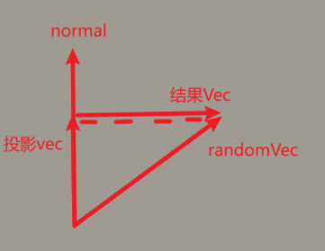

# 语法

* 顶点数据设置
  * VBO：管理顶点数据，一遍一次性发送到GPU显存中
  * 链接和布局：指定哪部分数据对应着色器中哪个顶点属性
    * glVertexAttribPointer(GLuint index, GLint size, GLenum type, GLboolean normalized, GLsizei stride, const void* pointer);
    * glVertexAttribPointer(顶点属性的索引（和shader中对应），分量数量（1/2/3/4维），分量数据类型，是否归一化，步长，起始位置偏移);
  * VAO：将顶点数据和链接方式组合，渲染时只需要绑定VAO，而不需要再次填充和布局
  * EBO/IBO：简化顶点数据的重复定义，通过顶点索引来组合图元，同样也可以被VAO绑定
* IO读取shader文件内容，存放在string对象中，通过c_str转换C风格字符串（常量字符数组）
* 缓冲区操作
  * glBufferSubData，和将数据填充到整个缓冲（GPU显存）不同，它填充缓冲的特定区域，它需要提供一个偏移量，指定从何处开始填充，这样顶点数据不用交错布局，可以采用分批布局，还需要调整之前的布局方式
  * glCopyBufferSubData将一个缓冲的内容拷贝到另一个缓冲
* 以gl_为前缀的是GLSL的内建变量：
  * gl_PointSize图元设置为点并控制它的大小，gl_VertexID顶点ID，gl_FragCoord它的xy存储片段屏幕坐标、z存储深度坐标，gl_FrontFacing当前是正面还是背面，gl_FragDepth片段只读深度值，gl_in[]接口块数组获取一个图元的所有顶点数据，gl_InstanceID实例化渲染的id
* shader传入数据方式：
  * 顶点数据：存储在GPU显存中，通常存储静态数据
  * uniform：高速的常量区域（在shader中不可更改），每次渲染前可以被CPU端快速更新，修改性能较高，因此通常存放动态数据，它是全局的，意味着每个shader都可以声明后使用，而不必从顶点传入
  * Uniform块布局,定义一系列Uniform变量
* shader之间的输入输出:
  * in/out/
  * struct，
  * 接口块类似于struct，但用in/out定义块,

# 面剔除

* 逆时针环绕顺序（顶点顺序）为正面，顺反面
* glCullFace函数指定剔除正面/背面/都剔除
* glFrontFace，将逆/顺，指定为正向面

# cubeMap

* cubeMap包含6张子纹理
* 天空盒：
  * 把cubeMap贴到立方体上，
  * 由于相机位于原点，立方体不使用M矩阵，让它始终包裹住相机，中心位于原点位置
  * 使用V矩阵，不使用位移变换，使得场景看起来很大，使用旋转，使得立方体可以转动，让我们可以观察四周
  * 采样纹理：用方向向量采样cubeMap，方向向量（顶点pos - 立方体中心），由于立方体位于原点（0,0,0），因此直接用位置即可
  * 深度，不启用深度测试, 先渲染天空盒，这样不会更新深度缓冲，启用深度测试，再渲染场景，这样天空盒显示到场景的后面
  * 优化性能：
    * 最先渲染天空盒，那些被场景遮挡的天空盒片元，需要做不必要的fs计算
    * 后渲染天空盒，但由于立方体的深度比绝大多数的片元都要近，立方体会覆盖图像大部分区域，为了解决这个问题，让vs中z=w，在透视除法中，透视除法到NDC空间中z/w = 1.0即深度值，深度值永远是最大的，这样只会让通过深度测试的天空盒片元进行fs计算，避免的大量不必要的计算
    * z=w不会形变：因为变换最终目的是投射到2D平面，也就是只关心xy，z是物体的深度值，将深度值设置为1，不会影响投射的形状，并且由于位于立方体内部，不会发生立方体面重叠现象
* 使用场景：
  * 天空盒
  * 点光源阴影
  * 基于图像的照明：LBL
  * ……

# 几何着色器

* vs和图元装配、fs阶段间的可选阶段gs，可以接受图元装配的完整图元，对每个图元的顶点增删改处理
* gs中需要指定装配的输入图元类型（点/线/三角形），指定gs的输出图元类型，指定max_vertices最大可以绘制的顶点数量，如果超过它将不会绘制
* glDrawArrays图元装配的图元类型是这个函数指定的
* EmitVertex发出顶点
* EndPrimitive发出图元
* 做不同处理
  * 定义每个顶点自身的顶点属性
* 爆破物体：
  * 利用gs：每个顶点往自己的法线方向移动一段距离，顶点位置 + 法线方向指定长度的向量
  * 三角形的法线方向：（p0 - p1）叉乘（p2 - p1）,注意向量叉乘的顺序会影响结果向量的方向
* 法线可视化：
  * 正常渲染场景
  * gs：再次渲染场景，接受物体顶点数据，让每个顶点往法线方向新增点变为线

# SSAO

* 环境光在blinn-phong中我们定义为常量，但是现实中，环境光并不是一成不变的，比如墙角这些地方，由于被临近几何体遮蔽的比较多，使得很难接受光线和流失光线反射到人眼，看起来会更暗，也就是对于空间中每个点，如果遮挡量越大，环境光应该越小
* AO环境光遮蔽：关键问题是如何求得遮挡量？如果根据真实的几何体数据来确定遮蔽量，技术上非常困难，又要消耗大量性能
* SSAO屏幕空间环境光遮蔽(是光栅化实现环境光的一种方式），根据屏幕空间的深度值来确定遮挡量，通过采样法在采样范围随机采样，比较采样点深度值和深度缓冲深度值，计算遮挡值，根据遮挡值决定环境光大小
* 流程：
  * 几何处理阶段：将场景数据存放到G缓冲，包括世界位置，线性深度，法线，噪声纹理……
  * SSAO阶段：
    * 采样范围：
      * 球体：对于墙面，由于一半的球体内采样点都被遮蔽，因此它看起来也很灰
      * 法线方向半球：对于墙面，整个半球内采样点都未被遮蔽，不会降低环境光照值
    * 样本生成：
      * 样本数：太低会得到波纹效果，如果太高会极大消耗性能，通过引入随机性采样，将会以有限样本数量得到高质量的结果
      * 采样算法：
        * 确定采样方向：v.xy的随机值在-1——1之间，z在0——1，这样保证了采样方向不朝半球下，结果归一化，这样保证只关心方向
        * 确定采样长度：scale为0——1，0——1保证不会超过半球范围，scale根据采样点索引确定，这样index越大距离原点越远
        * 有偏采样：现在采样点在半球体内均匀分布，让它们更靠近原点位置，改变scale为scale * scale形成非线性变化，绝大部分缩放值都接近于0即原点
        * 随机核心转动：
          * 如果为每个片段都生成自己的采样核，极大消耗性能
          * 如果对每个片段都应用上述随机生成的采样核，又重复性极高
          * 因此我们让每个核心绕z随机旋转，这样既不浪费性能，又提高了画面表现
          * 但如果让每个核心绕z随机旋转，也会极大消耗性能，因此创建4*4的噪声纹理，让它重复平铺在屏幕，根据片元对应采样获取的噪声值，转动自己的核心
          * 采样噪声纹理：屏幕宽高/纹理宽高，表示在宽高纹理重复了多少次，这样保证纹理大小不被缩放，均匀重复平铺
    * 变换到法向半球：
      * 
      * 为每个片元计算切线空间
      * 由于G缓冲，我们知道法线方向，N可以确定
      * Gramm-Schmidt处理：randomVec - normal * dot(randomVec, normal)，randomVec - randomVec在normal上的投影向量，获得垂直于normal的向量，并且方向是randomVec的方向
      * 根据NT叉乘确定B
      * 将每个sample*TBN，变化到世界切线空间，+fragPos 移动到片段的世界位置上
    * 计算遮挡值
      * 将每个sample *P（在几何阶段vs中做了MV变换，这里只需P）变换到NDC空间，再变换到0.0 - 1.0的值域，利用xy坐标采样深度纹理深度值（不用拉伸到屏幕空间，屏幕坐标超过0.0 - 1.0范围了）
      * 让采样的深度值和sample.z比较，这两个深度值都是视图空间的，也就是线性深度值，如果sample.z更大，说明sample被几何体遮挡，occlusion += 1，否则occlusion += 0
      * 优化范围检查：
        * smoothstep(0.0, 1.0, radius / abs(fragPos.z - sampleDepth));
          * 如果片段在视图空间的位置和采样的位置差距过大，则不应该产生影响
          * 距离差值越小，贡献值越大，距离越大，贡献值越小
      * 最后：每个采样点遮挡值求和/采样次数 取均值，即获得片段的遮挡值
  * 环境遮蔽模糊阶段：对上个阶段输出的AO纹理，进行简单模糊处理，取周围像素颜色值的均值作为当前像素颜色值
  * 光照处理阶段：渲染场景，从AO纹理采样AO值 * 环境光照值

# games101和opengl约定差异

* Games101
  * View坐标：右手系
  * NDC：右手系
  * nf定义： 0 > n > f,即负数
  * w：z
* opengl
  * View坐标：右手系
  * NDC：左手系
  * nf定义：和相机距离值，即0 < n < f，均正数，如果在相机后方，则为负数
  * w:-z
* 因此
  * 正交矩阵：由于NDC区别，第3行符号相反
  * 透视矩阵：由于NDC区别，第3行符号相反，由于w符号差异，整体4行符号再取反
  * 取值范围：由于w符号差异，对于Games101 w=z,由于从原点看-z轴，z为负，因此取值为(w,-w)要取反，opengl来说w为正，则(-w,w)
  * 深度值：由于NDC区别，Games101：n映射1，f映射-1，压缩到0——1区间，f0n1, 深度值0近1远，因此要取反，opengl：n映射-1，f映射1
  * 深度值0近1远：标准规定也就是opengl中，在NDC空间中，n映射-1，f映射1，经过压缩n0f1