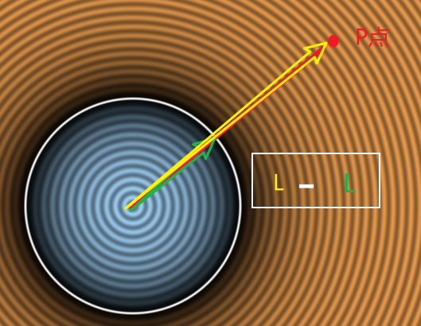
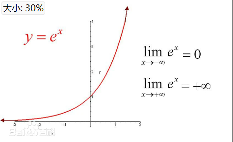

# ShaderToy

* [网站链接](https://www.shadertoy.com/)
* 介绍：基于WebGL API（可以理解为opengl的网页版本），使用glsl进行开发，专注于fs创作，用于学习和分享shader算法的在线社区
* 使用方式：
  * 界面：
    * 运行窗口：渲染窗口，暂停，重置，帧率，分辨率，录屏，声音，放大, 收藏，点赞，分享
    * 代码编辑窗口：加号新建shader，shader输入参考，编译，运行，全屏
    * channels：使用的纹理
  * 代码：
    * shader分类和入口点：
      * 图像shader入口点：void mainImage( out vec4 fragColor, in vec2 fragCoord );//在每个像素上调用，输出的颜色（忽略最后一位），输入的像素坐标（以像素为单位）
      * 声音shader入口点：vec2 mainSound( float time )时间以秒为单位，函数的返回值输出为立体声
      * VRshader入口点：void mainVR( out vec4 fragColor, in vec2 fragCoord, in vec3 fragRayOri, in vec3 fragRayDir )……，……，射线原点，射线方向
    * uniform变量，fs输入变量
      * uniform vec3      iResolution;           // 视口分辨率（像素）
      * uniform float     iTime;                 // 着色器播放时间（秒）
      * uniform float     iTimeDelta;            // 渲染时间（秒）
      * uniform float     iFrameRate;            // 着色器帧率
      * uniform int       iFrame;                // 着色器播放帧数
      * uniform float     iChannelTime[4];       // 通道播放时间（秒）
      * uniform vec3      iChannelResolution[4]; // 通道分辨率（像素）
      * uniform vec4      iMouse;                // 鼠标像素坐标。xy: 当前位置（如果左键按* 下），zw: 点击位置
      * uniform samplerXX iChannel0..3;          // 输入通道。XX = 2D/Cube
      * uniform vec4      iDate;                 // （年，月，日，时间秒数）

#### 代码阅读

* 示例——默认代码：

```glsl
vec2 uv = fragCoord.xy/iResolution.xy;//像素坐标/分辨率 = uv坐标
fragColor = vec4(uv,0.5+0.5*sin(iTime),1.0);//颜色在0.5——1之间，随iTime增加，uv.xyx根据uv坐标重组的向量，vec3(0,2,4)相位偏移常量确保余弦函数波形不同步
fragColor = vec4(1.0, 0.0, 0.0, 0.0);//输出红色
fragColor = texture(iChannel0, uv);//纹理
```

* 示例——2D_sdf：
  * [参考项目链接](https://www.shadertoy.com/view/lfyBR1)
  * fixUV：假设fc宽度范围为0——10，则2*fc范围为0——20，减去10范围为-10——10，/10，转换为-1——1的uv范围，形成按中心扩散的uv坐标
  * 
  * SDFCirlce：有限空间任何一点到圆表面的最小距离，length（）函数获取向量长度，length(uv)即获取uv向量的长度，-r空间中任何一点到圆的距离，距离>r为正数，<\r为负数，==r为0
  * mainImage：
    * 定义颜色：>0橙色，<=0蓝色
    * 
    * exp：以实数e（e≈2.71828）为底的指数函数。其表达式为exp(x)=e^x, 随着自变量的增加，函数值也会增加
    * 颜色渐变：越靠近圆边界越黑，abs仅考虑距离，当dis越大最小为0，-6.\*dis越小（在函数负半轴），exp(-6.*dis) 急速趋近于 0.0，当dis==0，exp为1，exp结果为0——1之间， 1.- 颜色反转
    * 等高线：随着距离增加，cos使其不断在-1——1之间变化，0.8 + 0.2*范围0.6——1.0周期变化，变灰再变亮，150.0\*控制周期频率
    * 圆轮廓：smoothstep(edge0, edge1, x)，当x位于[edge0, edge1]区间时，返回0——1之间的变化，否则返回0/1，如果dis在区间内，1.0-结果趋近1，越接近白色

* 示例-3D_ray_matching：
  * [参考项目链接](https://www.shadertoy.com/view/llt3R4)
  * rayDirection：获取光线方向
    * 将xy坐标变为中心往外的扩散，
    * 相机到屏幕距离z：radians()将fov从角度转弧度，/2为fov的一半，现在构建三角形（相机到屏幕的垂线作为临边，到顶部屏幕为斜边，顶部到屏幕中心为对边），tanθ = 屏幕高度y的一半 / 距离z，距离为两者相除
    * 对ray归一化
  * sphereSDF：
  * shortestDistanceToSurface：超过步进次数/小于最小范围/超过最大范围就返回，否则+步进长度即sdf，归一化的ray方向 * 标量（sdf）， + o 光源起点即camera的位置

* 示例——3D_ray_matching：
  * 光线步进类似光线追踪，也是从摄像机发射光线，唯一不同的是，它是按照步进的方式，而不是一次性的和场景求交
  * [参考项目链接](https://www.shadertoy.com/view/3dySDc)
  * 场景：球体，平面，灯光，相机
  * GetDist：sdf，空间中任意一点p，到场景中所有物体的最小距离，length（）函数获取向量长度，p到球面的距离 = p到球心距离 - 球半径，p到平面的距离 = p.y近似距离，取两者的最小距离
  * RayMarch：光线从起点出发，每次增加sdf距离，当超过步长次数 / 超过最小/最大距离 时停止步进，随着步进（安全距离）会逐渐接近物体表面，返回光线最终位置，作为光线和场景的交点

    ```c++
    vec2 e = vec2(0.01,0);
    vec3 n = d-vec3(
        GetDist(p-e.xyy),
        GetDist(p-e.yxy),
        GetDist(p-e.yyx));
    ```

  * GetNormal：获取空间中任意一点法线方向，交点的dfs，中心差分法来估算p点的法线方向
  * GetLight：
    * 着色计算：定义光源位置，并随时间圆周运动，光线方向为光到p的方向，法线方向GetNormal获得，根据点乘结果返回0——1漫反射颜色值，
    * 阴影计算：判断p点是否被遮挡，从p点沿法线方向偏移一段距离（解决自遮挡），如果 计算到光源的路径距离 < 到光源的距离，则说明有遮挡物，让漫反射颜色减弱
  * mainImage：横轴变换到-1——1的区间，纵轴根据比例获得区间，这将作为光线方向，ro为光线起点，计算漫反射颜色