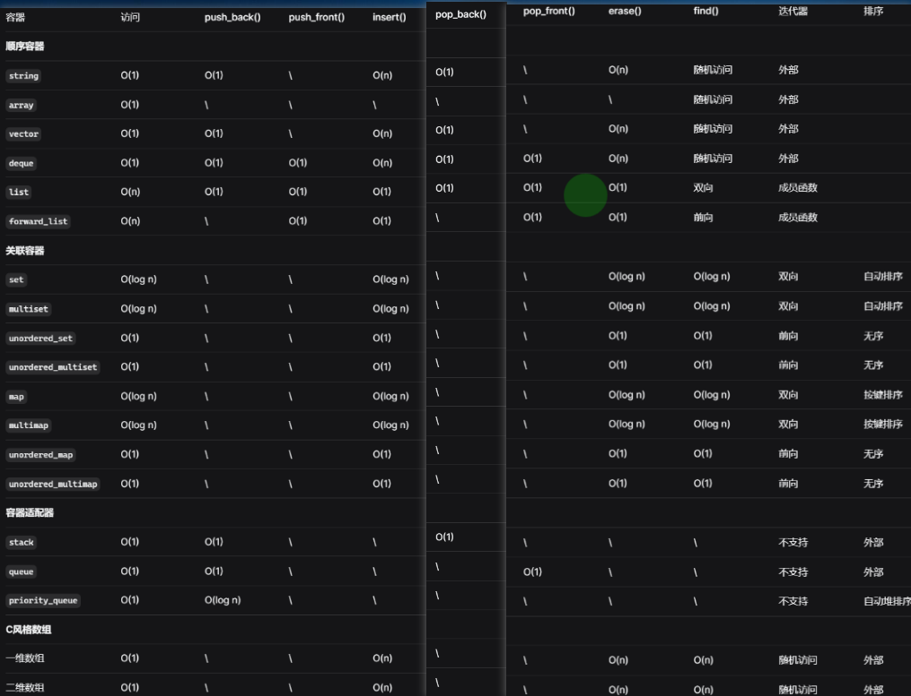

# 数据结构

数据结构：用于存储和管理数据集合

## 复杂度



操作：查询，插入，删除，首部添加删除，尾部添加删除

## 顺序容器

访问顺序不依赖元素值，而是依赖元素加入时间

#### 字符串

**C风格字符串**（非容器）

```c++
char str1[] = "Hello";
char str2[10] = "World";
const char* str3 = "C-style";
strlen(str1);//6
strcpy(str2, "New"); 
if (strcmp(str1, "Hello") == 0) {}
strcat(str2, "!!");
```

* 字符数组：const char[]，const char*
* 以空字符'\0'结尾
* strlen()获取长度,不算空字符
* strcpy()赋值，传入的指针必须指向以空字符结尾的数组
* strcmp()比较，如果不用此函数，将比较指针
* strcat()拼接
* 更轻量
* 适用于与C API交换情况

**string**

```c++
std::string str2("World");
std::string str3(5, 'A');
std::string str1 = "Hello";
str1.size();//5
str1 = "New String";
str2 = str1;
if (str1 != str2){}
str1 += "This";
const char * str = s.c_str();
```

* 可变长字符序列：类对象
* str.length()或str.size()获取长度，返回类型是size_type（无符号整数类型），通常用自动推断
* =赋值运算符 赋值
* 关系运算符 比较
* +/+= 拼接
* 转换到C风格字符串
* 范围for遍历序列元素
* []下标运算符 访问
* 更安全，更容易使用

#### 数组

**C风格数组**（非容器）

```c++
//静态数组
int arr1[5];
int arr2[5] = {1, 2, 3, 4, 5};
int arr3[] = {1, 2, 3};
int static2DArr2[2][3] = {1，2，3，4，5，6}；
int static2DArr2[2][3] = {
  {1, 2, 3},
  {4, 5, 6}
};
int size = sizeof(arr2) / sizeof(arr2[0]);
for (int i = 0; i < 5; ++i) {
    heapArr[i] = i * 10;
}
std::vector<int> vec2(std::begin(c_array), std::end(c_array));

//动态数组
//一维数组
// 初始化
int* arr = new int[n];
//释放
delete[] arr;
//二维数组
// 初始化
int** arr = new int*[row];
for(int i=0;i<row;i++)
{
  arr[i] = new int[col];
}
//释放
for(int i=0;i<row;i++)
{
  delete[] arr[i];
}
delete[] arr;
```

* 固定连续内存，编译期确定大小
* 多维数组：数组的元素是数组
* 静态动态数组，动态数组可以动态调整大小，p[i] == *(p + i) != *p + i
* sizeof()获取大小
* memset批量初始化
* 需逐个元素/memcpy，赋值

```c++
//一维传参：
void func(type arr[]) / void func(type arr[n]) / void func(type *arr) 
//二维传参：
void func(type arr[][y]) / void func(type arr[x][y]) / void func(type (*arr)[y])
//数组赋值给指针
type a[]; 
type* arr = a;
```

* 作为参数/赋值时，退化为指针（指向数组的首元素地址），丢失大小信息，无法通过 sizeof(arr) 获取数组真实大小
  * 解决方式：
    * 额外传递长度参数
    * type (&arr)[n]，type (&arr)[Rows][Cols]通过引用传递数组
* 转换到向量

**array**

```c++
std::array<int, 5> arr = {5, 2, 8, 1, 9};
arr.size();
arr.front();
arr.back();
```

* 兼容STL，初始化指定元素类型和容器大小
* 固定连续内存，编译期确定大小
* size()获取大小
* =赋值运算符 赋值
* []下标运算符，访问首个，末尾元素
* 比C风格数组更安全
* 没有灵活的内存管理

**vector**

```c++
std::vector<int> vec1;
std::vector<int> vec3(5, 10);
std::vector<int> vec2 = {1, 2, 3, 4, 5}; 
vec2.size();
vec.push_back(4);
vec.pop_back();
vec.insert(vec.begin() + 1, 99); 
vec.erase(vec.begin() + 2);
vec.resize(8, 100); 
int* arr = vec.data();
```

* 向量/可变大小数组：类模板，动态大小
* size()获取大小
* =赋值运算符 赋值
* 添加，弹出，插入，删除，调整大小……
* 后进先出，先进后出
* 转换到C风格数组
* 更安全，更容易使用
* string和vector由于元素在连续的内存空间，特定位置查询很快，但向特定位置（除了尾部）增/删会非常耗时（在增/删后需要移动其后的所有元素，以保证连续存储，可能还要分配额外的空间）

#### 链表

**forward_list**

```c++
std::forward_list<int> fl1; 
std::forward_list<int> fl3(5, 10); 
std::forward_list<int> fl4(fl2); 
std::forward_list<int> fl2 = {1, 2, 3, 4, 5};
for (auto it = fl2.begin(); it != fl2.end(); ++it){}
for (int val : fl2){}
fl.front();
auto it = fl.begin();
std::advance(it, 2); 
*it;
fl.push_front(0);
fl.insert_after(it, 99); 
fl.insert_after(it, {100, 200, 300}); 
fl.erase_after(it); 
auto first = fl.begin();
auto last = fl.begin();
fl.erase_after(first, last);
fl2.remove(2);
fl.sort();
fl.reverse(); 
fl3.merge(fl4);
```

* 单向链表
* 没有size获取大小的操作，只能遍历获取
* 通过for范围/迭代器来遍历
* 访问第一个元素，移动迭代器访问特定元素
* 向开头插入，向指定位置插入
* 删除后面的元素，删除范围内元素，删除所有特定值的元素
* 排序，反转，合并两个有序链表

**list**

```c++
lst.push_back(1); 
lst.pop_back(); 
lst.back();
for (auto it = lst2.rbegin(); it != lst2.rend(); ++it){}
auto it = lst.end();
--it;
lst1.splice(lst1.end(), lst2);  
lst.resize(5); 
```

* 双向链表
* 后面添加/删除/访问
* 反向遍历
* 反向移动
* 拼接到末尾
* 调整大小
* 链表在任何位置增/删会很快，但不支持随机访问（如果要访问指定元素，只能遍历链表），链表的内存开销比string和vector都要大，考虑到内存开销，如果不需要反向操作用forward_list

## 关联容器

通过元素值来存储和访问

#### 集合

存储单个值，通常作为去重，无映射关系

```c++
std::set<int> s = {3, 1, 4, 1, 5, 9};
std::multiset<int> ms = {3, 1, 4, 1, 5, 9};
std::unordered_set<int> us = {3, 1, 4, 1, 5, 9};
std::unordered_multiset<int> ums = {3, 1, 4, 1, 5, 9};
auto it1 = s.find(3); 
```

**set**

* 有序，自动按键升序排序
* 底层实现：红黑树
* 查找时间：O(log n)
* 可以有序遍历
* lower_bound，upper_bound范围查询

**multiset**

* 允许重复
* 删除所有匹配元素
* 内存占用较多

**unordered_set**

* 无序，不会自动排序
* 查找时间：O(1)
* 用于快速查询
* 内存消耗较多

**unordered_multiset**

#### 哈希

存储pair<const Key, Value>键值对，映射关系

```c++
std::map<std::string, int> m = {
    {"apple", 5}, {"banana", 3}, {"apple", 10}
};
m["apple"] = 5;  
```

**map**

**multimap**

* 不支持[]操作符

**unordered_map**

**unordered_multimap**

## 容器适配器

由已有容器类型封装，使其看起来像另一种类型


堆/队列：队头做删除操作,在队尾做插入操作，LIFO：先进先出，后进后出

栈：仅能在栈顶进行插入和删除操作，把另一端称为栈底，FIFO：先进后出，后进先出

#### 栈

```c++
std::stack<int> stk; 
std::stack<int, std::vector<int>> stk2;
std::stack<int, std::list<int>> stk3;
stk.push(1); 
stk.top();
```

**stack**

* 底层容器：vector/list/deque
* 接口相对vector比较少，语义更明确，有LIFO访问限制，防止意外访问

#### 堆/队列

**queue**

```c++
std::queue<int> q;
std::queue<int, std::list<int>> q2; 
q.push(1);    
q.front();
q.back();
```

* 接口相对vector比较少，语义更明确，有FIFO访问限制，防止意外访问

**priority_queue**

```c++
std::priority_queue<int> pq;
pq.push(30);
pq.top();
pq.size();
```

* 优先队列
* priority_queue< type, container, function>元素类型，底层容器（缺省），比较方式（缺省）
* 元素根据其优先级大小有序排列，优先级高的元素会优先出队，而不是像普通队列那样遵循FIFO原则
* 优先队列也称为堆heap，分为大顶堆和小顶堆（默认底层容器是数组，默认是最大堆），堆的本质是完全二叉树
* 大顶堆和小顶堆

    

    

    * 大顶堆：arr(i)>arr(2 * i+1) && arr(i)>arr(2*i+2),每个结点的值都大于其左孩子和右孩子结点的值
    * 小顶堆：arr(i)< arr(2 * i+1) && arr(i)< arr(2*i+2),每个结点的值都小于其左孩子和右孩子结点的值
* 比较函数：
  * c++提供了两个内置比较函数：less->构造大根堆->降序（默认），greater->构造小根堆->升序

**deque顺序容器**

```c++
std::deque<int> dq;
dq.push_back(30); 
dq.front();
dq.back();
dq[1];
dq.pop_front();
dq.pop_back();
dq.insert(dq.begin() + 1, 25);
```

* 双端队列
* 特定位置查询很快，但向特定位置（除了首部尾部）增/删会非常耗时

## 工具

#### pair

```c++
std::pair<int, std::string> p1(1, "Alice");
std::pair p2(2, "Bob");  
auto [id, name] = p1;
p1.first = 100;
p1.second = "David";
```

* 对
* 键值对，固定2个元素，map元素类型是pair
* 通过first, second访问
* 可以作为函数多返回值

#### tuple

```c++
std::tuple<int, std::string, double> t1(1, "Alice", 95.5);
std::tuple t2(2, "Bob", 88.0); 
std::get<1>(t1);
std::tuple<int, int> x(1, 2);
std::tuple<int, int> y(1, 3);
(x < y)；
```

* 元组
* 编译器确定数量
* get\<N>()访问
* 可以作为函数多返回值

#### tie

```c++
//tie解包
auto student = std::make_tuple(1, "Alice", 95.5);
int id;
std::string name;
double score;
std::tie(id, name, score) = student;
//最简洁
auto student = std::make_tuple(1, "Alice", 95.5);
auto [id, name, score] = student; //会创建变量
//手动方式
id = std::get<0>(student);
name = std::get<1>(student);  
score = std::get<2>(student);
```

* 绑定
* 创建tuple/pair的引用，将它们的值解包到变量中

## 自定义

#### 树

* 基本概念
  * 祖先：从根到结点的唯一路径上的任意结点
  * 子孙；如果a是b的祖先，则b是a的子孙
  * 双亲：最接近的祖先
  * 孩子；最接近的子孙
  * 兄弟：有共同双亲的节点
  * 深度：从根结点开始自顶向下逐层累加的（）
  * 高度：从叶结点开始自底向上逐层累加的
  * 度：一个结点的孩子个数
* 性质：
  * 节点n，边数n-1
  * 第h层节点数量 = \<h的所有层节点数量 + 1
  * 对于树节点编号，是从上到下，从左到右
  * 深度高度和层级都从索引0开始：
    * 第k层最多有2^k
    * 高度为h最多有2^（h + 1） - 1个节点
  * 深度高度和层级都从索引1开始：
    * 第k层最多有2^(k - 1)
    * 高度为h最多有2^h - 1个节点
* 二叉树：
  * 每个结点至多只有两棵子树
  * 分类：
    * 斜树：所有的结点都只有左子树的二叉树
    * 满二叉树：所有层的结点个数都是最大值，有2^h - 1个节点，
    * 完全二叉树：除最后一层外，其他层的结点个数全部达到最大值，且最后一层的结点从左侧填充
      * 父节点索引从0开始：
        * 父节点索引i：左孩子:2 * i + 1, 右孩子:2 * i + 2
        * 左/右节点i：父节点：(i-1)/2
        * 结点i所在层次为log2^i
        * 具有n个(n>0)结点的完全二叉树的高度为log2^n
      * 父节点索引从1开始：
        * 父节点索引i：左孩子:2 * i为偶数, 右孩子:2 * i + 1为奇数
        * 左/右节点i：父节点：i/2
        * 结点i所在层次为log2^i + 1
        * 具有n个(n>0)结点的完全二叉树的高度为log2^n + 1
    * 二叉搜索树：左子树上所有结点的关键字均小于根结点的关键字;右子树上的所有结点的关键字均大于根结点的关键字
    * 平衡二叉树：树上任一结点的左子树和右子树的深度之差不超过1
* 遍历方式：
  * 先序：根左右
  * 中序：左根右
  * 后序：左右根
  * 层级：

#### 图

* 基本概念：
  * G图，V节点集合，v节点，E边集合，uv边
* 分类：
  * 有向图：若E是有向边的有限集合
  * 无向图：若E是无向边的有限集合
  * 简单图：不存在重复边，不存在顶点到自身的边
  * 多重图：两个结点之间的边数多于一条
  * 完全图：有n ( n − 1 ) / 2 n(n -1)/2n(n−1)/2条边的无向图称为完全图，任意两个顶点之间都存在边
  * 连通图：
    * 若从顶点v到顶点w有路径存在，则称v和w是连通的
    * 若图G GG中任意两个顶点都是连通的，则称图G GG为连通图
* 遍历方式：
  * 深度搜索DFS：
  * 广度搜索BFS:

#### 空间数据结构

详见其他章节

# 迭代器

```c++
for(auto it = s.being(); it != s.end(); it++){}
```

* 迭代器不是指针，但类似于指针
* 主要用于容器元素访问
* []下标运算符只能有限容器访问，迭代器适用于所有STL容器（List，set），支持STL算法
* 操作：
  * begin()获取容器首个元素的迭代器
  * end()获取容器尾元素后的下一个位置的迭代器（不存在的元素）
  * *iter，解引用返回iter指向的元素引用
  * ->，获取iter指向元素的成员
  * ++，--，移动到容器元素的下一位，上一位
  * ==，!=，比较两个iter是否指向同一元素
  * +，-，+=，-= 一个整数值，仍得到迭代器
  * iter - iter，返回迭代器直接的距离
  * iter >, >=,<,<= iter,所指位置前后关系
* 迭代器类型：iterator非常量指针,const_iterator常量指针，begin/end是否返回const由对象是否是const决定