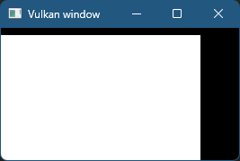

# 简述

* 特性
  * 跨平台
  * 具有更接近GPU的API
  * 性能强大
  * 支持多线程
* 组件
  * 
  * 
  * 
  * 
  * 
  * 
  * VkFramebuffer帧缓冲区：引用颜色、深度、模板 的VkImageView
  * VKRenderPass渲染通道：描述了渲染期间使用的图像类型、使用方式、处理方式
  * VkPipeline图形管线：创建图形管线，描述配置状态（视口大小，深度缓冲区操作、VkShaderModule的可编程状态、有哪些渲染目标），如果要改变不同shader/顶点数据，那么需要重新创建VkPipeline,只有一些基本配置(视口大小,清除颜色)可以动态更改,
  * VkShaderModule着色器模块：
  * VkCommandPool命令池：
  * VkCommandBuffer命令缓冲区：从VkCommandPool分配，命令提交到VkQueue前，首先需要记录到VkCommandBuffer然后才能提交，需要为每个VkSwapchainKHR的图像提供VkCommandBuffer
  * VKSemaphore信号量:保证VkQueue中命令的执行顺序
* 函数
  * vkAcquireNextImageKHR：从交换链获取图像
  * vkQueueSubmit：将命令加入到VkQueue
  * vkQueuePresentKHR：图像使用完返回给VkSwapchainKHR，它需要等待显示器读取完成
* 图形API规范
  * Vulkan函数、枚举和结构体都在中定义vulkan.h头文件
  * 前缀后缀
    * 函数具有小写的vk前缀
    * 枚举和结构体等类型具有大写的Vk前缀
    * 枚举值具有VK_前缀
    * KHR后缀的属于vulkan扩展
  * 函数
    * API通常使用结构体来向函数传递参数
    * 结构体中需要在sType成员中明确指定结构体的类型
    * pNext可以指向扩展结构
    * 通常Enumerate函数会被调用两次
      * 首次调用传递&count（函数形参是*，接受地址，通过指针方式获取函数返回值），nullptr，获取数量
      * 再次调用传递arr.data()获取数据（函数形参是 元素*，data()可以获取指向数组第一个元素的指针（二维数组同理），不使用&vector是因为类型不匹配，不使用&vector[0]是为了防止访问越界，假如数组为空的话）
    * 几乎所有函数都会返回VkResult，该返回值要么是VK_SUCCESS，要么是错误代码

# 环境配置

* Vulkan SDK
  * 包含头文件，验证层，函数的加载器（运行时查找驱动程序中的函数）
  * 安装Vulkan SDK
    * 版本：1.1/1.2都太陈旧了，建议1.3/1.4，我使用的是1.3.296.0
    * 下载：在[官网](https://vulkan.lunarg.com/)选择window->x64/x86选择某某版本对应的VulkanSDK-版本号-Installer.exe下载
    * 安装：
      * 双击下载的.exe安装
      * 一路next即可
      * 对于选择组件这一步，选择你自己需要的组件
    * 环境变量：
      * 系统变量VK_SDK_PATH,VULKAN_SDK变量名，变量值为你的安装目录
      * 区别：
        * 系统变量：所有用户都可读取，只有管理员可以更改
        * 用户变量：仅当前用户可以读取，仅当前用户可改
        * 变量名唯一标识符，变量值为目录，它们是一种映射关系，可以通过键引用值
        * path中：当输入命令，会在path的目录顺序逐个搜索这个可执行文件，找到就执行
  * 验证：前往安装目录，在bin目录，运行vkcube.exe演示程序，如果看到飞速旋转的立方体，则显卡和驱动程序可以正确支持vulkan，否则你将收到错误消息
  * bin目录中glslangValidator.exe和glslc.exe用于将GLSL编译成字节码，我们会在shader章节详细介绍
  * bin目录还包含Vulkan加载器和验证层的二进制文件，Lib目录包含库文件，Include包含头文件
* GLFW：
  * vulkan是跨平台的，本身不提供窗口的，会使用GLFW库来创建窗口，它支持不同的操作系统
  * 下载：在[官网](https://www.glfw.org/download.html)选择window64位二进制下载
  * 解压后会看到所有版本的集合，头文件，库文件
* GLM
  * 用于线性代数运算的库，专为图形API设计
  * 下载：在[官网](https://github.com/g-truc/glm/releases)下载最新版本即可
* VisualStudioCode_MSVC_编辑器的配置文件
  * 详见 VsCode、MSVC编译C++ 此章节
  * 使用库_链接错误：

    ```c++
    若要使用此运行时库:单线程，静态链接(libc.lib) 请忽略这些库:libcmt.lib、msvcrt.lib、libcd.lib、libcmtd.lib、msvcrtd.lib 
    若要使用此运行时库:多线程，静态链接(libcmt.lib) 请忽略这些库:libc.lib、msvcrt.lib、libcd.lib、libcmtd.lib、msvcrtd.lib 
    若要使用此运行时库:多线程，动态链接(msvcrt.lib) 请忽略这些库:libc.lib、libcmt.lib、libcd.lib、libcmtd.lib、msvcrtd.lib 
    若要使用此运行时库:调试单线程，静态链接(libcd.lib) 请忽略这些库:libc.lib、libcmt.lib、msvcrt.lib、libcmtd.lib、msvcrtd.lib 
    若要使用此运行时库:调试多线程，静态链接(libcmtd.lib) 请忽略这些库:libc.lib、libcmt.lib、msvcrt.lib、libcd.lib、msvcrtd.lib 
    若要使用此运行时库:调试多线程，动态链接(msvcrtd.lib) 请忽略这些库:libc.lib、libcmt.lib、msvcrt.lib、libcd.lib、libcmtd.lib 
    ```

    * LINK : warning LNK4098: 默认库“MSVCRT”与其他库的使用冲突；请使用 /NODEFAULTLIB:library
      * C运行时库提供了标准C函数，它们有互斥性，运行时库冲突，使用/NODEFAULTLIB:MSVCRT 忽略特定版本的C运行时库
    * 错误：glfw3.lib(win32_init.obj) : error LNK2019: 无法解析的外部符号 __imp_TranslateMessage，函数 _glfwInitWin32 中引用了该符号
      * TranslateMessage函数位于user32.dll中，无法解析的外部符号，缺少Windows系统库导致的，添加必要的Windows系统库：user32.lib，gdi32.lib，shell32.lib
* VisualStudioCode_MSVC_Cmake配置文件
  * 为了支持跨平台性，我们的项目将使用cmake配置工程
  * c_cpp_properties和task都不需要
  * 编写CmakeLists.txt文件，详见 构建工具_Cmake 此章节
  * 编译
    * 使用cmake + cmake tools 这两个插件
      * F1使用Cmake Configure生成工程，可以选择Visual Studio Community 2022 Release - amd64
      * 编译：RunTask->Cmake:build
      * 运行：还需要之前的launch.json文件，F5运行
    * 使用命令行：new Terminal，输入构建编译的命令，详见 构建工具_Cmake 此章节
* 
* 运行结果

# 程序框架

* 头文件
  * cstdlib 头文件提供了 EXIT_SUCCESS 和 EXIT_FAILURE 宏，作为程序返回结果
  * 包含 stdexcept 和 iostream 头文件是为了报告错误情况
* APP
  * 程序本身作为一个类
  * run作为接口包含4个阶段：
    * 初始化窗口：glfwInit初始化，可调整大小，glfwCreateWindow创建窗口
    * 初始化vulkan
    * 循环：当glfwWindowShouldClose窗口没有关闭时，会一直循环，并接受glfwPollEvents窗口事件
    * 清理：glfwDestroyWindow销毁窗口，glfwTerminate
* main
  * 创建app
  * 异常捕获在app run时，如果catch异常输出cerr错误日志

# 创建VkInstance

* Vulkan单例：程序的入口点和上下文环境
* 初始化vulkan：
  * VkApplicationInfo创建APP结构体：APP名字，应用程序版本（表示当前的程序是什么版本的），API版本（1_3）
  * VkInstanceCreateInfo创建结构体：包含VkApplicationInfo的引用，扩展数量（glfwGetRequiredInstanceExtensions返回GLFW创建窗口所需的Vulkan扩展列表，vulkan通过扩展和窗口系统交互），扩展名字，验证层数量
  * vkCreateInstance函数创建VkInstance，如果！=VK_SUCCESS创建失败，会throw抛出runtime_error异常
* 清理：vkDestroyInstance销毁VkInstance