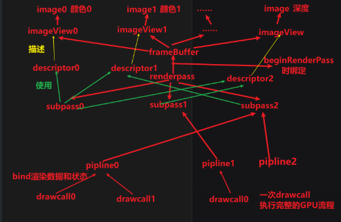
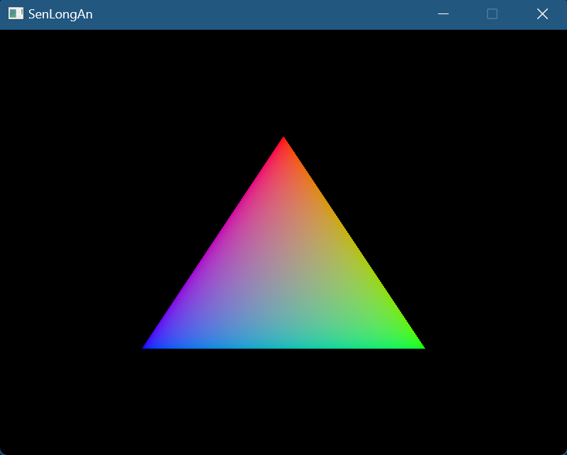
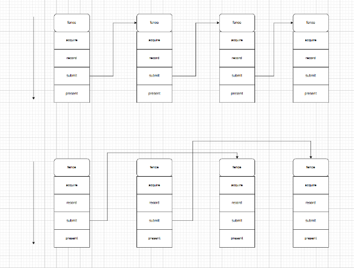

# 创建VkInstance

* Vulkan单例：上下文：程序运行所依赖的外部环境
* 初始化vulkan：
  * VkApplicationInfo创建APP结构体：APP名字，应用程序版本（表示当前的程序是什么版本的），API版本（1_3）
  * VkInstanceCreateInfo创建结构体：包含VkApplicationInfo的引用，扩展数量和数据（glfwGetRequiredInstanceExtensions返回GLFW创建窗口所需的Vulkan扩展列表，vulkan通过扩展和窗口系统交互），层数量和数据，指向扩展结构的指针
  * vkCreateInstance函数创建VkInstance，如果！=VK_SUCCESS创建失败，会throw抛出runtime_error异常
* 清理：vkDestroyInstance销毁VkInstance

# 验证层

* 默认情况下API中的错误检查非常有限，开启验证层将包含很多检查
  * 函数实参是否正确
  * 对象是否存在资源泄漏
  * 检查线程安全性
  * 每个函数调用和参数记录到标准输出
  * 性能分析
  * 可以在开发时使用，发布时禁用
* 流程
  * 初始化：
    * 检查支持：vkEnumerateInstanceLayerProperties枚举VkInstance的层属性，遍历层属性检查是否有VK_LAYER_KHRONOS_validation，如果有则表示可以支持验证层
    * 添加扩展：先通过glfwGetRequiredInstanceExtensions返回GLFW创建窗口所需的Vulkan扩展列表，设置给const char** glfwExtensions指向首元素的指针，在c++中我们使用扩展都是std::vector<const char*> 的形式，因此用glfwExtensions范围初始化它，再添加VK_EXT_DEBUG_UTILS_EXTENSION_NAME验证层扩展
    * 设置VkInstanceCreateInfo：
      * 扩展已在上一步加入，还需要设置enabledLayerCount层的数量，ppEnabledLayerNames层名字，
      * 创建VkDebugUtilsMessengerCreateInfoEXT调试信息结构体，并设置为pNext作为扩展
        * 消息级别（详细诊断信息，INFO一般信息，警告信息，错误信息），
        * 消息类型（GENERA一般消息，VALIDATION验证层，PERFORMANCE性能相关）
        * 它们值都是位掩码通过位|或进行组合（比如0b0001 + 0b0010 + 0b0100）
        * 回调函数（形参为PFN函数指针，接受函数的绑定），发送std::cerr错误日志
    * 设置调试消息：
      * 再次创建VkDebugUtilsMessengerCreateInfoEXT结构体
      * 通过vkGetInstanceProcAddr（对于全局函数可以直接使用，对于实例/设备级函数需要获取），获取vkCreateDebugUtilsMessengerEXT创建调试信息 函数地址，转换为PFN_vkCreateDebugUtilsMessengerEXT函数指针，并调用函数
  * 清理：vkDestroyDebugUtilsMessengerEXT销毁验证层扩展

# VkPhysicalDevice、VkQueueFamily

* VkPhysicalDevice物理设备：通过VkInstance查询属性（VRAM显存大小，设备支持哪些功能），选择一个/多个物理设备（优先推荐专用显卡），对GPU的抽象
* VQueueFamily队列家族：分为3类：图形（渲染相关的命令）、计算、内存传输，每个QueueFamily对应多个queue
* 流程
  * 初始化：
    * vkEnumeratePhysicalDevices枚举物理设备，遍历检查每个设备，vkGetPhysicalDeviceQueueFamilyProperties获取物理设备队列家族，遍历队列家族，检查是否有VK_QUEUE_GRAPHICS_BIT标志，如果有退出循环，返回这个设备

# VkDevice、VkQueue

* VkDevice逻辑设备：使用什么 VkPhysicalDeviceFeatures 物理设备特性（比如info.enabled……扩展，层……），对VkPhysicalDevice功能集抽象，几乎所有函数都需要用它作为参数
* VkPhysicalDeviceFeatures：物理设备特性（多视口，64位浮点数）
* VkQueue：VQueueFamily中分配VkQueue队列，命令（绘制，内存操作）提交到队列异步执行，同一个queue中每个命令会按照顺序依次执行，多个queue可以多线程并行执行
* 流程
  * 初始化：
    * 再次获取VkQueueFamily索引，创建VkDeviceQueueCreateInfo设备队列，包含队列家族索引，队列数量，队列属性
    * 创建VkDeviceCreateInfo，包含VkDeviceQueueCreateInfo引用和数量，设备特性，扩展数量，验证层数量和名字
    * vkCreateDevice创建逻辑设备
    * vkGetDeviceQueue获取设备的VkQueue
  * 清理：vkDestroyDevice销毁逻辑设备

# VkSurfaceKHR

* VkSurfaceKHR窗口表面：窗口通常会使用像GLFW库创建，由于vulkan是跨平台的，所以需要有一个抽象层即表面，来与不同操作系统的窗口交互
* 流程
  * 初始化
    * 在创建VkPhysicalDevice前，glfwCreateWindowSurface调用glfw函数，创建VkSurfaceKHR
    * VkPhysicalDevice：如果一个设备的VkQueueFamily既包含VK_QUEUE_GRAPHICS_BIT又vkGetPhysicalDeviceSurfaceSupportKHR可以支持VkSurfaceKHR，则选择它
    * VkDevice：为每个VkQueueFamily，创建VkDeviceQueueCreateInfo设备队列，vkGetDeviceQueue要获取两次的VkQueue
  * 清理：vkDestroySurfaceKHR销毁窗口表面

# VkSwapchainKHR、VkImage

* VkSwapchainKHR交换链：一组渲染目标，确保不会发生图像撕裂（双缓冲/三缓冲 + 垂直同步）
* 流程
  * 初始化：
    * VkPhysicalDevice：
      * vkEnumerateDeviceExtensionProperties枚举VkPhysicalDevice扩展，遍历所有扩展，如果有VK_KHR_SWAPCHAIN_EXTENSION_NAME则表示此VkPhysicalDevice支持VkSwapchainKHR
      * vkGetPhysicalDeviceSurfaceCapabilitiesKHR获取VkPhysicalDeviced支持的VkSurfaceKHR的功能VkSurfaceCapabilitiesKHR，vkGetPhysicalDeviceSurfaceFormatsKHR获取VkPhysicalDeviced支持的VkSurfaceKHR的格式VkSurfaceFormatKHR，vkGetPhysicalDeviceSurfacePresentModesKHR获取VkPhysicalDeviced支持的VkSurfaceKHR的呈现模式VkPresentModeKHR
      * 如果某物理设备，对之前的VkQueueFamily支持，支持VkSwapchainKHR，VkSurfaceFormatKHR和VkPresentModeKHR都不为空，则选择此物理设备
    * VkDevice:添加扩展VK_KHR_SWAPCHAIN_EXTENSION_NAME数量和数据
    * VkSwapchainKHR
      * 再次获取VkPhysicalDeviced对VkSwapchainKHR的支持
      * 遍历VkSurfaceFormatKHR，如果格式为VK_FORMAT_B8G8R8A8_SRGB / VK_COLOR_SPACE_SRGB_NONLINEAR_KHR，则选择它，否则选择首个元素
      * 遍历VkPresentModeKHR，如果有VK_PRESENT_MODE_MAILBOX_KHR选择它，否则为VK_PRESENT_MODE_FIFO_KHR
      * 如果VkSurfaceCapabilitiesKHR表面能力（minImageCount、maxImageCount此物理设备支持为表面创建交换链的最小、大图像数量，currentExtent 是表面的当前宽度和高度，如果\==0xFFFFFFFF\==numeric_limits\<uint32_t>::max()表示表面的大小将由指向该表面的交换链的尺寸决定，可以更改大小，否则！=特殊值，说明swapchain要匹配这个大小，minImageExtent最小交换链范围，maxImageArrayLayers交换链中可呈现图像能够拥有的最大层数），通常直接返回交换链当前大小，如果==uint32_t，则glfwGetFramebufferSize获取帧缓冲的大小，将帧缓冲的宽高限制到VkSurfaceCapabilitiesKHR可以支持的宽高，并作为VkSurfaceCapabilitiesKHR当前的宽高
      * VkSurfaceCapabilitiesKHR，如果minImageCount==maxImageCount则返回maxImageCount
      * VkSwapchainCreateInfoKHR，包含最小图像数量，图像格式，颜色空间，图像大小，图像数组层，图像用法（颜色附件），图像共享模式（并发，独立），VkQueueFamily数量和索引，传输，透明度，请求模式，是否裁剪，交换链，vkCreateSwapchainKHR创建交换链
      * vkGetSwapchainImagesKHR获取交换链图像
  * 清理：vkDestroySwapchainKHR销毁交换链

# VkImageView

* VkImageView图像视图：对VkSwapchainKHR的图像包装为VkImageView
* 流程
  * 初始化：创建VkImageViewCreateInfo，包含
    * 图像引用，
    * 图像视图的类型（1D2D3D），
    * 图像格式，
    * 图像子资源：
      * 指定图像的哪些方面包含在视图中，比如颜色，深度，模板
      * 第一个可访问的mipmap级别和可访问的数量,
      * 第一个可访问的数组层级别和可访问的数量），
    * vkCreateImageView创建
  * 清理：vkDestroyImageView销毁图像数组

# VkShaderModule

* 着色器模块
* 流程
  * 初始化：
    * 使用IO模块，分别读取vs，fs文件内容到std::vector\<char>
    * VkShaderModuleCreateInfo，包含代码字节数大小，代码数据
    * vkCreateShaderModule分别创建两个VkShaderModule
    * VkPipelineShaderStageCreateInfo，包含管线阶段（顶点，片段，集合，计算），对应的VkShaderModule，着色器的入口点名称
  * 销毁：vkDestroyShaderModule分别销毁两个VkShaderModule
  * shader
    * vs: 目前顶点数据直接在shader中定义，没有使用vbo顶点缓冲，顶点数据包含位置和颜色，颜色的计算位置是在vs中，颜色传入到fs，
    * fs：接收颜色值，会为每个片元插值颜色结果
  * failed to open file!：
    * 原因：经过std::filesystem::current_path()调试，发现当前在vscode的安装目录中
    * 解决：修改launch.json文件，cwd配置项：设置工作目录为项目目录，而不是安装目录
  * validation layer: Validation Error: vkCreateShaderModule(): pCreateInfo->pCode doesn't point to a SPIR-V module
    * 原因：说明着色器文件没有被正确编译成 SPIR-V 格式
    * 解决：使用vulkanSDK中的glslc.exe来编译shader文件为SPIR-V 字节码，添加compile.bat文件，着色器文件的后缀名需要为vert和frag才能被识别

# 流程梳理

* 
* framebuffer<-imageview<-image
* RenderPass 绑定一个framebuffer（全部渲染目标）
* RenderPass 可以包含多个Subpass （使用特定的渲染目标，使得可以有更灵活的控制）
* RenderPass内部可以bind多个Pipeline （Pipeline描述管线各种状态和绑定数据，每个Pipeline绑定一个subpass（即绑定渲染目标），可以有多个pipline绑定同一个subpass）
* 每个Pipeline内部可以调用多次drawcall（顶点数据可以改变，只要能符合pipline的descriptor布局，这样可以渲染多个网格体，每个drawcall下uniform可以每帧改变，这样可以每帧更改每个网格体），每个drawcall执行完整的GPU渲染管线流程
* 注意执行顺序：Subpass的执行顺序是固定的0，1，2……，在最开始只能使用bind到subpass0的pipline，只有通过vkCmdNextSubpass改变后，才能使用bind到subpass1的pipline，但GPU的执行是并行的

# 图像布局

* 图像布局：像素在内存中的组织方式，最适合该操作使用的布局，将获得最佳性能（均以VK_IMAGE_LAYOUT_开头）
  * VK_IMAGE_LAYOUT_PRESENT_SRC_KHR：最适合呈现
  * VK_IMAGE_LAYOUT_COLOR_ATTACHMENT_OPTIMAL：最适合作为附件，用于在shader写入颜色
  * VK_IMAGE_LAYOUT_DEPTH_STENCIL_ATTACHMENT_OPTIMAL：最适合作为附件，用于在shader写入深度/模板
  * VK_IMAGE_LAYOUT_SHADER_READ_ONLY_OPTIMAL：最适合从shader采样
  * VK_IMAGE_LAYOUT_TRANSFER_SRC_OPTIMAL：最适合作为传输操作的源，例如 vkCmdCopyImageToBuffer
  * VK_IMAGE_LAYOUT_TRANSFER_DST_OPTIMAL：最适合作为传输操作的目的地，例如 vkCmdCopyBufferToImage
* 图像布局转换：改变像素在内存中的组织方式

# VkRenderPass

* VKRenderPass渲染通道（pass处理阶段）：绑定一个framebuffer，可以包含多个Subpass
* subpass：使用多个subpass而不是多个renderpass可以提高性能，Vulkan能够重新排序操作并节省内存带宽，从而可能获得更好的性能
* 流程
  * 初始化：
    * 
    * VkAttachmentDescription附件描述，包含：附件的图像视图的格式，图像的样本数（抗锯齿），loadOp指定首次被使用的subpass开始前 和 storeOp指定最后被使用的subpass结束后 如何处理附件中的数据（颜色/深度）（LOAD保留附件的现有内容，CLEAR将值清除为常量（清楚色/背景色，常用选项），DONT_CARE内容未定义）（STORE渲染的内容将存储在内存中以便读取（颜色要被呈现），DONT_CARE渲染后内容未定义（通常为用于深度测试的深度）），tencilLoadOp / stencilStoreOp 应用于模板数据，initialLayout、finalLayout 指定renderpass开始时和结束时的图像布局
    * VkAttachmentReference附件引用(subpass使用attachment的中间层，指定使用谁，使用方式)，VkRenderPassCreateInfo中的索引，在subpass使用时的图像布局
    * VkSubpassDescription，subpass描述，类型（图形/计算 subpass），每个subpass都会包含一个/多个VkAttachmentReference引用（对应shader中layout(location = index) out），由于颜色附件可以有多个，因此数量需要指定，而深度模板则不用
    * VkSubpassDependency，subpass依赖控制（同步原语）（同一帧之间subpass / 首个subpass和VK_SUBPASS_EXTERNAL外部状态（Acquire，record，前一帧present……操作） 的同步）：
      * 对于首个subpass存在问题：
        * 隐式subpass：包括图像布局转换操作（initialLayout → 第一个子通道需要的布局，最后一个子通道的布局 → finalLayout），发生在renderpass开始后，subpass0开始前
        * 但是开始时转换时机不正确，我们可能尚未获取图像（？？？我们暂时先不关心这个问题的正确性）
      * 有两种方法解决：
        * acquire的semaphore的等待改为VK_PIPELINE_STAGE_TOP_OF_PIPE_BIT以确保renderpass在图像可用之前不会开始执行
        * 另一种方式，通过VkSubpassDependency精细控制，让renderpass等待VK_PIPELINE_STAGE_COLOR_ATTACHMENT_OUTPUT_BIT（等待颜色附件输出阶段完成（图像已获取后））
      * VkSubpassDependency
        * srcSubpass来源子通道索引（被等待的subpass，如果前面没有，指定VK_SUBPASS_EXTERNAL外部操作（隐式图像布局转换））
        * dstSubpass目标子通道索引（需要等待的subpass）
        * srcStageMask，指定dstSubpass需要等待srcSubpass的哪个pipline stage完成
        * dstStageMask，指定dstSubpass的哪个pipline stage和之后stage需要等待
        * srcAccessMask，指定dstSubpass需要等待srcSubpass阶段的srcStageMask的哪个具体操作完成
        * dstAccessMask，指定dstSubpass的dstStageMask阶段的哪个具体操作需要等待
    * VkRenderPassCreateInfo渲染通道参数，包含VkAttachmentDescription数量和引用，VkSubpassDescription数量和引用，VkSubpassDependency数量和引用
    * vkCreateRenderPass创建VkRenderPass
  * 清理：vkDestroyRenderPass销毁VKRenderPass

# VkPipeline

* VkPipeline渲染管线：定义渲染管线状态：（视口大小，深度缓冲区操作、VkShaderModule的绑定、有哪些渲染目标，面剔除，混合），如果要改变状态，那么需要重新创建VkPipeline,只有一些基本配置可以动态更改（视口大小、裁剪大小）
* VkPipelineLayout：用于传递uniform值（动态全局变量，每帧可以更改值），着色器可以访问的资源布局（比如Descriptor）
* 流程
  * 初始化：
    * VkPipelineVertexInputStateCreateInfo管线顶点输入状态（顶点数据），描述了将传递给顶点着色器的顶点数据的格式（shader的编号，逐顶点还是逐实例，数据的尺寸和类型，偏移量），包含VkVertexInputBindingDescription顶点输入绑定，VkVertexInputAttributeDescription顶点输入属性描述的数量和数据
    * VkPipelineInputAssemblyStateCreateInfo管线输入组装状态（图元），包含拓扑结构（点，线，三角形），按索引（元素缓冲，重用顶点的优化）绘制时特殊顶点是否允许重新组装
    * VkPipelineViewportStateCreateInfo管线视口状态，包含使用的视口数量，裁剪区域的数量
    * VkPipelineRasterizationStateCreateInfo管道光栅化状态，启用深度限制（近平面和远平面的片段将被钳制到它们，而不是丢弃它们），图元是否在光栅化阶段之前立即被丢弃，光栅化模式：如何为几何图形生成片段（FILL片段填充多边形区域，LINE多边形边缘绘制为线条，POINT多边形顶点绘制为点），线条的粗细，面剔除（禁用剔除、剔除正面、剔除背面或两者都剔除，被视为正面的面的顶点顺序）
    * VkPipelineMultisampleStateCreateInfo管线多重采样状态,包含是否启用样本着色，样本数
    * VkPipelineDepthStencilStateCreateInfo深度模板测试
      * 是否启用深度测试
      * 是否启用深度写入
      * 深度测试方式
      * 是否启用深度边界测试
      * 是否启用模板测试
    * VkPipelineColorBlendAttachmentState每个附加帧缓冲的配置，是否为相应的颜色附件启用混合，src和dst的rgb/a的混合因子，混合操作
    * VkPipelineColorBlendStateCreateInfo全局颜色混合设置，包含是否应用混合操作，哪种逻辑运算，附件数量和引用指向VkPipelineColorBlendAttachmentState，混合常数的 R、G、B 和 A 分量
    * VkPipelineDynamicStateCreateInfo管线动态状态，这些是可以运行时改变的状态，包含VkDynamicState的数量和数据
    * VkPipelineLayoutCreateInfo管道布局，包含描述符集的数量和数据，常量范围的个数和数据
    * vkCreatePipelineLayout创建VkPipelineLayout
    * VkGraphicsPipelineCreateInfo图形管线，将上面创建的组件都附加上（着色器模块（可编程阶段），固定功能状态（非可编程阶段的状态），pipelineLayout管线布局（着色器引用的 uniform 值，可在每帧实时更新，renderPass引用），basePipelineHandle/basePipelineIndex派生自现有管线来创建新的图形管线，当有很多共用功能，这样创建的成本较低），
    * vkCreateGraphicsPipelines创建，第二个参数引用VkPipelineCache对象，
  * 清理：vkDestroyPipeline，vkDestroyPipelineLayout

# VkFramebuffer

* VkFramebuffer帧缓冲区（渲染目标）：引用颜色、深度、模板 的VkImageView，它将在VkRenderPassBeginInfo中被绑定（index为在swapchain acquire的图像index），需要为每个swapchain的image创建framebuffer
* 流程
  * 初始化：为VkFramebuffer调整大小和VkImageView数量一致，遍历每个元素，VkFramebufferCreateInfo，包含VkRenderPass，附件的数量和数据（VkImageView），帧缓冲区的宽高，图像数组中的层数，vkCreateFramebuffer创建
  * 清理：vkDestroyFramebuffer销毁

# VkCommandPool、VkCommandBuffer

* VkCommandPool命令池：管理用于命令缓冲区的内存，每个VkCommandPool只能分配在单一类型的queue上提交的VkCommandBuffer（pool对应一类queue）
* VkCommandBuffer命令缓冲区：从VkCommandPool分配，想要执行的命令首先记录到VkCommandBuffer, 然后提交到VkQueue，命令录制支持多线程，并且record和submit由于是分开的因此也可以多线程，需要为每个VkSwapchainKHR的图像提供VkCommandBuffer（但是目前我们先创建一个）
* 流程
  * 初始化：
    * VkCommandPoolCreateInfo，包含标志（VK_COMMAND_POOL_CREATE_TRANSIENT_BIT频繁地被重置（可能进行特殊优化），VK_COMMAND_POOL_CREATE_RESET_COMMAND_BUFFER_BIT重新记录（需要手动重置）），VkQueueFamily索引，vkCreateCommandPool创建
    * VkCommandBufferAllocateInfo，包含VkCommandPool，命令缓冲区的级别（是PRIMARY主VkCommandBuffer提交到队列执行,还是SECONDARY辅助VkCommandBuffer不能直接提交，但可以从主命令缓冲区调用（多线程）），命令缓冲区的数量，vkAllocateCommandBuffers创建
  * 清理：vkDestroyCommandPool

# VkSemaphore、VkFence

* 不同于opengl，vulkan需要用同步原语,手动  控制执行顺序（大部分API都是异步执行的），因为需要确保执行完成后，再进行之后的操作
* VKSemaphore信号量:
  * 有两种信号量：二进制信号量和时间线信号量，本次使用二进制信号量
  * 有两种状态：未发信号状态（默认），已发信号状态
  * 使用方式：将信号量S作为queueA的info中的pSignalSemaphores，并作为queueB中的pWaitSemaphores，这样A操作完成时发出信号S，B在此前会等待S，当B开始执行后，S重置为未发信号状态，允许再次使用它
  * 用于在GPU上保证执行顺序，CPU会继续执行不会阻塞
  * 应用：
    * swapchain的操作（获取图像和呈现），不希望CPU等待
    * 保证VkQueue（同一队列/不同队列）中队列操作（vkQueueSubmit，vkQueuePresent）的执行顺序
* VkFence栅栏：
  * CPU需要知道GPU何时完成某项工作，充当cpu和gpu之间的同步工具
  * 有两种状态：已发信号或未发信号
  * 使用方式：比如GPU的命令A，围栏F，当A执行完成，F发出信号，CPU会wait直到接收到信号
  * 和semaphore不同，fence会导致CPU被阻塞，因此我们尽量选择semaphore而不是fence
  * vkResetFences我们需要手动重置围栏，它才会回到未发信号状态（因为它控制CPU的执行，我们可以直接控制它）
  * 应用：等待上一帧，需要CPU等待，因为每帧都会reset command buffer，不想在正在使用时，将下一帧的命令覆盖当前command buffer（record录制命令，和在submit使用命令，在它们完成后即可重新录制和使用）
* 流程
  * 初始化：
    * VkSemaphoreCreateInfo，vkCreateSemaphore创建信号量
    * VkFenceCreateInfo,添加VK_FENCE_CREATE_SIGNALED_BIT标志，以便首次执行时不会阻塞，vkCreateFence创建栅栏

# vkCmd、vkQueue

* vkCmd开头的都是向commandBuffer，Record录制命令
* vkQueue开头的都是向Queue，Submit提交命令
* 流程
  * 每帧
    * vkWaitForFences，vkResetFences栅栏
    * vkAcquireNextImageKHR，从VkSwapchainKHR请求下一个可用的图像，第4个参数是成功获取图像（在呈现完成 + 读取完成后）后发出信号的Semaphore（对于首帧来说不需要等待present完成）（请求图像）
    * vkResetCommandBuffer，清除上一次录制命令
    * VkCommandBufferBeginInfo,包含标志如何使用命令缓冲区（ONE_TIME_SUBMIT执行一次后立即重新记录，RENDER_PASS_CONTINUE辅助命令缓冲区，SIMULTANEOUS_USE在已经挂起执行的同时重新提交），从主命令缓冲区继承的状态，vkBeginCommandBuffer开始录制
      * VkRenderPassBeginInfo，包含VkRenderPass，VkFramebuffer，渲染区域宽高和偏移量，清理值的数量，清除值（背景色），vkCmdBeginRenderPass开始渲染阶段，第一个参数始终是要记录命令的commandBuffer，第二个参数RenderPass info，最后一个参数控制RenderPass内的绘制命令将如何提供（VK_SUBPASS_CONTENTS_INLINE命令将嵌入在主命令缓冲区本身中，VK_SUBPASS_CONTENTS_SECONDARY_COMMAND_BUFFERS命令将从辅助命令缓冲区执行）
        * vkCmdBindPipeline，绑定VkPipeline，第二个参数指定管线对象是图形管线还是计算管线
        * vkCmdSetViewport，视口的宽高，深度值范围（这些值必须在 [0.0f, 1.0f] 范围内）
        * vkCmdSetScissor，动态设置裁剪矩形：偏移量和大小
        * 上面两个，由于在VkPipeline中将VIEWPORT和SCISSOR设置为VkDynamicState动态状态，因此要在这里每帧设置它们
        * vkCmdDraw，drawcall命令，要绘制的顶点数，绘制的实例数（实例化渲染），顶点缓冲区的偏移量，实例化渲染的偏移量
      * vkCmdEndRenderPass结束渲染管线
    * vkEndCommandBuffer结束录制

    * VkSubmitInfo，包含执行命令缓冲区之前需要等待的信号量数量和引用，VkPipelineStageFlags引用（每个信号量等待将发生的管线阶段）,命令缓冲区的数量和引用，命令执行完成后需要通知的信号量数量和引用，vkQueueSubmit向队列提交和执行命令（渲染）
    * VkPresentInfoKHR，包含呈现请求之前需要等待的信号量数量和引用，VkSwapchainKHR的数量和引用，要呈现图像的索引，vkQueuePresentKHR对swapchain呈现/交换操作，以显示渲染结果（呈现）
  * 清理：vkDestroySemaphore、vkDestroyFence
* 

# 帧并行

* log测试imageCount为3，因此说明swapchain为三缓冲
* 每帧流程：acquire（请求图像）->record（录制命令）->submit（执行命令和渲染）->present（交换链交换，并被显示器读取）
* 注意：
  * 对于三缓冲，一个front被显示器读取，无法acquire，两个back，被使用时无法acquire，空闲的可以被acquire，当无法acquire时会阻塞CPU指令，由于CPU启动GPU执行，因此也会阻塞GPU执行
  * Semaphores的等待是GPU的等待，也就是CPU的vkQueuePresentKHR指令会执行，只是GPU接收指令后会等待Semaphores发出信号后才会真正执行
  * 三缓冲才会实现并行，因为双缓冲时，一个front被显示器读取，无法acquire，一个back，正被使用时无法acquire，因此没有额外可acquire的图像
  * 三缓冲只需要2个CommandBuffer，一个front被显示器读取，无法acquire，最多两个渲染同时并行
* 
* 之前只有一个VkCommandBuffer、VkSemaphore、VkFence时：
  * 只有一个VkCommandBuffer时，为了防止数据竞争（clear/new record），我们控制只有当i-1帧的Submit渲染完成，才会让fence发出信号，Acquire请求新的图像并执行接下来的流程，这会浪费GPU性能，让它空闲等待
* 变为VkCommandBuffer、VkSemaphore、VkFence数组时：
  * 当前帧i需要等待i-2帧渲染完成，也就是不需要等待i-1帧，这样可以两帧并行渲染
* 使用时使用frame id，每帧流程后都会对++frame id % max frame，清理数组

# 图像size

* glfwGetFramebufferSize窗口大小：实际窗口，超过窗口外的将看不到（画框，超出画框的纸张将被裁剪掉）
* swapchain的大小==framebuffer大小：渲染目标的大小，通常与窗口在左上角对齐（纸张大小）
* viewport大小：坐标映射到渲染目标的范围，从左上开始算（图片抻拉映射到纸张的那部分区域）
* scissor大小：渲染目标的可视范围（哪部分可视，哪部分裁剪）

# 重建swapchain

* 当窗口大小改变时，窗口表面会发生变化，导致交换链大小不再与之兼容，因此要捕获此事件和重建swapchain
* 流程：
  * 初始化窗口：glfwSetFramebufferSizeCallback当窗口大小改变时，就会调用它的回调函数，glfwSetWindowUserPointer将参数2任意用户数据指针与参数1GLFW 窗口关联，通过glfwGetWindowUserPointer获取用户指针，在回调函数中，让bool开关打开
  * 清理SwapChain：将清理操作抽象出来到函数中，包括VkSwapchainKHR，VkImageView，VkFramebuffer
  * 重新创建SwapChain：清理并重建（先通过glfwGetFramebufferSize获取帧缓冲大小（单位是像素，物理大小，随窗口大小按比例改变），当宽高为0时，会等待窗口事件，不会渲染）
  * 每帧：在Acquire后和Present后，如果VK_ERROR_OUT_OF_DATE_KHR交换链已变得与表面不兼容，就重建SwapChain，并退出函数，由于窗口未关闭，因此会继续下一次drawFrame流程