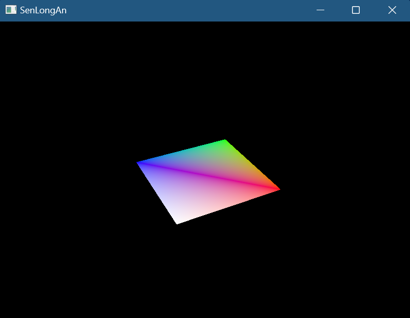

# VkCommandBuffer数组

* acquire（请求图像）->record（录制命令）->submit（执行命令和渲染）->present（交换链交换，并被显示器读取）
* 只有一个VkCommandBuffer时：
  * 第i+1帧acquire会正确请求到图像吗，假设上一帧的present没有执行完，行为是：等待 / 获取frontbuffer / 获取backbuffer？
    * 会等待present中交换操作完成后（frontbuffer 始终被显示器占用，我们无法获取它），而不必等待读取完成，就可以获取到新的backbuffer，在UINT64_MAX时间内会一直等待，阻塞CPU线程
  * record和 acquire和submit有同步机制吗，怎么保证record在acquire后submit前执行？
    * 有隐式同步机制，
    * acquire的等待会阻塞整个CPU线程，包括后续的record操作,
    * record是CPU命令，可以保证内部顺序，
    * 在它们执行完成后执行vkQueueSubmit，
    * acquire和submit都是GPU命令（单commondbuffer其实可以不用semaphore），无法自动保证内部执行顺序，手动用semaphore保证顺序
  * 流程：当第i帧的submit结束就可以第i+1帧的流程执行，需要等待acquire后（也就是上一帧的present后），然后record执行，submit执行
  * 下一帧的流程需要等待上一帧的完成
* VkCommandBuffer数组时：
  * 第i+1帧acquire会正确请求到图像吗？同上
  * 和单VkCommandBuffer的区别？双缓冲下本质没有区别，虽然vkWaitForFences不会阻塞第i+1帧的执行，但vkAcquireNextImageKHR会阻塞第i+1帧的执行（因为i帧的present中交换操作没有完成，同上面一样还是需要交换完成后才能i+1帧的流程），因此本质没有改变
  * 真正可以让 CPU 与 GPU 并行是需要三缓冲实现的
* 流程：VkCommandBuffer、VkSemaphore、VkFence都变为数组，包括初始化，使用时使用frame id，每帧流程后都会对++frame id % max frame，清理数组

# 重建swapchain

* 当窗口大小改变时，窗口表面会发生变化，导致交换链大小不再与之兼容，因此要捕获此事件和重建swapchain
* 流程：
  * 初始化窗口：glfwSetFramebufferSizeCallback当窗口大小改变时，就会调用它的回调函数，glfwSetWindowUserPointer将参数2任意用户数据指针与参数1GLFW 窗口关联，通过glfwGetWindowUserPointer获取用户指针，在回调函数中，让bool开关打开
  * 清理SwapChain：将清理操作抽象出来到函数中，包括VkSwapchainKHR，VkImageView，VkFramebuffer
  * 重新创建SwapChain：清理并重建（先通过glfwGetFramebufferSize获取帧缓冲大小（单位是像素，物理大小，随窗口大小按比例改变），当宽高为0时，会等待窗口事件，不会渲染）
  * 每帧：在Acquire后和Present后，如果VK_ERROR_OUT_OF_DATE_KHR交换链已变得与表面不兼容，就重建SwapChain，并退出函数，由于窗口未关闭，因此会继续下一次drawFrame流程

# 顶点数据描述

* 之前顶点数据直接放在shader中，现在我们要定义在cpp中，传入到shader中
* 流程：
  * 顶点数据：将3个顶点的位置和颜色数据存放在数组中，每个元素都是Vertex自定义类型
  * VkVertexInputBinding
  * Description顶点输入绑定，包含绑定编号，字节间隔，顶点属性寻址是依赖于逐顶点还是逐实例
  * VkVertexInputAttributeDescription顶点输入属性描述，包含数据的绑定编号，着色器输入位置编号，数据的尺寸和类型，相对于顶点输入绑定的元素起始位置的字节偏移量（通过offsetof（class 类型，类成员），获取成员的偏移量）
  * VkPipeline：在VkPipelineVertexInputStateCreateInfo中，为vertexBindingDescriptionCount,vertexAttributeDescriptionCount设置数量和数据
  * shader：把vs中定义的顶点数据删除，改为layout(location = index) in 从外部输入

# VkBuffer、VkDeviceMemory

* VkDeviceMemory物理设备内存：从GPU的memoryHeaps上分配的内存，抽象出来让我们自己定义分配策略
* VkBuffer缓冲：GPU上分配的内存的关联绑定（包装），以及指定此内存的相关描述（使用方式,共享模式）
* 流程：
  * 初始化：
    * 创建VkBuffer：VkBufferCreateInfo，包含缓冲区的大小（以字节为单位），指定缓冲区的允许使用方式（VK_BUFFER_USAGE_VERTEX_BUFFER_BIT缓冲区用于vkCmdBindVertexBuffers），指定当多个队列家族访问缓冲区时的共享模式（独占 / 共享），vkCreateBuffer创建缓冲区
    * VkMemoryRequirements内存需求，包含所需内存量的大小（根据VkBuffer使用vkGetBufferMemoryRequirements获取），以字节为单位，缓冲在已分配的内存区域中开始的字节偏移量，需求的内存类型
    * 分配VkDeviceMemory：VkMemoryAllocateInfo内存分配，包含分配的字节数为VkMemoryRequirements的大小，从VkMemoryRequirements获取内存类型索引（vkGetPhysicalDeviceMemoryProperties获取物理设备所有内存属性（返回结果结构体包含两个数组 memoryTypes 和 memoryHeaps这个内存用来存放数据分为不同的内存类型，目前只关心memoryTypes），检查Requirements的内存类型索引，和是否有VK_MEMORY_PROPERTY_HOST_VISIBLE_BIT标志以便可以写入，如果有返回对应索引），vkAllocateMemory创建内存
    * 关联：vkBindBufferMemory将VkBuffer和VkDeviceMemory绑定，关联起来
    * 填充VkDeviceMemory：vkMapMemory将GPU内存映射到CPU的地址空间，让CPU能够直接读写这块内存(下面将称为映射内存)中，vkUnmapMemory取消映射，内部通过memcpy将顶点数据填充到GPU上分配的内存中
    * 要注意：驱动程序可能不会立即将数据复制到缓冲内存中，导致内存中不可见，解决问题分为两种办法：
      * 内存类型VK_MEMORY_PROPERTY_HOST_COHERENT_BIT内存类型，这可能导致比显式刷新稍差的性能
      * 在写入映射的内存后调用 vkFlushMappedMemoryRanges，在从映射的内存读取之前调用 vkInvalidateMappedMemoryRanges
  * 每帧：
    * 绑定：在recordCommandBuffer中，vkCmdBindVertexBuffers绑定顶点缓冲
    * drawcall中，使用顶点数据的大小
  * 销毁：vkDestroyBuffer，vkFreeMemory

# 暂存缓冲区

* 此标记VK_MEMORY_PROPERTY_HOST_VISIBLE_BIT的内存可以被CPU写入，但是GPU读取会较慢，此标记VK_MEMORY_PROPERTY_DEVICE_LOCAL_BIT的内存不可被被CPU写入，但是GPU读取会较快，因此我们首先创建HOST_VISIBLE的CommandBuffer，然后将vertex数据写入，然后将数据copy到DEVICE_LOCAL的CommandBuffer中，以便被GPU快速读取
* 缓冲区复制命令需要支持传输操作的queueFamily，任何具有 VK_QUEUE_GRAPHICS_BIT 或 VK_QUEUE_COMPUTE_BIT 功能的queueFamily,都已经隐式支持 VK_QUEUE_TRANSFER_BIT
* 流程：
  * 初始化：
    * 先创建staging暂存的VkBuffer和VkDeviceMemory，它的flag包括之前使用的VK_MEMORY_PROPERTY_HOST_VISIBLE_BIT和VK_MEMORY_PROPERTY_HOST_COHERENT_BIT，还要新增VK_BUFFER_USAGE_TRANSFER_SRC_BIT源，最后将vertex数据存储在staging的Memory中
    * 再创建非staging的VkBuffer和VkDeviceMemory，有VK_BUFFER_USAGE_TRANSFER_DST_BIT | VK_BUFFER_USAGE_VERTEX_BUFFER_BIT, VK_MEMORY_PROPERTY_DEVICE_LOCAL_BIT标志
    * 拷贝buffer：
      * 创建新的CommandBuffer，和之前一样使用VkCommandBuffer调用vkAllocateCommandBuffers
      * vkBeginCommandBuffer，调用vkCmdCopyBuffer,大小指定为vertex数据的大小
      * 此命令需要提交到queue上执行，vkQueueSubmit，info中也要引用CommandBuffer
  * 销毁：使用完staging版本的，和CommandBuffer，就可以立即销毁了

# 索引缓冲

* 现在绘制矩形，顶点需要6个，可以用索引缓冲解决这个问题，现在需要4个顶点
* 流程：
  * 初始化:
    * 修改vertex数据，新建indices数据
    * 新建indices的VkBuffer和VkDeviceMemory，和vertex一致，不同点就是数据的改变
    * 在recordCommandBuffer中和vertex一样，也要vkCmdBindIndexBuffer绑定缓冲
  * 销毁：vkDestroyBuffer，vkFreeMemory

# VkDescriptorSetLayout

* VkDescriptorSetLayout描述符集布局：用于指定pipline将要访问的实际uniform数据的相关描述（比如shader中对应的index、类型和数量，类似于VBO的VkVertexInputBindingDescription和VkVertexInputAttributeDescription，不过它不是绑定到pipline的固定功能阶段中，而是vkCmdBindDescriptorSets以便在每帧中可以更新）
* 数量：一个VkDescriptorSetLayout可以有多个VkDescriptorSetLayoutBinding绑定点，对应LayoutCount * imageCount的VkBuffer、VkDeviceMemory、VkDescriptorSet，而VkDescriptorPool通常只有一个
* 和VBO/IBO不同，UBO以及set需要数组形式，其数量和swapchain的image数量一致
  * 多帧会并行执行，uniform数据是动态数据，多个线程同时读写同一数据，造成数据竞争，每个线程一个对应的UBO，防止数据竞争
  * 由于同步原语的限制，最多仅会开启image数量个线程
* 流程：
  * 初始化:
    * 定义uniform数据，MVP矩阵，并填充数据（glm库函数，以及std::chrono可以随时间更新）
    * 和VBO和IBO一样创建VkBuffer、VkDeviceMemory用于存储uniform数据，vkMapMemory启用映射，并填充数据
    * VkDescriptorSetLayoutBinding，包含在shader中对应的绑定点index，描述符数量（此绑定点有多少同类型对象，以数组为单位，即数组的元素数量为多少），描述符的类型（我们使用uniform缓冲区），采样器，指定哪个管线着色器阶段可以访问此资源（位掩码，我们在vs阶段），VkDescriptorSetLayoutCreateInfo，包含VkDescriptorSetLayoutBinding的数量和引用，vkCreateDescriptorSetLayout
    * pipline的VkPipelineLayoutCreateInfo中，DescriptorLayout的数量和引用
    * vs中：layout(binding = 0) uniform 传入数据，gl_Position应用MVP矩阵
  * 每帧：memcpy填充数据
  * 销毁：vkDestroyDescriptorSetLayout，vkDestroyBuffer，vkFreeMemory

# VkDescriptorPool、VkDescriptorSet

* VkDescriptorPool描述符池：用于分配VkDescriptorSet
* VkDescriptorSet描述符集：需要从DescriptorPool分配，会关联layout，以及绑定实际VkBuffer（包装），用于shader访问uniform全局变量（它可以被指定的pipline stag访问，在每帧drawcall前可以更改值）
* 流程：
  * 初始化:
    * 内存对齐：
      * c++自动应用默认内存对齐，可能不符合vulkan内存对齐的要求
      * vulkan内存对齐要求：标量需要按照4字节对齐，vec2需要按照8字节对齐，vec3/vec4/mat4需要按照16字节对齐
      * 解决方式
        * 在struct成员中，使用alignas(x)来手动控制成员按照x字节对齐
        * 也可以#define GLM_FORCE_DEFAULT_ALIGNED_GENTYPES，这样就不必考虑这些对齐要求
    * VkDescriptorPoolSize，包含总描述符数量（pool的所有VkDescriptorSet的中描述符的数量，描述符仍以数组为单位 * VkDescriptorSet的数量），VkDescriptorPoolCreateInfo，包含VkDescriptorPoolSize数量和引用，从池中分配的最大VkDescriptorSet数量，vkCreateDescriptorPool
    * VkDescriptorSetAllocateInfo，包含VkDescriptorPool的引用，从VkDescriptorPool分配的VkDescriptorSet的数量，VkDescriptorSetLayout引用，vkAllocateDescriptorSets分配
    * VkDescriptorBufferInfo，包含VkBuffer引用（每个set关联各自对应的buffer），偏移量，数据大小，VkWriteDescriptorSet，包含要更新的VkDescriptorSet，描述符集中的描述符的index，绑定内的起始字节偏移量，描述符类型，描述符数量（此set对应的数量），VkDescriptorBufferInfo的引用，vkUpdateDescriptorSets将GPU资源更新到set中
  * 每帧：vkCmdBindDescriptorSets
  * 销毁:vkDestroyDescriptorPool
  * 

# VkImage、VkImageMemoryBarrier

* VkImage图像：之前它是由swapchain自动创建的，现在我们自己创建，它和VkBuffer很相似，不同的是它用于纹理，也是需要bind关联memory
* VkImageMemoryBarrier屏障：图像布局转换最常见的方法之一是使用Barrier，并且Barrier也属于同步原语之一，具有同步对资源的访问作用（比如确保图像在读取之前已写入）
* 流程：
  * 导入stb_image库，并包含头文件
  * 初始化:
    * 加载数据：通过stb_image库加载纹理资源，它将返回unsigned char类型数组，以及纹理宽高和通道，使用完数据后，要stbi_image_free释放数组内存
    * staging：依旧先创建staging的VkBuffer、VkDeviceMemory，把获取的数据填入
    * VkImage：VkImageCreateInfo，包含图像类型（将以哪种坐标系寻址，分为1D2D3D），尺寸（宽高的纹素数量，深度），mipmap数量，图像中的层数，格式（应与VkBuffer一样的格式，否则copy失败），纹理单元（纹素）块的排列方式（VK_IMAGE_TILING_LINEAR以行优先顺序排列，可以直接访问，VK_IMAGE_TILING_OPTIMAL以实现定义的顺序排列，无法直接访问，但着色器进行高效访问），初始化布局（VK_IMAGE_LAYOUT_UNDEFINED第一次转换将丢弃纹素，VK_IMAGE_LAYOUT_PREINITIALIZED第一次转换将保留纹素），图像的预期用途（位掩码，图像的布局），每个纹理单元的采样数，被多个队列家族访问时的共享模式，纹素采样点数量，可选标志，vkCreateImage（虽然也可以让shader访问buffer中的值，但image可以使用2D坐标更快的访问）
    * Memory：vkAllocateMemory分配内存，之前VkBuffer+Memory，现在VkImage+Memory，两个缓冲之间需要copy（虽然也可以创建staging image，但从buffer->image的方式在某些硬件上更快），但是在其copy前后需要建立Barrier
    * transitionImageLayout图像布局转换：VkImageMemoryBarrier，包含源布局，目标布局，如果你使用屏障来传输队列族所有权，QueueFamilyIndex应为队列族的索引，如果不想这样做，应指定默认值VK_QUEUE_FAMILY_IGNORED，受此barrier影响的VkImage句柄和图像的特定部分（mipmap级别和数量，层级别（图像数组会使用）和数量），访问掩码（我们还要关心资源的同步问题，因此你必须指定哪些涉及资源的操作类型必须在屏障之前发生/等待屏障，在第一次transition前不需要等待任何，write需要等待第一次transition完成，第二次transition需要等待write完成，read需要等待第二次transition完成）
    * transitionImageLayout图像布局转换：vkBeginCommandBuffer，vkCmdPipelineBarrier（需要指定哪个管线阶段必须在屏障之前发生/等待屏障），包含VkPipelineStageFlags，VkImageMemoryBarrier的引用，vkEndCommandBuffer，Submit，我们将应用两次转换，第一次在copy前，layout转换为TRANSFER_DST，第二次在copy后，layout转换为SHADER_READ
    * copy：VkBufferImageCopy，包含像素值开始的缓冲区中的字节偏移量,bufferRowLength 和 bufferImageHeight像素在内存中的布局方式，imageSubresource、imageOffset和imageExtent字段指示我们要将像素复制到图像的哪一部分，vkBeginCommandBuffer，vkCmdCopyBufferToImage，vkEndCommandBuffer，Submit
  * 销毁：vkDestroyImage，vkFreeMemory