# 顶点数据描述

* 之前顶点数据直接放在shader中，现在我们要定义在cpp中，传入到shader中
* 流程：
  * 顶点数据：将3个顶点的位置和颜色数据存放在数组中，每个元素都是Vertex自定义类型
  * VkVertexInputBinding
  * Description顶点输入绑定，包含绑定编号，字节间隔，顶点属性寻址是依赖于逐顶点还是逐实例
  * VkVertexInputAttributeDescription顶点输入属性描述，包含数据的绑定编号，着色器输入位置编号，数据的尺寸和类型，相对于顶点输入绑定的元素起始位置的字节偏移量（通过offsetof（class 类型，类成员），获取成员的偏移量）
  * VkPipeline：在VkPipelineVertexInputStateCreateInfo中，为vertexBindingDescriptionCount,vertexAttributeDescriptionCount设置数量和数据
  * shader：把vs中定义的顶点数据删除，改为layout(location = index) in 从外部输入

# VkBuffer、VkDeviceMemory

* VkDeviceMemory物理设备内存：从GPU的memoryHeaps上分配的内存，数据（顶点，索引，uniform，纹理）的实际存储位置，抽象出来让我们自己定义分配策略
* VkBuffer缓冲：GPU上分配的内存的关联绑定（包装），以及指定此内存的相关描述（使用方式,共享模式）
* 流程：
  * 初始化：
    * 创建VkBuffer：VkBufferCreateInfo，包含缓冲区的大小（以字节为单位），指定缓冲区的允许使用方式（VK_BUFFER_USAGE_VERTEX_BUFFER_BIT缓冲区用于vkCmdBindVertexBuffers），指定当多个队列家族访问缓冲区时的共享模式（独占 / 共享），vkCreateBuffer创建缓冲区
    * VkMemoryRequirements内存需求，包含所需内存量的大小（根据VkBuffer使用vkGetBufferMemoryRequirements获取），以字节为单位，缓冲在已分配的内存区域中开始的字节偏移量，需求的内存类型
    * 分配VkDeviceMemory：
      * VkMemoryAllocateInfo内存分配，包含
        * 分配的字节数为VkMemoryRequirements的大小，
        * 从VkMemoryRequirements获取内存类型索引（vkGetPhysicalDeviceMemoryProperties获取物理设备所有内存属性（返回结果结构体包含两个数组 memoryTypes 和 memoryHeaps这个内存用来存放数据分为不同的内存类型，目前只关心memoryTypes），检查Requirements的内存类型索引，和是否有VK_MEMORY_PROPERTY_HOST_VISIBLE_BIT主机访问标志以便CPU可以写入(比如memcpy)，如果有返回对应索引）
        * vkAllocateMemory创建内存
    * 关联：vkBindBufferMemory将VkBuffer和VkDeviceMemory绑定，关联起来
    * 填充VkDeviceMemory：vkMapMemory将GPU内存映射到CPU的地址空间，让CPU能够直接读写这块内存(下面将称为映射内存)中，vkUnmapMemory取消映射，内部通过memcpy将顶点数据填充到GPU上分配的内存中
    * 要注意：驱动程序可能不会立即将数据复制到缓冲内存中，导致内存中不可见，解决问题分为两种办法：
      * 内存类型VK_MEMORY_PROPERTY_HOST_COHERENT_BIT内存类型，这可能导致比显式刷新稍差的性能
      * 在写入映射的内存后调用 vkFlushMappedMemoryRanges，在从映射的内存读取之前调用 vkInvalidateMappedMemoryRanges
  * 每帧：
    * 绑定：在recordCommandBuffer中，vkCmdBindVertexBuffers绑定顶点缓冲
    * drawcall中，使用顶点数据的大小
  * 销毁：vkDestroyBuffer，vkFreeMemory

# 暂存缓冲区

* 此标记VK_MEMORY_PROPERTY_HOST_VISIBLE_BIT的内存可以被CPU写入，但是GPU读取会较慢，此标记VK_MEMORY_PROPERTY_DEVICE_LOCAL_BIT的内存不可被被CPU写入，但是GPU读取会较快，因此我们首先创建HOST_VISIBLE的CommandBuffer，然后将vertex数据写入，然后将数据copy到DEVICE_LOCAL的CommandBuffer中，以便被GPU快速读取
* 缓冲区复制命令需要支持传输操作的queueFamily，任何具有 VK_QUEUE_GRAPHICS_BIT 或 VK_QUEUE_COMPUTE_BIT 功能的queueFamily,都已经隐式支持 VK_QUEUE_TRANSFER_BIT
* 流程：
  * 初始化：
    * 先创建staging暂存的VkBuffer和VkDeviceMemory，它的flag包括之前使用的VK_MEMORY_PROPERTY_HOST_VISIBLE_BIT和VK_MEMORY_PROPERTY_HOST_COHERENT_BIT，还要新增VK_BUFFER_USAGE_TRANSFER_SRC_BIT源，最后将vertex数据存储在staging的Memory中
    * 再创建非staging的VkBuffer和VkDeviceMemory，有VK_BUFFER_USAGE_TRANSFER_DST_BIT | VK_BUFFER_USAGE_VERTEX_BUFFER_BIT, VK_MEMORY_PROPERTY_DEVICE_LOCAL_BIT标志
    * 拷贝buffer：
      * 创建新的CommandBuffer，和之前一样使用VkCommandBuffer调用vkAllocateCommandBuffers
      * vkBeginCommandBuffer，调用vkCmdCopyBuffer,大小指定为vertex数据的大小
      * 此命令需要提交到queue上执行，vkQueueSubmit，info中也要引用CommandBuffer
  * 销毁：使用完staging版本的，和CommandBuffer，就可以立即销毁了

# 索引缓冲

* 现在绘制矩形，顶点需要6个，可以用索引缓冲解决这个问题，现在需要4个顶点
* 流程：
  * 初始化:
    * 修改vertex数据，新建indices数据
    * 新建indices的VkBuffer和VkDeviceMemory，和vertex一致，不同点就是数据的改变
    * 在recordCommandBuffer中和vertex一样，也要vkCmdBindIndexBuffer绑定缓冲
  * 销毁：vkDestroyBuffer，vkFreeMemory

# VkDescriptorSetLayout

* VkDescriptorSetLayout描述符集布局：用于指定pipline将要访问的实际uniform数据的相关描述，类似于VBO的VkVertexInputBindingDescription和VkVertexInputAttributeDescription，也要绑定到pipline中
* 数量：一个VkDescriptorSetLayout可以有多个VkDescriptorSetLayoutBinding绑定点，VkDescriptorPool数量\==LayoutCount 可以有多个VkDescriptorPoolSize，VkBuffer、VkDeviceMemory、VkDescriptorSet数量\== commandBufferCount，VkWriteDescriptorSet的数量为LayoutCount * commandBufferCount
* 和VBO/IBO不同，uniform数据是动态数据（意味着会被CPU写入），CPU写入GPU读取，多线程同时读写同一数据，造成数据竞争，访问到不正确的结果，解决办法（加锁但会浪费性能，访问不同数据）是UBO以及VkDescriptorSet需要数组形式，其元素数量和swapchain的image数量一致，这是因为由于同步原语的限制，CPU最多更新imageCount个有效数据
* 流程：
  * 初始化:
    * 定义uniform数据，MVP矩阵，并填充数据（glm库函数，以及std::chrono可以随时间更新）
    * 和VBO和IBO一样创建VkBuffer、VkDeviceMemory用于存储uniform数据，vkMapMemory启用映射，并填充数据
    * VkDescriptorSetLayoutBinding，包含在shader中对应的绑定点index，描述符数量（此绑定点有多少同类型对象，以数组为单位，即数组的元素数量为多少），描述符的类型（我们使用uniform缓冲区），采样器，指定哪个管线着色器阶段可以访问此资源（位掩码，我们在vs阶段），VkDescriptorSetLayoutCreateInfo，包含VkDescriptorSetLayoutBinding的数量和引用，vkCreateDescriptorSetLayout
    * pipline的VkPipelineLayoutCreateInfo中，DescriptorLayout的数量和引用
    * vs中：layout(binding = 0) uniform 传入数据，gl_Position应用MVP矩阵
  * 每帧：memcpy填充数据
  * 销毁：vkDestroyDescriptorSetLayout，vkDestroyBuffer，vkFreeMemory

# VkDescriptorPool、VkDescriptorSet

* VkDescriptorPool描述符池：用于分配VkDescriptorSet
* VkDescriptorSet描述符集：需要从DescriptorPool分配，会关联layout，以及绑定实际VkBuffer（包装），用于shader访问uniform全局变量（它可以被指定的pipline stag访问，在每帧drawcall前可以更改值）
* 流程：
  * 初始化:
    * 内存对齐：
      * c++自动应用默认内存对齐，可能不符合vulkan内存对齐的要求
      * vulkan内存对齐要求：标量需要按照4字节对齐，vec2需要按照8字节对齐，vec3/vec4/mat4需要按照16字节对齐
      * 解决方式
        * 在struct成员中，使用alignas(x)来手动控制成员按照x字节对齐
        * 也可以#define GLM_FORCE_DEFAULT_ALIGNED_GENTYPES，这样就不必考虑这些对齐要求
    * VkDescriptorPoolSize，包含总描述符数量（此绑定点有多少同类型对象 * VkDescriptorSet的数量），VkDescriptorPoolCreateInfo，包含VkDescriptorPoolSize数量和引用，从池中分配的最大VkDescriptorSet数量，vkCreateDescriptorPool
    * VkDescriptorSetAllocateInfo，包含VkDescriptorPool的引用，从VkDescriptorPool分配的VkDescriptorSet的数量，VkDescriptorSetLayout引用，vkAllocateDescriptorSets分配
    * VkDescriptorBufferInfo，包含VkBuffer引用（每个set关联各自对应的buffer），偏移量，数据大小，VkWriteDescriptorSet，包含要更新的VkDescriptorSet，描述符集中的描述符的index，绑定内的起始字节偏移量，描述符类型，描述符数量（此set对应的数量），VkDescriptorBufferInfo的引用，vkUpdateDescriptorSets将buffer和set绑定
  * 每帧：vkCmdBindDescriptorSets
  * 销毁:vkDestroyDescriptorPool
  * 

# VkImage、VkImageMemoryBarrier

* VkImage图像：之前它是由swapchain自动创建的，现在我们自己创建，它和VkBuffer很相似，不同的是它用于纹理，也是需要bind关联memory
* VkImageMemoryBarrier屏障：图像布局转换最常见的方法之一是使用Barrier，并且Barrier也属于同步原语之一，具有同步对资源的访问作用（比如读写）
* 和ubo数据不同，它不是动态数据，是一张不变的纹理，因此不会写入，也就不会数据竞争，所以只用创建1个不用创建image数量个
* 流程：
  * 导入stb_image库，并包含头文件
  * 初始化:
    * 加载数据：通过stb_image库加载纹理资源，它将返回unsigned char类型数组，以及纹理宽高和通道，使用完数据后，要stbi_image_free释放数组内存
    * staging：依旧先创建staging的VkBuffer、VkDeviceMemory，把获取的数据填入
    * VkImage：VkImageCreateInfo，包含
      * 图像类型（将以哪种坐标系寻址，分为1D2D3D），
      * 尺寸（宽高的纹素数量，深度），
      * mipmap数量，
      * 图像中的层数，
      * 格式（应与VkBuffer一样的格式，否则copy失败），
      * 纹理单元块（纹素）的排列方式（VK_IMAGE_TILING_LINEAR线性贴图（数组），CPU读写方便（手动填充memory数据而非memcpy，就像操作数组一样），GPU访问效率低（shader采样，渲染目标写入，显示器读取……），VK_IMAGE_TILING_OPTIMAL最优平铺，CPU读写不方便（可能为块状排列，压缩格式，交错排列……），GPU更高效的内存访问），
      * initialLayout 指定了图像所有子资源的初始 VkImageLayout
      * 图像的预期用途（图像的布局），
      * 每个纹理单元的采样数，
      * 被多个队列家族访问时的共享模式，
      * vkCreateImage（虽然也可以让shader访问buffer中的值，但image可以使用2D坐标更快的访问）
    * Memory：vkAllocateMemory分配内存，之前VkBuffer+Memory，现在VkImage+Memory，两个缓冲之间需要copy（虽然也可以创建staging image，但从buffer->image的方式在某些硬件上更快），但是在其copy前后需要建立Barrier
    * transitionImageLayout图像布局转换：
      * VkImageMemoryBarrier，包含
        * 源布局，
        * 目标布局，
        * 如果你使用屏障来传输队列族所有权，QueueFamilyIndex应为队列族的索引，如果不想这样做，应指定默认值VK_QUEUE_FAMILY_IGNORED，
        * 受此barrier影响的VkImage句柄
        * 受此barrier影响的图像的特定部分
          * 数据（颜色，深度，模板……）
          * mipmap级别（第一个可访问的）和数量（从此级别开始算）
          * 层级别（图像数组会使用）和数量
          * 访问掩码（我们还要关心资源的同步问题，在第一次transition前不需要等待任何操作，第二次read需要等待write操作完成）
      * 命令：
        * vkBeginCommandBuffer，
        * vkCmdPipelineBarrier布局转换,包含VkImageMemoryBarrier的引用（这里还需要同步具体阶段，第一次不需要任何等待即可传输，第二次需要等待传输完成才能被shader读取）
        * vkEndCommandBuffer
        * Submit
        * 我们将应用两次转换，第一次在copy前，layout转换为TRANSFER_DST，第二次在copy后，layout转换为SHADER_READ
    * copy：
      * VkBufferImageCopy，包含
        * 像素值开始的缓冲区中的字节偏移量,
        * bufferRowLength 和 bufferImageHeight像素在内存中的布局方式，
        * imageSubresource：imageOffset和imageExtent字段指示我们要将像素复制到图像的哪一部分，
      * vkBeginCommandBuffer，
      * vkCmdCopyBufferToImage此操作会将数据从stagingMemory拷贝到ImageMemory，
      * vkEndCommandBuffer，
      * Submit
  * 销毁：vkDestroyImage，vkFreeMemory

# VkImageView、VkSampler

* VkImageSampler图像采样器：用于从VkImage采样颜色
* 流程：
  * 初始化:
    * PhysicalDevice：在选择合适的PhysicalDevice时，应该保证支持的Features中支持samplerAnisotropy采样
    * LogicalDevice：deviceFeatures.samplerAnisotropy = VK_TRUE;控制PhysicalDevice的采样功能启用
    * VkSamplerCreateInfo，包含放大、缩小时的过滤算法，UVW坐标在 [0,1) 范围外的寻址模式，是否启用各向异性过滤，使用的各向异性值限制，预定义边框颜色，是否使用归一化纹理坐标来寻址图像的纹理单元，是否在查找过程中与参考值的比较，指定比较运算符，指定应用于查找的mipmap滤波器，vkCreateSampler
    * 将之前创建VkImageView的部分抽象出来封装到函数中
  * 销毁：vkDestroySampler、vkDestroyImageView

# VkDescriptorSet

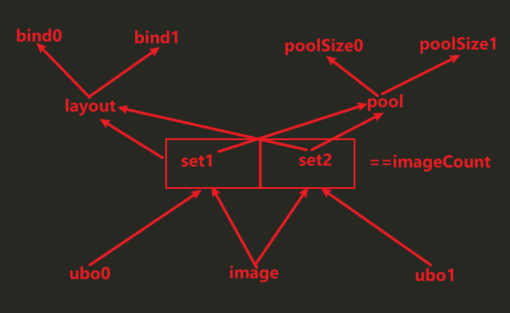

* 流程：
  * 初始化:
    * 顶点数据，新增纹理坐标，VkVertexInputAttributeDescription中新增绑定location
    * VkDescriptorSetLayoutCreateInfo新增VkDescriptorSetLayoutBinding绑定（绑定点为1（之前ubo数据为0），描述符数量1，类型为图像采样，采样器为空，阶段标志为fs阶段），绑定点数量变为数组元素数2
    * VkDescriptorPool新增VkDescriptorPoolSize（描述符数量依旧==image数量，因为不是数组形式），修改PoolSize的数量和数据引用
    * 新增VkDescriptorImageInfo（之前是VkDescriptorBufferInfo），关联VkImageView（之前descriptor和buffer关联，现在和image的包装imageview关联）、VkSampler
    * 新增VkWriteDescriptorSet（绑定点改为1，描述符类型图像采样，引用VkDescriptorImageInfo）
    * vs：layout(location = 2)新增布局，并把它out输出给fs
    * fs：layout(binding = 1) uniform sampler2D新增纹理传入，和in接收vs的输出，颜色值从texture采样
    * 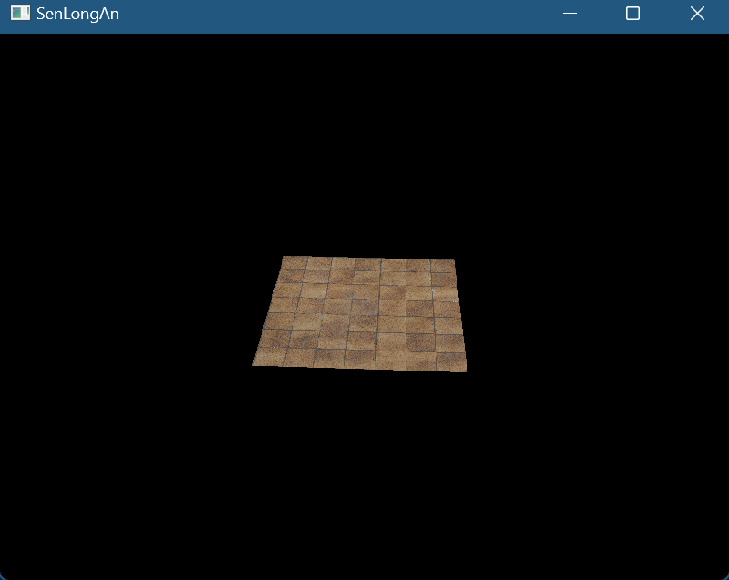

# 深度测试

* 流程：
  * 初始化:
    * 修改测试场景：顶点、索引数据：我们创建两个具有前后关系（z值不同）的quad作为测试场景
    * 创建附件：
      * VkImage（对于格式获取物理设备支持的格式特性，如果候选格式中支持需要的特定则选择它，纹理单元排列方式OPTIMAL因为不需要手动按纹素填充数据），Memory（CPU不需要memcpy而是由GPU深测阶段填充，因此memory类型是VK_MEMORY_PROPERTY_DEVICE_LOCAL_BIT对GPU访问进行了优化），最后将image和memory绑定
      * 为image创建ImageView，格式和image一致，指定图像的哪些方面包含在视图中（此处为深度）
      * framebuffer：需要把新的imageview作为framebuffer的attachment的一部分
    * 创建附件描述：
      * 新增VkAttachmentDescription深度附件描述，和color不同的是，深度数据不需要呈现，因此pipline使用后不需要保留数据，因此storeOp可以指定dont care，把这个附件添加到VkRenderPassCreateInfo中
      * 为subpass新增VkAttachmentReference
      * 修改VkSubpassDependency，这里我们只创建了一个image，因此在dependency中应该等待之前的所有subpass深度写入完成
    * 设置深度测试的状态：
      * Pipeline中VkPipelineDepthStencilStateCreateInfo，设置为启用和测试方式
    * vs：把顶点属性的ve2变为ve3
  * 每帧：新增深度的VkClearValue
  * 销毁：vkDestroyImageView、vkDestroyImage、vkFreeMemory
  * 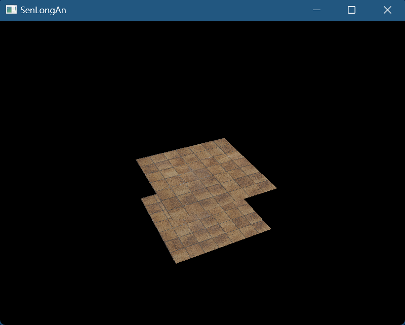

# 加载模型

* 流程：
  * 初始化:
    * 我们将使用 tinyobjloader 库，加载obj文件，LoadObj获取数据，通过遍历范围值，将获得Vertex数据（pos，纹理坐标）和indices数据，把之前场景使用的顶点数据删除就好
    * 渲染模型和渲染自定义的网格体，没什么差异，其实就是改一下使用的顶点数据
    * 注意我们使用glm是，S\*R\*T\*V的顺序
    * 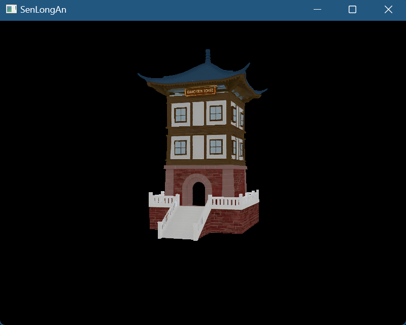

# mipmap

* 流程：
  * 初始化:
    * 为纹理生成mipmap：
      * 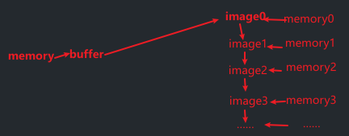
      * mipLevels级别取决于原分辨率的大小,新生成的个数为log2 ^max(width, height),再加上原图像即+1
      * 创建staging buffer：依旧把纹理数据存储在staging memory中
      * 创建image和memory：
        * 创建image时，应指定mipLevel数量（创建mipLevel数量个image），usage需要新增TRANSFER_SRC（因为要根据它们创建下一级别的image）
        * memory会根据image的Requirements请求内存，因此和image的miplevel数量一致
      * 布局转换：第一次transitionImageLayout图像布局转换时（转换为TRANSFER_DST），也应指定mipLevel数量（这里把所有level图像都转为了dst）
      * copy数据：然后正常执行copy操作（VkBuffer+Memory -> VkImage+Memory），这里mipLevel指定为0（表示仅copy数据到第0层mipmap）
      * 不需要第二次图像布局转换（转换为SHADER_READ）
      * 生成mipmap：
        * 根据图像format从物理设备获取属性看是否支持采样
        * beginCommandBuffer：
        * for循环中：
          * 按照下面方式循环mipLevels - 1次（对于image0，已经从buffer copy数据了，也就是从image1开始，到最后一个image，每次对于imagei先把前一个imagei-1布局转换为TRANSFER_SRC，然后传输数据到imagei，然后再把imagei-1布局转换为SHADER_READ_ONLY，以便可被shader读取，最后要把最后一个image也转换SHADER_READ_ONLY布局）
          * 使用Barrier进行布局转换，其中mipmap levelCount可访问的数量为1，baseMipLevel开始层为i-1
          * 同步：
            * 第一次布局转换：等待之前传输写入完成，才能进行传输读取
            * 第二次布局转换：等待传输读取完成，才能被shader读取
          * VkImageBlit
            * Offsets：源区域范围（分辨率），目标区域范围（分辨率）
            * 源子资源：数据为颜色，mipmaplevel 为i-1，层为0
            * 源子资源：数据为颜色，mipmaplevel 为i，层为0
          * vkCmdBlitImage，源图像和布局，目标图像和布局，VkImageBlit引用，缩放时应用的过滤器（线性过滤）
        * EndCommandBuffer
    * createTextureImageView:要指定mipmap的levelCount
    * VkSampler：
      * 限制计算出的LOD值（Level of Details多细节层次:根据模型的节点在显示环境中所处的位置(Screen Size)和重要度，来决定物体渲染的资源分配）的最小值和最大值（如果不想限制最大值，将指定为VK_LOD_CLAMP_NONE），
      * 添加到 mipmapLOD计算中的偏移量
      * 我们可以修改minLod来观察纹理lod的效果
      * 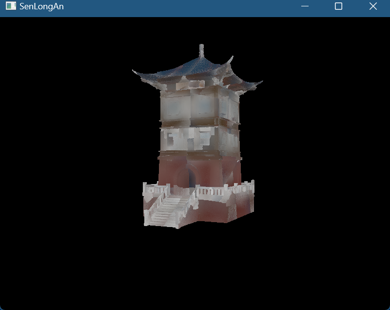

# 多重采样

* 我们要在原来的swapchain上多采样渲染，最后应该还原为1采样点，所以要创建新的image，底层会为我们自动转换
* 流程：
  * 初始化:
    * 查询采样数量：获取PhysicalDeviceProperties，对于颜色采样数量和深度采样数量，取共有标志（位掩码），如果共同拥有某采样点数量的支持则选择（此处选用最大支持数量，因为具体采样数量是由Pipeline中设置的）
    * 创建新的附件：创建image和memory，和image view，Framebuffer中新增这个imageView
    * 附件描述：
      * RenderPass中，让colorAttachment和depthAttachment的samples数量修改为现用数量，把此colorAttachment的finalLayout改为COLOR_ATTACHMENT（因为它不再需要直接呈现）
      * 新增附件描述，samples数量为1，finalLayout为PRESENT_SRC，把此附件添加到VkRenderPassCreateInfo中，并在VkSubpassDescription中新增此附件
    * Pipeline中：把VkPipelineMultisampleStateCreateInfo的rasterizationSamples数量修改现用数量，我们可以启用样本着色sampleShadingEnable，和设置样本着色的最小分数minSampleShading，来产生更好的效果（内部的高对比度颜色）
  * 销毁：vkDestroyImageView，vkDestroyImage，vkFreeMemory
  * 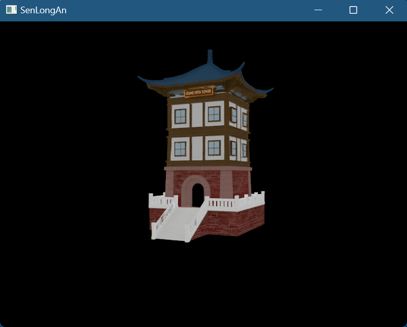
  * 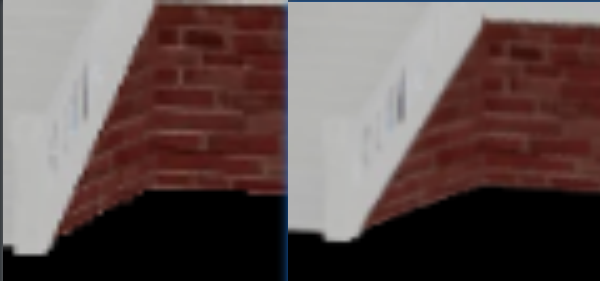

# 粒子

* CS计算着色器：
  * 位置：不属于图形管线的一部分，是独立运行的，
  * 作用：可以让GPU进行计算工作，包括图像处理、可见性测试、后期处理、高级光照计算、动画、物理，也包括非图形计算工作
  * 优势：GPU硬件高度并行特性使得非常适合做密集型计算（拥有数万个小型计算单元，而CPU只有几个大型计算单元），并且不需要数据从CPU传输到GPU的消耗性能的操作，所有的数据都存储在GPU
* 粒子：
  * 通常有数千个组成，传统方法是将粒子的顶点数据存储到CPU内存中，再传输到GPU的内存中，然后每帧使用CPU更新它们，再次传输到GPU的内存中，以便显示更新后的粒子，这个传输操作非常昂贵
  * 如果基于GPU，我们只需要首次传输，之后的更新都在GPU的CS中完成，这样就不必每帧从CPU传输数据
* CS像其他shader一样也可以处理数据和图像：
  * 和vs有顶点缓冲一样（通常称为vbo顶点缓冲对象），cs也有存储缓冲（通常称为SSBO着色器存储缓冲对象）
  * 数据依旧使用VkBuffer包装，为了让它用于cs的存储缓冲，需要添加标志VK_BUFFER_USAGE_STORAGE_BUFFER_BIT，shader中使用layout(std140, binding = 2) buffer，可以像数组一样读取和写入，readonly和writeonly限定符，std140内存布局限定符，它确定成员元素在内存中如何对齐，这是CPU和GPU内存映射必须的
  * VkImage添加标志，VK_IMAGE_USAGE_STORAGE_BIT，shader中计算着色器中使用imageLoad和imageStore完成存储图像的读取和写入
* 流程：
  * 初始化:
    * PhysicalDevice选择和queue：
      * 选择支持compute QueueFamilies的PhysicalDevice，新增QueueFamilies的VK_QUEUE_COMPUTE_BIT标志的判断
      * 除了之前的graphics和present，还要根据QueueFamilies index从device获取compute queue
    * particle数据：
      * 创建9000个粒子，使用random伪随机生成particle数据（2D位置，速度，颜色）
    * 创建VkBuffer和memory：
      * **注**：这里particle数据被buffer包装后，particle数据既可以作为顶点数据存储在vbo中，又可以作为存储数据存储在ssbo中
      * 依旧先创建staging的VkBuffer（VK_MEMORY_PROPERTY_HOST_VISIBLE_BIT以便可以将数据从CPU写入，TRANSFER_SRC传输源）和memory，particle数据填充到memory
      * 创建当前的VkBuffer和memory（VK_BUFFER_USAGE_VERTEX_BUFFER_BIT用于vs的vbo、 VK_BUFFER_USAGE_STORAGE_BUFFER_BIT用于cs的ssbo、另外VK_BUFFER_USAGE_TRANSFER_DST_BIT用于从staging传入数据，
      * 注意当前的VkBuffer和memory个数要为2个（当前帧和上一帧）
      * copy数据，两个buffer都要拷贝
    * Vertex
      * 描述：particle数据作为顶点数据时，需要创建BindingDescription和AttributeDescription，对于velocity不用添加到描述中，因为它仅供cs使用
      * graphic Pipeline：VkPipelineVertexInputStateCreateInfo中依旧绑定Description
      * 每帧：vkCmdBindVertexBuffers绑定上面创建的VkBuffer
    * uniform数据
      * 创建：VkBuffer（UNIFORM_BUFFER用于ubo，HOST_VISIBLE可以被主机CPU写入）和memory，只进行vkMapMemory内存映射，填充数据放在每帧中进行
      * 数据成员：deltaTime
      * 每帧：
        * 计算新数据：glfw获取cur time - last time
        * memcpy更新ubo
    * Descriptor：
      * **注**：我们的ssbo、ubo都要使用descriptor
      * Layout：要创建3个bind（一个ubo，两个SSBO当前帧和上一帧），描述类型（ubo、ssbo），着色器访问阶段（cs）
      * Pool：有两个poolsize，第一个是ubo，第二个storage存储数据，描述符数量要*2（当前帧和上一帧）
      * set：创建3个VkWriteDescriptorSet，以便将ubo、ssbo和set绑定
      * **注**：
        * 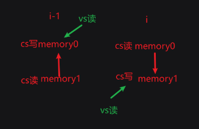
        * set0绑定buffer1，buffer0，set1绑定buffer0，buffer1，这样就可以cs的ping pong交换数据，第i-1帧使用set0利用buffer1计算新数据到buffer0，第i帧使用set1利用buffer0计算新数据到buffer1
        * cs中修改的memory的数据，由于和vbo使用同一buffer,所以：
        * vkCmdBindVertexBuffers(commandBuffer, 0, 1, &shaderStorageBuffers[currentFrame], offsets);
        * 每帧会读取到新的数据（GPU修改顶点数据），由于currentFrame每帧更新，读取0，1，0，1……正好和上面对应
    * Compute Pipeline：
      * 创建VkShaderModule，和VkPipelineShaderStageCreateInfo，和之前差不多，只需要改stage为computer
      * VkPipelineLayoutCreateInfo，引用VkDescriptorSetLayout
      * vkCreateComputePipelines而不是vkCreateGraphicsPipelines
    * cs：
      * 工作组workload：抽象为3维模型，将所有工作任务组成workload，每个workload都执行相同的调用集合，它们可以并行，维度在cs中设置
      * 调用invocation：
      * layout (local_size_x = 256, local_size_y = 1, local_size_z = 1) in;（由于是一维数据，因此只需要工作组的x维度）
      * 接收3组数据，根据输入的上一帧粒子SSBO数据 + 速度（矢量）*时间 来更新位置输出到当前帧SSBO
      * 如果粒子到达屏幕边界，速度方向就反向
    * vs：接收顶点位置和颜色，gl_PointSize设置顶点大小，gl_Position输出顶点位置
    * fs：接收vs out的颜色，输出
    * computer CommandBuffer：从command pool分配computer CommandBuffer，和graphic CommandBuffer一样数量
    * computer同步原语：创建computer的Semaphores和fence
    * graphic Pipeline：
      * AssemblyState的topology从TRIANGLE变为POINT
      * DepthStencilState删除，不需要深度测试了
      * 由于graphic不需要使用ubo，因此pipelineLayout更新为空
  * 每帧
    * computer部分：(不需要acquire)record（bind computePipeline，BindDescriptorSets，vkCmdDispatch让cs开始计算）->Submit(不需要present)
    * 同步：
      * 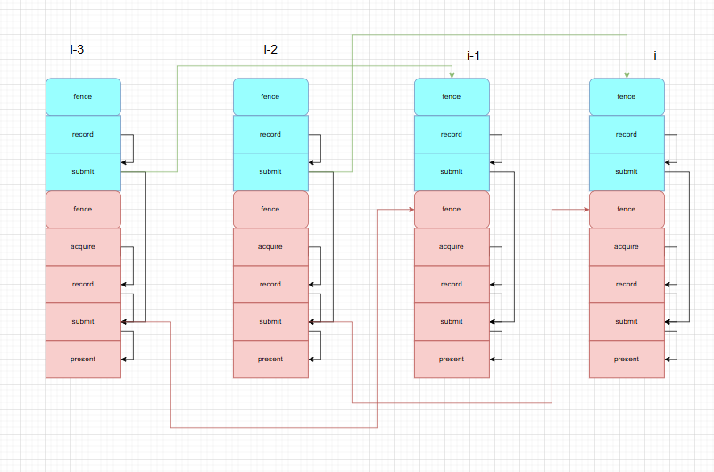
      * 允许多帧并行（三缓冲下2帧并行），graphic和computer分开，对于第i帧，如果i-2帧的computer完成，就可以执行当前computer
      * 对于单帧：按序执行，graphic需要在computer后
* 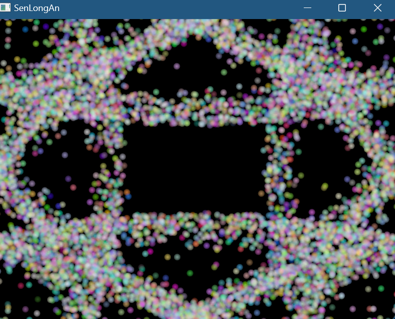