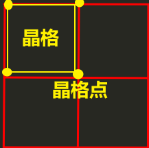
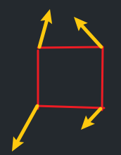
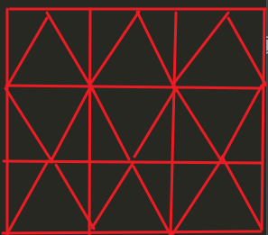
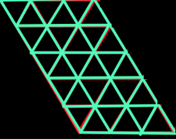

# 噪声

* 作用：提供随机值
* 使用场景：地形生成，渲染效果……
* 噪声分类：
  * 晶格：
    * 
    * 思想：在一个规则的空间网格（晶格）的顶点（晶格点：网格交叉点）上预定义随机值，然后通过插值计算网格内部任意点的值
    * 特点：
      * 随机性
      * 哈希性/可预测：
        * Minecraft中，只会加载以玩家为中心一定范围内的区域，超过范围的部分卸载，新的部分加载，但是当回到原来的区域时，希望看到和之前相同的结果
        * 哈希算法/散列算法：
          * 将任意长度的数据输入转换为固定长度输出值的数学函数
          * 输出结果通常被称为：哈希值
          * 包含输入/输出：一维/二维/三维
          * 特点：
            * 确定性：相同的输入总是产生相同的输出
            * 抗碰撞性：几乎不可能找到两个输入不同，但哈希值相同
            * 雪崩效应：输入数据的微小变化，应引起输出值的显著变化，这样有效保证哈希值的随机性
            * 固定长度输出：所有哈希算法的输出长度是固定的，不随输入长度而改变
      * 平滑性：不同于random函数（rand（0 到 RAND_MAX 之间的整数，伪随机数（每次生成相同的随机数序列），种子值为1），srand（用于设置随机数生成器的种子，每次生成不同的随机数序列，种子值为时间））生成的随机值，它提供的随机值更加平缓
    * 代表：Value，Perlin，Simplex
  * 点：
    * 思想：在空间中随机分布一系列的特征点，然后计算空间中任意点到其最近几个特征点的距离，并基于这些距离生成数值
    * 特点：不连续，不可预测
    * 代表：Worley，Voronoi，Cellular Noise
* Value噪声
  * 思想：定义若干晶格点，每个晶格点都包含伪随机值，某个坐标的输出值：附近所有顶点对它影响的叠加（距离越近权重越大）
  * 步骤：
    * 创建晶格：二维：正方形（创建三维地形用二维晶格），三维:超正方体
    * 附近顶点：输入点坐标，找到它所在晶格点（对应晶格的顶点）（二维下有4个（正方形），三维下有8个（超正方体），N维下有2^n个）
    * 伪随机值：根据一维哈希函数获取这些顶点的伪随机值
    * 插值计算：直接使用双线性插值（直接以输入点的x/y相对坐标作为权重），会导致明显的不连续性，我们使用缓和曲线作为权重，s(t) = 3t^2−2t^3（开销更小） / 6t^5-15t^4+10t^3（效果更好，适用于预计算），输入t为输入点的x/y相对坐标
* Perlin柏林噪声
  * 
  * 思想；和上面差不多，主要是伪随机值-》伪随机梯度向量（二维哈希函数），晶格点伪随机值-》晶格点伪随机梯度值：梯度向量 点乘 距离向量（以晶格点为起点，输入点为终点）
* Simplex噪声
  * 
  * 
  * 思想：和上面差不多，主要是晶格不再是方形，而是单形（一维：线段，二维：三角形，三维:四面体），对于正方形，N维下有2^n个，而单形N维下有n+1个，这可以使得我们大大减少计算量
  * 问题：如何找到输入点所在的单形？对单形网格结构进行坐标偏斜（两个单形对应平行四边形）变成正方形网格结构（两个单形对应正方形），以便像之前一样可以坐标取整（获得晶格左上点），通过xy+-size找到晶格点
  * 步骤：
    * 创建晶格：同上
    * 输入点的坐标偏斜：坐标偏斜公式：x` = x +（x + y +……）* K1,省略号是输入坐标所有分量，K1 = (sqrt(n + 1) - 1 ) / n，n是几维空间，坐标偏移将点映射到正方形网格结构，即可得到所在的正方形
    * 附近顶点：确定在哪个单形：把输入点分量和取整分量相减（相对位置差值）（在正方形网格结构中计算），分量降序排序，取整点记为(0,0,0)，哪个分量大就先加哪个，比如x>z>y,则其余3个点为(1, 0, 0)(1, 0, 1)(1, 1, 1),此处0/1都是增量delta
    * 伪随机梯度向量：在正方形网格结构获取单形顶点的伪随机梯度向量（二维哈希函数）
    * 距离向量：对3个顶点逆偏斜公式变换到单形网格结构，x = x· +（x· + y· +……）* K2，K2 = (1 / n + 1) - 1 ） / n，从而得到距离向量
    * 伪随机梯度值：同上
    * 插值计算：同上
  * 比起Perlin：效果更好、速度更优
* 无缝噪声纹理
  * 用上面方法也可以生成噪声纹理，但它不支持无缝衔接，有两种方法可以实现无缝衔接：
    * 翻转纹理：
      * 对一张已生成的噪声纹理分别进行X轴翻转，Y轴翻转，XY轴同时翻转，将它们拼成一张大纹理
      * 优点：简单高效
      * 缺点：过于对称
    * 高维度圆采样：
      * 在2n的维度下计算（例如将二维纹理的每个坐标点uv，通过三角函数映射到四维空间的圆形上，然后根据四维噪声算法（输入点xyzw在4维的simplex晶格）来采样噪声值）
      * 映射：对于0——1的uv坐标，*2Π映射到圆形，cos获取单位圆下x分量，\*dx缩放半径（控制噪声频率），/2Π归一化，+offest偏移量
      * 结果：将 生成 一张2D的无缝噪声纹理，这样可以支持预计算，平铺使用，对于每个区块是完全重复的，区块间是无缝的
      * 作用：让生成的有限大小的纹理，可以重复使用而不产生接缝
      * 四维的w是什么方向
      * 优点：效果好
      * 缺点；计算量增加，复杂度维2^n
* 分形噪声
  * 可控参数：
    * 频率frequencies：输入参数的缩放，晶体格的边长越小，频率越高
    * 振幅amplitudes：返回结果的缩放
  * 作用：模拟更自然的噪声
  * 思想：
    * 使用不同参数多做几次计算（这些称为倍频），最后结果叠加（加权平均）在一起
    * 倍频选择
      * frequencies = 2^i（倍频索引）
      * amplitudes = persistence^i， persistence用于控制高频细节对最终结果的贡献强度，取值为0——1，通常为0.5，越接近0快速衰减，平滑地形，细节很少，越接近1慢速衰减，粗糙地形，大量细节
      * Σi=0——n noise(2^i point（xy）) * amplitudes, n为倍频的个数 ： noise(x,y) = 1/2noise(2x,2y) * amplitudes + 1/4noise(4x,4y) * amplitudes……
    * 倍频数量越多，计算时间越久，噪声越自然