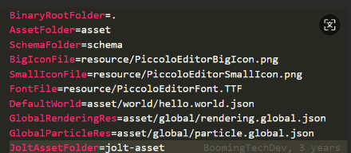

# 课程目录

课程分为3部分，共22节课

* 架构概述
  * 导论
  * 分层
  * 渲染中的数学
* 各核心系统原理
  * 大气和云
  * 渲染管线
  * 后处理
  * 动画技术
  * 物理系统
  * 粒子
  * 工具链
  * gameplay
  * 网络
* 前沿领域简述
  * 动态GI
  * GPU
* piccolo源码解读

# 架构分层

* 
* gameplay->editor->runtime(function->resource->core->platform)->三方库->操作系统->驱动->硬件
* 为什么分层：
  * 让不同部门专注于特定层优化
  * 遵守封装，降低耦合度
* editor
  * 工具层editor：编辑器_用户交互界面，允许其他人使用工具开发游戏
    * 编辑器：世界、资产文件、世界层级、属性、菜单、工具、材质、节点、动画……
    * 代码量是最大的
    * 和其他GCC工具（maya，max……）统称为工具层
* runtime
  * 功能层function：不同子系统，是中间层
    * 子系统分类：渲染、动画、UI，物理，IO，玩家，相机，逻辑，输入
    * 每帧更新：logic（相机，控制器，动画，物理……），render（相机，裁剪，场景渲染，后处理，呈现）
    * 让gameplay层方便扩展API
    * 必不可少的多线程
  * 资源层resource：资源管理，是中间层
    * 离线资源导入：
      * 预处理加载资源：
        * 资源分类：纹理，骨骼，模型，音频，动画，关卡地图，材质，数据文件，脚本，字体……
        * 资源resource到资产asset转换：转换可以被GPU处理的格式、提取有用的数据、压缩
        * 作用：提高运行时访问速度
      * 统一访问方式：通过统一抽象层（继承体系），访问所有类型的元资产（asset的各种数据）
      * 复合资产文件：涵盖所有资源
      * 为asset映射路径：path
      * 全局唯一标识符：GUID
    * 运行管理：
      * 资产系统：通过path动态的加载卸载asset（不同资源有不同生命周期，延迟加载（在运行到某节点加载），垃圾回收：不需要的asset要即时释放）
  * 核心层core：功能的内核，提供各个功能系统所需的各种工具和功能
    * 数学：强调运算效率，可以接受近似结果
    * 数据结构：c++数据结构不易直接使用，需要专门写一层封装，因为容易造成内存浪费
    * 内存管理：优化点：1.把数据集中存放；2.按照顺序结构排列；3.批处理分配和撤销
  * 平台层platform：对接不同平台，使游戏开发不受平台差异影响
    * 图形API：RHI渲染硬件接口，多个GPU架构以及SDK
    * 文件系统：路径（正斜杠、反斜杠），环境变量，目录遍历
    * 操作系统
    * 输入输出设备
    * SDK
* 引擎常用三方库：
  * 窗口输入：glfw
  * 数学：glm
  * GUI：imgui
  * 模型加载：tinygltf、tinyobjloader、Assimp
  * 日志：spdlog
  * 纹理：stb_image、ktx
  * 序列化：cereal、json11、yaml-cpp
  * 物理：JoltPhysics、Box2D
  * vulkan资源管理：vma
  * Vulkan内存分配库：vulkanmemoryallocator
  * 控件：ImGuizmo
  * 随机数生成器：random
  * 反射：rttr
  * cereal：json
  * 实体组件：eventpp、entt
  * vulkan SDK
  * 矢量字体：msdf-atlas-gen
  * 文件系统监控：filewatch
  * 嵌入C#脚本支持：mono

# 构建运行

* cmake . -B build  生成工程文件
* cmake --build build 构建
  * vs中：（需要将PiccoloEditor设置为开始项目）
    * JobSystemThreadPool.cpp(115,27): error C3688: invalid literal suffix 'us'; literal operator or literal operator template 'operator ""us' not found
      * us微妙，编译器无法识别
      * 加入头文件#include \<chrono> using namespace std::chrono_literals;
    * LINK : fatal error LNK1104: cannot open file '..\..\3rdparty\JoltPhysics\Build\Debug\Jolt.lib'
      * 是因为JoltPhysics这个项目开启了“将警告视为错误”，因此也就没有生成Jolt.lib文件，链接时也就找不到这个文件
      * 把这个project的属性，C/C++ ->General->Treat Warnings As Errors设置为No即可
* bin/PiccoloEditor 运行
* 

# 源码解读

piccolo引擎共有9个迭代版本，编程语言：c++/C，图形API：vulkan，版本管理工具：git，构建工具：cmake，平台支持：windows/linux/macOS,代码量：31481行代码

#### runtime文件夹下文件内存分布

function > core > resource > engine > platform

#### 文件解读_简述：

* 以‘ . '开头的（.github，.gitlab，.clang-format，.clang-tidy，.gitignore）文件，是各个工具的配置文件
* cmakelists.txt是cmake的配置文件
* LICENSE授权，README、releasenotes自述
* scripts和build + 平台 开头的bat批处理文件，为了方便构建写的脚本文件（生成工程 + 构建）
* engine:
  * 
  * **3rdparty** 第3方库的源码/2进制文件
    * glfw  管理窗口、图形API上下文、输入和事件循环 的跨平台库
    * glm   数学库
    * imgui  用户ui库
    * json11 数据序列化库
    * spdlog 日志库
    * stb 实用工具库
    * tinyobjloader 轻量级OBJ模型加载器
    * vulkanmemoryallocator Vulkan内存分配库（简化GPU内存管理）
    * vulkanSDK  图形APISDK
  * **bin**： 包含parser解析器文件，在构建时，解析c++文件，根据template模板文件生成功能性代码（_generated序列化文件）
  * **template**：c++模板文件
  * **asset**引擎启动时需要的资产，资产文件夹映射的位置
    * json是序列化文件（这些都是手动编写的）（粒子、渲染（天空纹理、颜色，环境光，相机，定向光）、世界、关卡、玩家、动画、控制器、材质（玩家，黄金，银，白），栅栏，地面，楼梯，墙……）
    * 资产：图片（jpg、png、hdr、tga），模型（obj）
  * **configs**引擎启动时需要的文件
    * 
    * PiccoloEditor.ini:
      * 要在main中输入，最终会被config_manager解析
      * resource路径在editor/resource下，这里包含piccolo图标icon资源
  * **shader**引擎启动需要的shader
  * **jolt-asset**：物理库相关的shader
  * source源码
    * **_generated**存放反射、序列化，程序生成的文件(都已.gen.h扩展名结尾)
    * **meta_parser**：paser解析器源码
    * **precompile**：包含camke脚本和配置文件，使得cmake在构建前使用parser解析源码
    * **test**用于存放测试代码
    * editor编辑器
      * resource编辑器相关资源
      * include头文件
        * axis:位移旋转缩放 继承RenderEntity
        * editor_file_service：获取父节点指针，检查文件数组，获取根节点
        * editor_global_context：初始化，清理，包含场景管理，输入，窗口，引擎
        * editor_input_manager：按键，重置，光标按下，滚轮，鼠标点击，窗口关闭，更新光标轴，  获取窗口位置、大小
        * editor_scene_manager：获取旋转对象的id、矩阵，获取编辑器轴模式
        * EditorUI继承window_ui并重写方法
        * **editor**编辑器核心,初始化，运行，清理
      * source源文件
        * **main**核心入口点
          * PiccoloEngine，PiccoloEditor，对它们分别初始化，
          * 对editor运行（这里会调用engine的运行），最后清理
    * runtime运行时
      * **engine**引擎核心
        * 函数：
          * 公开：
            * 初始化（空定义），清理（空定义）
            * 开始，反射系统注册元数据，global_context开始系统
            * 结束，global_context结束系统，反射系统取消注册元数据
            * 运行，global_context中的window_system，当窗口没有关闭就会一直运行，计算DeltaTime时差（利用chrono库），每帧
            * 每帧更新：逻辑、计算FPS、交换逻辑和渲染的数据、渲染，其他的不易划分到逻辑渲染中（物理世界，时间轮询，窗口标题）
            * 退出，
          * 私有：
            * 每帧逻辑更新：global_context中的world_manager更新tick，global_context中的input_system更新
            * 每帧渲染更新：global_context中的render_system更新
            * 计算fps
            * 获取fps
        * 友元：editor
      * platform平台层:
        * 文件系统 file_service，获取文件路径名（其他文件使用时#include）
        * 路径 path：获取相对路径、路径段、文件扩展名、文件名（其他文件使用时#include）
      * core核心层:
        * 基础 base ：宏（日志（log_system的log），睡眠，转换为字面值，断言）、哈希函数（以便获取随机值）
        * 颜色 color：rgb成员的类
        * 数学库 math
          * vec2、vec3、vec4、matrix3、matrix4、transform（SRT）、random、quaternion四元数、math（Radian弧度、Angle角度、Degree度），axis_aligned轴对齐包围盒、math_marcos宏（最小最大……），math_headers所有math头文件的汇总
        * 日志 log
          * log_system，日志等级的枚举（调试，信息，警告，错误，极为严重的错误），spdlog库的logger成员，打印日志根据等级和信息，回调抛出异常
        * 元数据 meta
          * 概念：
            * 反射：运行时（指令）对 对象数据（元数据）访问/修改值 的行为
            * 元数据：
              * 通过反射能够访问到的所有数据
              * 常见有：
                * 是否为类类型、指针、const、enum
                * 类名，父类信息，实现接口，继承访问修饰符
                * field字段名，字段类型，访问修饰符，字段注释，是否为静态，
                * 方法名，返回类型，参数（类型，名字，注释），抛出的异常，访问修饰符
                * 对齐要求，对象大小，成员偏移量
            * 使用成员不属于反射：因为它是在编译器就确定了访问谁 怎样修改，而非运行时查询
            * 类的get/set不属于反射
            * 反射实现：java，c#都有反射语言特性，c++没有提供，要实现反射能力，需要自定义反射系统
            * 序列化：
              * 将对象转换为可存储的格式（JSON、XML……），以便重新转换为对象
              * 使用场景：保存/加载场景
              * 本质使用反射机制，序列化（利用反射读取对象元数据 → 保存），反序列化（读取保存的元数据 → 利用反射重建对象）
              * 优势：轻量，解耦
          * 反射 
            * reflection_register，元数据注册（在engine开始时会调用），取消注册（在engine结束时会调用）
            * reflection：
              * C++反射系统，很多头文件都使用它
              * 宏(CLASS/STRUCT标记需要反射的类，REFLECTION_BODY反射支持私有成员，META标记需要反射的成员)
              * 元数据存储结构
                * TypeMetaRegisterinterface，管理所有TypeMeta
                * TypeMeta描述单个类型元数据
              * 访问器：FieldAccessor字段、MethodAccessor方法、ArrayAccessor数组
          * 序列化器serializer：将C++对象序列化为JSON，将JSON反序列化为C++对象
          * meta_example使用示例：普通类，有继承关系的类
      * resource资源层:
        * 资产系统 **asset_manager**：
          * 在global_context创建，函数会被各个模块调用，是序列化器的接口
          * 加载（反序列化）：应传递json路径，读取文件写入到string，传给json11库，由Serializer读取
          * 保存（序列化）：通过Serializer写入到输出文件
          * 获取path：filesystem::absolute
        * 配置系统 **config_manager**:
          * 在global_context初始化，负责管理path
          * 公有方法：
            * 初始化：根据实参的路径，读取文件，getline读取每行，如果找到=号，就substr提取字串，将path赋值给member成员
            * 获取根目录、资产目录、最小/大图标路径，字体路径、世界路径、渲染资源路径、粒子资源路径
          * 私有成员：
            * filesystem::path各个路径
        * 元数据 res_type
          * 全局数据 global（应用于所有物体）
            * 粒子数据 global_particle：发射周期、次数、步长、生命……
            * 渲染数据 global_rendering：地图边界，定向光，天空盒，天空颜色，环境光色，相机
          * 通用数据 common
            * 世界 world：名字，路径，默认关卡路径
            * 关卡 level：玩家名字，重力值，
            * 对象 object：类型名，组件名
          * 组件数据 components
            * 动画 animation：变换，骨骼路径，混合状态，帧位置（0——1），
            * 相机 camera：fov，垂直偏移，光标旋转，速度，参数
            * 粒子发射器 emitter：局部变换，速度，大小，类型，生命，颜色
            * 网格 mesh：变换，材质，子网格
            * 运动 motor：速度，跳跃高度，最大速度，冲刺速度
            * 刚体 rigid_body：全局变换，形状类型，包围盒
          * 其他数据 data
            * 动画片段 animation_clip：名字，关键帧位置，旋转位置，总帧，通道
            * 动画骨骼节点 animation_skeleton_node_map：转换
            * 基本形状 basic_shape：半径，高度
            * 动画混合状态 blend_state：片段数量，混合路径，混合高度，
            * 相机配置 camera_config：位置，目标，上向量，zf距离
            * 材质 material：基础色、法线纹理、粗糙度纹理、不透明度纹理、自发光纹理 路径
            * 网格数据 mesh_data：vbo，ibo，骨骼绑定
            * 骨骼 skeleton_data：名字，索引，父索引
            * 骨骼掩膜 skeleton_mask：骨骼文件路径，是否启用
      * function功能层：
        * 框架framework：运行时功能核心框架
          * 世界管理器 **world_manager**：
            * 公有函数：
              * 初始化，清理，保存、重新加载当前关卡，获取当前激活关卡，获取当前激活物理场景
              * 每帧：
                * 如果不存在world就加载世界
                * 对active_level调用tick
            * 私有函数
              * 加载世界：
                * asset_manager加载json文件，获取世界资源
                * 加载关卡
                * 找到默认关卡，设置为当前激活的关卡
              * 加载关卡：根据path调用level的加载，并添加到哈希中保存
            * 私有成员：世界是否加载，世界url，世界资源，关卡哈希，当前激活的关卡，关卡调试者
          * 关卡 level：
            * LevelDebugger：负责关卡调试，显示所有物体所有骨骼、一个物体所有骨骼、对象的包围盒……
            * **level**：
              * 公有函数：
                * 加载：
                  * 根据asset_manager加载关卡元数据
                  * physics_manager创建物理场景
                  * 粒子发射器重置
                  * 循环对象列表，创建对象
                  * 创建Character
                * 每帧：遍历所有gobject（game object）、Character、physics_scene，调用tick
                * 卸载，保存，获取所有对象、所有对象ID、当前激活的角色、关卡路径、创建对象、删除对象、物理场景
              * 私有函数：清理
              * 私有变量：是否加载，关卡url，GObject哈希，Character，PhysicsScene
          * 游戏对象 **object** ：
            * game object（gobject）：
              * 本身没有任何功能，只有挂载了component才有功能
              * 加载，保存，获取id，获取名字，是否有组件
              * 每帧：遍历所有components，调用tick
            * object_id_allocator：对象分配器，分配id
          * 组件component全都继承自 component.h 中的 Component 类，目前组件包括：
            * 动画 animation
            * 相机 camera
            * 网格 mesh
            * 运动 motor
            * 粒子 particle
            * 刚体 rigidbody
            * 变换 transform：获取/设置 SRT、变换、矩阵，每帧更新
        * 子系统
          * 动画 animation
            * animation_loader.h 加载动画帧、骨骼数据、动画骨骼、
            * animation_system.h 加载骨骼、动画、动画骨骼、混合
            * node.h ：获取名字、父物体、位置缩放旋转
            * skeleton.h：构建，重置，获取骨骼数量
            * utilities.h ：查找根据 索引/名字
          * 角色 character
            * character.h 获取id，设置/获取 位置旋转
          * 控制器 controller
            * character_controller.h 移动
          * 全局上下文**global_context**
            * global_context
              * 在Engine中开始和结束系统，管理所有子系统（引擎需要的模块）、管理器（逻辑上需要的模块）
              * 公有方法：
                * 开始系统：接受path（用于传给config_manager），对各个成员指针make_shared构造对象，并初始化
                * 结束系统
                  * 先调用各自指针的clear清理子资源，再调用reset释放内存并置nullptr
              * 私有成员：包括所有子系统的指针（日志、输入、文件、资产、配置、世界、物理、窗口、渲染、粒子、调式绘制、渲染调式配置）
          * 输入 input
            * input_system.h 初始化，每帧，清理，重置游戏命令
          * 粒子 particle
            * emitter_id_allocator.h 分配，重置
            * particle_common.h 位置、速度、大小、生命
            * particle_desc.h 粒子发射器，位置、速度、大小、生命、颜色、类型、旋转……
            * particle_manager.h 粒子pass，创建粒子发射器
          * 物理 physics
            * utils单元:获取层数量，数据类型转换
            * physics_config：数据（身体数量，屏障数量，重力）
            * physics_manager：创建物理场景
            * physics_scene：获取重力，创建刚体，更新刚体全局位置，光线捕获，是否覆盖，获取形状
          * UI ui
            * window_ui抽象基类,初始化，预处理渲染
          * 渲染 render
            * 接口
              * **RHI**：渲染硬件接口，抽象基类,都使用RHI……类型，接口被各个文件调用，其中init被render_system调用
                * 公开函数
                  * 初始化流程: 调用各个私有函数
                  * create / allocate  vulkan对象
                  * command（cmd开头的，sync……）都封装为函数
                  * get：函数返回vulkan对象,都使用RHI类型
                  * write：BeginCommandBuffer，submit……
                  * destory：销毁各种vulkan对象
                  * memory：映射……
              * **RHI—struct**：跨平台通用类型，核心类型，都使用RHI……开头
              * vulkan
                * **vma**：定义宏
                * **resource**：定义vulkan对象（仅对核心对象）封装（托管/包装），提供set、get接口，继承自RHI类型
                * **rhi**：
                  * vulkan API，核心，继承自RHI并重写函数
                  * 数据类型转换：使用RHI……对象时，转换为Vulkan……，再getResource获取Vk……对象（以便赋值给Vk……对象） / setResource设置（以便设置RHI的值）
                  * 公开函数：
                    * 重写基类
                  * 公开成员：
                    * vulkan对象，PFN_ 函数指针
                  * 私有函数
                    * instance,validation_Layer，windowsurface,physicalDevies,Device,CommandPool,CommandBuffer,DescriptorPool,SyncPrimitives,Swapchain,SwapchainImageViews,FramebufferImageAndView,Allocator
                    * 验证层，队列索引，查询设备支持，选择交换链格式……
                  * 私有成员
                    * 某些vulkan对象：格式，尺寸，信息，呈现模式……
                * **util**：
                  * 创建：着色器模块，buffer和memory、copy，创建image和imageView、cubemap、mipmap、layout、sampler
                  * 销毁：……上面
            * debugDraw调试绘制系统
              * debug_draw_buffer内存分配器，管理GPU资产
              * debug_draw_primitive图元：时间类型，图元类型，填充模式，顶点，图元
              * debug_draw_group：各个图元的列表，添加图元，获取数量，写入数据
              * debug_draw_context：获取/创建 group
              * debug_draw_font：需要创建图像显示字体
              * debug_draw_manager：核心，其他调试绘制的指针
              * debug_draw_pipeline：pipline相关的vulkan对象
            * passes不同特性的pass（都继承自RenderPass）
              * color_grading_pass.h 颜色渐变
              * combine_ui_pass.h
              * directional_light_pass.h定向光
              * fxaa_pass.h抗锯齿FXAA
              * main_camera_pass.h主相机
              * particle_pass.h粒子
              * pick_pass.h 拾取色
              * point_light_pass.h 点光源
              * tone_mapping_pass.h 色调映射
              * ui_pass.h 用户UI
            * light.h ：点光源，环境光，定向光（平行光），光源列表（点光源可以有多个）
            * **render_camera**.h
              * 世界窗口的相机
              * 属性：相机类型（编辑器，运行时），位置旋转缩放、zf距离、fov，前上右轴，视图矩阵、投影矩阵
              * 函数：获取和设置 属性
            * **render_common**.h 
              * 渲染相关数据：都以结构体形式存在
                * 存储缓冲：定向光，点光源，存储缓冲，点/平行光源阴影，粒子……
                * 网格，材质
            * render_debug_config.h ，调式模式：展示骨骼、相机信息、包围盒
            * render_entity.h ：id，矩阵，材质id，基础色，混合，法线缩放，不透明强度
            * render_guid_allocator.h 内存分配器
            * render_helper.h 上下左右前后，定义BoundingBox、BoundingSphere包围盒
            * render_mesh.h，对于VBO数据的Descriptions（vulkan）
            * **render_object**.h游戏对象id和相关描述
            * render_pass_base.h 渲染通道基类：初始化，设置信息，数据
            * render_pass.h渲染通道：继承base，帧缓冲附件，帧缓冲，描述，管线
            * **render_pipeline_base**.h 管线基类：清理，初始化，数据，前向/延迟渲染
            * **render_pipeline**.h管线：拾取网格体的GUID，重置交换链，
            * **render_resource_base**.h 资产基类：更新游戏对象渲染资产、加载纹理、hash、材质、静态网格
            * **render_resource**.h ：
              * 全局渲染资源 + 渲染资源管理器（负责所有GPU资源的管理）
              * 全局渲染资产：
                * IBL资产（brdfLUT、环境贴图、预滤波环境贴图，它们三个组成IBL贴图）（image, imageView, sampler, allocation）（宽高、格式），颜色渐变（LUT图像），存储缓冲
              * 渲染资源：
                * 函数：
                  * 上传：全局渲染资源：加载各种texture data，利用RHI创建图像
                  * 上传：游戏对象渲染资源、预帧缓冲、实体网格、实体材质
                * 成员：全局渲染资源、render_common定义的所有数据，其中mesh和material上传需要有description描述符
            * **render_scene**.h场景：
              * 用于管理所有场景对象（光源，实体）
              * 清理，更新可视对象，获取分配器，删除对象
            * **render_swap_context**.h：
              * 渲染交换上下文，负责逻辑线程与渲染线程间的数据同步，避免多线程的数据竞争
              * 交换数据结构体：
                * 数据
                  * 关卡：天空盒环境贴图、镜面贴图，颜色渐变
                  * 相机：fov，相机类型、视图矩阵
                  * 游戏对象：游戏对象的deque（双端队列）
                  * 粒子：发射器数组，粒子发射器变换
                * 函数
                  * 添加阻挡物
                  * 删除游戏对象
                  * 添加新的粒子发射器
                  * 添加帧粒子发射器
                  * 更新粒子发射器变换
              * 函数：获取逻辑、渲染 交换数据，重置各种交换数据
              * 成员：逻辑、渲染 数据索引，总数据数组
            * **render_system**.h 
              * 渲染器，渲染子系统的核心，在global_context中初始化
              * 初始化
                * 获取config_manager、asset_manager、window_system
                * 创建RHI并初始化
                * 加载全局数据：config_manager获取渲染资源path，通过asset_manager读取json文件并加载 全局渲染数据，通过swap_context，
                * 创建resource、相机、场景、管线，将这个全局渲染数据中 相应资源数据 加载到对应对象中
              * 函数：每帧，清理，交换逻辑渲染数据，获取交换资源，获取相机、RHI（返回成员），设置管线类型、初始化UI、更新视口大小、获取点击网格的GUID、通过网格ID获取对象ID，获取，获取视口大小，创建、设置可视、选择 轴，
              * 包含各个子模块指针：RHI，相机，场景，资源，管线
            * **render_type**.h 自定义RHI通用类型，目的跨平台，都以RHI……开头
            * window_system.h：注册 按键，字符，鼠标，光标，滚轮，推拽，窗口大小，窗口关闭