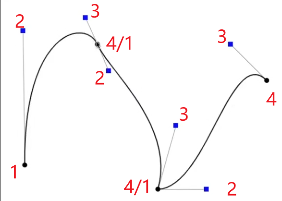
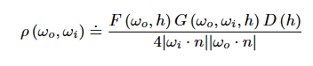

* 光栅化
  * 通过MVP变换，得知了世界空间中物体点映射到屏幕空间的什么位置
  * 光栅化将图元（点/线/三角形……）转换为片元（像素）
  * 采样法：遍历屏幕内每个像素中心的采样点，进行覆盖性测试，利用叉乘判断是否在图元内部
  * 优化：根据顶点确定包围盒范围，仅遍历包围盒范围内的采样点
  * Aliasing走样问题：锯齿，摩尔纹（moire Patterns）（水波纹），车轮效应（分不清顺逆时帧旋转）……
  * 抗锯齿：SSAA,MSAA,FXAA,TAA……详见其他章节

* 周期函数
  * 函数：y = f(x)，和编程语言的函数很相似，都有输入输出函数名函数体
  * 周期函数：形如正弦、余弦
  * 周期：是从一个最高点到下一个最高点
  * 振幅：从中线（x）到最高点/最低点的高度（y）,也是从最高点到最低点的距离除以2
  * 相移: 函数水平向右移动多远
  * 垂直位移：函数垂直向上移动多远
  * 频率：1/周期
  * y = A sin(Bx + C) + D
    * 振幅是A
    * 周期是2π/B
    * 相移是−C/B
    * 垂直移位是D

* 傅里叶级数变换
  * 
  * 傅里叶级数展开：微积分中的函数展开方法之一，任何一个周期函数都可以写成一系列的正弦余弦函数组合 + 常数项，比如一个凹凸的函数可以近似为cos函数向上移动后
  * 傅里叶级数变换：把一个函数经过复杂变换为另一函数，还可以逆变换为原函数
  * 采样和频率：频率越高的函数需要越多的采样点表示

* 深度测试
  * 3D-遮挡关系
  * 深度值计算：发生在光栅化阶段，如果像素通过覆盖性测试，根据图元3个顶点在NDC空间下的z值，和当前像素位置做插值
  * 深度值存储：计算完成将存储在寄存器中，供之后适用
  * 深度缓冲：通常分辨率和颜色缓冲一致，每个像素存储float深度值，限制到0——1之间，深度越近越接近0
  * 提前深度测试（可选）：发生在fs之前，Early-Z深度测试依赖于上一次drawcall的late-z的结果，不会更新深度缓冲，将未通过深度测试对应的片段丢弃
    * 优势：让未通过深度测试的片段不必fs计算
  * 默认深度测试（必须）：发生在fs之后（同样一个像素对应的所有颜色值也存储在寄存器中），根据比较规则和寄存器中的深度信息更新深度缓冲和颜色缓冲
  * 注意：Early-Z不会更新深度缓冲，默认深度测试的存在是必须的
    * 开启Alpha测试
    * 假如有2个物体ab，a为完全透明，b不透明，且b在a后，预期结果为呈现b
    * 如果只存在late-z：
      * ab覆盖的片元都被fs计算，Alpha测试后a未通过丢弃，b通过，与预期结果相符
    * 如果只存在early-z并允许更新深度缓冲：
      * 丢弃b片元，保留a，fs：计算a片元颜色值，Alpha测试：丢弃a，结果ab都被丢弃，和预期不符
    * Early-Z不更新深度缓冲，late-Z更新深度缓冲
      * Early-Z：深度缓冲区初始为1.0，ab通过Early-Z，fs：计算a片元颜色值，Alpha测试：丢弃a，late-z：b通过，与预期结果相符
  * 深度冲突
    * 由于深度缓冲的精度有限，可能会发生深度值相同的情况，此时会造成画面闪烁
    * 解决方法
      * 尽量不要物体靠太近
      * 使用更高精度的深度缓冲
      * 近平面设置远一些，近处精度高（在经过透视投影变换后，近处物体的深度值差异较大，远处物体的深度值差异较小）

* 着色
  * 原理
    * 不同表现效果：光的不同作用方式
    * 作用方式：散射（反射（漫反射，镜面反射），折射）吸收，被吸收的颜色，微表面方向、自遮挡……
    * 颜色：未被吸收的物体颜色传入人眼，使得我们看到物体颜色
    * 反射：
      * 笼统角度：漫反射向周围四面八方反射，镜面集中在一个镜面波瓣的反射，通常物体越粗糙越接近于漫反射
      * 微观角度：物体越粗糙，微表面越不平整，光线反射方向偏差大，微表面越平整，光线总是趋近于同一方向反射
    * 高光：镜面反射由于光线反射的聚集性，亮度很高
    * 阴影：光的直线传播中被物体阻挡，从而照射不到的物体形成阴影
    * 夹角：光线方向和法线方向夹角越大，物体接收到的光能量就越小，颜色越暗
    * 各项异性材质：微表面存在一定的方向性
    * 能量守恒：光线传播越远每个角度的能量越小
  * Blinn-Phong着色模型(近似计算场景颜色的算法模型)
    * 视线方向v，光线方向i，法线方向n，光源位置l，着色点位置o，物体颜色c，反光度s……其中inv为单位向量
    * 未被吸收/物体颜色：定义为变量
    * 不考虑折射，阴影，粗糙度……
    * 定义漫反射是均匀的
    * 漫反射：Ld = kd(I/r^2)max(0,i*n); 吸收 + 接收 + 反射，kd表示未被吸收的颜色，I为光线强度，r为光与点的距离，0限制到0——90°，不考虑从平面下方照射
    * 镜面反射：Ls = ks(I/r^2)max(0,n*h)^s, 吸收 + 接收 + 反射，ks表示未被吸收的颜色，指数反光度s越大cos曲线越陡峭，控制高光范围越小变换越剧烈
    * 半程向量h：
      * v+i的单位向量，vi两个方向的平分向量，原本比较v和r反射向量接近程度，现在比较n和h接近程度
      * 解决断层：当物体较粗糙，高光区域会很大，会看到很大的断层，因为vr超过了90度点乘为负数取0，通过转换到hn点乘，相当于从0——180°夹角范围约束到了0——90°范围，使得视线在平面上方任何角度观察，结果都>=0
      * nh夹角通常比vr夹角更小，表现为亮度更高，范围更广，可以通过增大指数来达到和冯氏光照一样的效果
    * 环境光：kaIa，颜色，强度假设对于所有位置都相同
  * 着色频率
    * 按顶点，像素根据顶点的fs结果插值，开销更小，效果略次
    * 按像素，像素根据顶点的数据插值，用fs计算，开销更大，效果更好
    * 两种方式顶点数量越多，效果越好

* 渲染管线
  * GPU渲染流水线（for(阶段)）
    * 应用阶段CPU：（准备数据和状态）
      * 准备场景数据
        * 顶点数据(顶点位置，法线方向，纹理坐标)
        * 摄像机（位置，方向，正交/透视，裁剪空间范围）
        * 光源（位置，数量，颜色，强度，方向，范围）
        * 资源（纹理，模型）
        * 渲染状态（测试规则，面剔除，背景色）
      * bind数据和状态
      * 调用drawcall，开始执行GPU渲染流程
    * 几何阶段GPU：（处理几何体）
      * 逐顶点vs（MVP，转换到裁剪空间）
      * 逐顶点ts细分 (可选)
      * 逐顶点gs几何（可选，对每个顶点增/减，性能开销大）
      * 图元装配 (将顶点装配为基本图元：点、线、三角形等)
      * 裁剪：剔除视锥外的图元
      * 透视除法：将裁剪坐标转换为归一化设备坐标 (NDC)
      * 视口变换（转换到屏幕空间）
    * 光栅化阶段GPU：（颜色处理）
      * 栅格化（覆盖性测试，将图元转为片元，插值顶点属性）
      * 逐片元fs（计算颜色）
      * alpha测试
      * 模板测试
      * 深度测试
      * 颜色混合
      * 写入颜色缓冲区
  * CPU渲染流水线（for(图元)）

* 纹理映射
  * 纹理是一块数据，可以存储任何数据
  * 纹理映射
    * 把一张纹理贴到模型表面（3维坐标映射到2维uv坐标，颜色值数据拷贝到对应位置）
    * 如何计算内部像素映射的uv位置，根据三角形图元重心插值，三角形顶点对应的纹理坐标通常会预先定义好
  * 重心插值
    * 插值时机：
      * 要为像素插值以便得知对应的纹理坐标，但纹理坐标需要在三维空间做计算而不是屏幕空间，并且要知道对应哪个图元，只有在光栅化后我们才能知道这些信息（获得所有与射线相交的图元），所以插值应发生在光栅化后
    * 透视校正公式
      * 但由于光栅化后已经不在3维空间，因此要转为3维空间
      * 转换到3维空间 + 3维重心坐标：找到像素采样点对应的三维空间位置（深度缓冲/光线步进……），和图元的3个顶点位置做重心插值，这种方式性能消耗较大
      * 
      * 2维重心坐标 + 透视校正：和上面方法等价，并且上面方式性能低下，通常会使用透视校正方式，屏幕坐标的重心坐标，其中aby是重心坐标，z_a, z_b, z_c是3维空间中顶点深度值
    * 重心坐标(a,b,y)公式：
      * 
      * 根据不相邻三角形面积/总面积
      * 
      * 面积的计算可能不太容易，用这个公式计算重心坐标
    * 重心插值公式：aA + bB + yC,a+b+y == 1,a、b、y>0（如果不是非负，在三角形所在平面内）
    * 三角形重心，为重心坐标(1/3,1/3,1/3)的位置，它将三角形面积分为3等分
  * 屏幕分辨率 > 纹理分辨率，
    * 需要把纹理放大使得大小一致，放大时纹理的像素数量不变，像素大小变大，一个纹理像素对应多个屏幕像素，并通常查询到非整数坐标，
    * 邻近插值：四舍五入，多个屏幕像素查询同一纹理像素，形成的图像会产生一个个格子
    * 解决方法：
      * 双线性插值：
        * 找到临近的四个像素，2*2，可以根据这个uv点，首先四舍五入找到当前像素，看在当前像素的左上左下右上右下哪个方向找4个像素
        * 线性插值lerp：v0 + t(v1 - v0),t(0——1)， == tv0 + (1-t)v1
        * 水平2次线性插值，垂直一次线性插值
        * 这个x的值范围为0——1，因为两个像素中心距离最大为1
      * 三线性插值：
        * 见下方
  * 屏幕分辨率 < 纹理分辨率
    * 需要把纹理缩小使得大小一致，缩小时纹理的像素数量不变，像素大小变小，一个屏幕像素对应多个纹理像素，并通常查询到非整数坐标
    * 临近插值：四舍五入，一个屏幕像素大小（1*1，非点）覆盖更多的远处纹理像素，覆盖更少的近处纹理像素，形成摩尔纹，近处锯齿的走样
    * 解决方式：
      * 抗锯齿，但需要使用很多很多的采样点（比如512个）才能达到不错的效果，极度消耗性能
      * 范围采样：
        * 思想：可以找到屏幕像素覆盖的所有纹理像素的平均颜色值，作为屏幕像素颜色，但暴力法极度消耗性能，使用近似方法mipmap将减少性能消耗
        * 创建：从一张原纹理第0层新生成log2^n层纹理（n为原纹理max(width,height)的分辨率），每次生成的分辨率是上一次的1/4（width,height同时/2，如果width != height，短的到1为止不在变化，长的继续），像素大小为上一层的4倍，上一层每4个旧像素合成一个新像素，取像素平均值作为新像素的颜色值
        * 
        * 内存消耗：新增内存为原图的1/3，消耗非常小
        * 限制：只对正方形范围查询效果良好
        * 查询覆盖面积：
          * 方法一：找到uv像素和临近像素（上右），在uv纹理中映射的点，和计算连接向量模长，作为覆盖面积的长宽，这是因为两个像素采样点的距离为1，等于此像素的边长，根据它们估计此像素在uv中的覆盖面积是较为近似的
          * 方法二：将uv像素的4个顶点映射到uv中计算面积
          * 近似为正方形
        * 找到查询层
          * 根据像素面积，查询在哪一层会变为一个像素的大小，查询索引log2^n（n为覆盖面积的边长），在这层的uv位置获取颜色值（需要双线性插值），作为此像素颜色值
        * 非整数查询层
          * 三线性插值：如果查询到非整数层（覆盖面积边长非2的整数倍），分别在两整数层找到颜色结果，再根据覆盖面积接近两层像素大小的程度，做一次线性插值，形成均匀过渡
        * 问题：对于远处的物体，会完全模糊掉，因为它仅限正方形范围查询
          * 模糊原因：屏幕像素覆盖面积形状可能是长方形/不规则图形，方向正/斜
          * 
          * 各项异性过滤（不同方向上表现不同），和mipmap等比压缩不同，对长宽某一侧压缩，以便可以查询矩形区域, 但对于斜着的区域不友好，新的内存消耗是原本的3倍
  * 漫反射贴图：存储颜色值作为漫反射颜色值
  * 光照贴图：定义镜面反射的区域强度
  * 法线贴图：详见其他章节
  * 视差贴图：详见其他章节
  * 凹凸贴图：
    * 通过修改法线从而使得模型表面的贴图产生凹凸的错觉
    * 如何根据高度图生成法线方向？
      * 从一维函数看，切线方向是求一阶导数，法线方向垂直于切线，即将切线方向旋转90°可得到法线方向（xy对换，将x加上负号），归一化
      * 
      * 对于2维来说，思想和一维一样，分别求两个方向的导数，再旋转90°得到法线方向，归一化
  * 位移贴图：
    * 和凹凸贴图使用一致的纹理
    * 对顶点实际的移动
    * 需要顶点数量足够多，纹理分辨率足够大
    * 效果更好，性能消耗更多
  * 深度贴图：存储深度值，常用于遮蔽关系，阴影生成……
  * 环境贴图：
    * 记录所有方向的所有光源（无论直接光照/间接光照）
    * 假设所有光都来自很远处，这样不用考虑物体所在位置的影响
    * 通常用cubeMap/sphericalMap存储
    * 球体存储直接展开的扭曲问题：由于顶端周长小，中间周长大，展开到长方体上两侧会被拉伸，可以用正方体包裹球体，根据球心到球面点方向向量投射到立方体，展开立方体的6个面
  * 3D纹理：空间任何一个点的纹理值，使得物体可以看到内部
  * 噪声贴图：生成噪声算法纹理，使得物体表面变化具有随机感
  * AO纹理：

* 数学
  * x^a 幂函数，x作为底数，a作为指数
  * 正分数幂：a^(m/n) == sqrt(a^m)n
  * 负分数幂：a^-(m/n) == 1/sqrt(a^m)n
  * 小数次幂：小数转为分数
  * 复数：
    * 虚数i^2 == -1
    * 复数表示法：形如a + bi为复数，实数与虚数的组合
    * 坐标表示法：实数是一维数，都在实数轴上，复数在二维空间，复数平面，x为实轴，y为虚轴，a画在x轴方向，b画在y轴方向
  * 指数函数 a^x = y (a > 0 && a != 1) 
    * 指数函数 a < 0时，负数的非整数指数幂在实数范围内没有定义，会导致函数断裂，破坏连续性，无研究意义
    * 指数函数 a == 0时，无论x取何值，结果为0，无研究意义
    * 指数函数 a == 1时，函数是线性的，无研究意义
  * 对数函数loga^y = x
    * lg:10为底的对数
    * ln：以无理数e（e=2.71828...）为底的对数，叫作自然对数
    * log2^n = x: n\==1->0,n\==2->1,n\==4->2,n\==8->3,n\==16->4,n\==32->5,n\==64->6,n\==128->7,n\==256->8,n\==512->9
      * x从0开始每次+1，n从1开始每次变为上一次的2倍
      * 前n-1层节点数量 == 第n层节点数量-1

* 几何
  * 隐式：
    * 数学表达式
    * bool运算：并集，差值，交集
    * 距离函数SDF：两个物体求得距离函数后混合，可以得到有趣的几何体
    * 分型
    * 缺点：很难知道哪些点满足表达式
    * 优点：容易判断一个点是否满足表达式，将点带入表达式，如果结果为负在物体内，0在物体表面，为正在物体外
  * 显示
    * 图元（点云，线（直线/曲线），三角形）
    * 参数映射方法，由2维空间转换到3维空间的函数
      * 优点：很容易知道包含哪些点
      * 缺点：很难判断一个点是否在表面上
  * 曲线
    * 贝塞尔曲线
      * 通过一系列控制点定义曲线
      * 曲线一定经过原始起点终点控制点，并不一定经过原始中间控制点
      * 曲线一定在控制点形成的凸包内（包裹所有图形的最小范围）
      * 算法：
        * 递归：
          * 输入所有控制点
          * 状态转移：根据所有线段生成新的点（线性插值：v0 + t(v1 - v0)，for权重值t 0——1），对新点形成的新线段递归
          * 返回条件：每个t值新生成点的数量==1
          * t的取值间隔决定最后一层控制点的数量，连接这些点，组成最后的线段集合
      * 多项式展开
        * 任意n阶贝塞尔（n+1个控制点），任意时间t，最后一个点可以用第0层所有点的线性组合表示
        * 
        * 
        * bj第0层的索引j点
        * 系数Bj伯恩斯坦多项式，（n i）二项分布——概率统计学：详见其他章节
        * 每个Bj在同一t时间下值和为1
      * 分段考虑
        * 
        * 将起始和终点连接，有的中间控制点在线段的一边，有的在线段的另一边，这样是可以生成曲线，但并不直观
        * 我们分段考虑，每4个点生成一条曲线
        * 如何保证各个分段平滑过渡
          * 上一段终点==下一段起点
          * 上一段的最后两点方向，这一段前两点方向，方向一致，长度相同
    * 样条线
      * b样条线，修改一个点，仅会影响一部分范围
  * 曲面
    * 贝塞尔曲面
      * 比如给4*4 16个点，先从u方向，生成4条贝塞尔曲线，根据时间t，沿着v方向，查找4个曲线上的控制点，生成数条贝塞尔曲线
  * 网格细分
    * 细分：将由三角形面表示的网格，增加三角形数量
      * loop细分
        * 引入点：将一个三角形变为3个三角形，连接各个边的中点
        * 移动点：
          * 区分新增点和旧点，我们将根据不同规则移动位置，使得网格体更加平滑
          * 
          * 新点：找到菱形区域，ab，cd，根据公式线性差值
          * 
          * 旧点：找到6边形区域，n是和中心点相连的边的数量，u为周围旧点数量
        * 局限：仅限于三角形网格
      * catmull clark细分
        * 对于非三角形网格比如四边形网格
        * 四边形，非四边形，奇异点（和它相连的边数量 ！= 4）
        * 引入点：每个面取中点，和此面所有边的中点连接起来，这样新增了一个点和数条边，
          * 新点的边数和原面边数一致，如果原面是非四边形，则引入了一个奇异点
          * 在非四边形面引入点，一定是奇异点，
          * 引入点后就没有非四边形面了，也就是一次细分后再细分不会增加奇异点了
        * 移动点：
          * 
          * 面中间新增的点
          * 边中间新增的点
          * 旧的点
        * 适用于各种网格类型
  * 网格简化：
    * 将由三角形面表示的网格，减少三角形数量
    * 边坍缩：边的两个顶点合并到新点，边不再存在
      * 坍缩后放在什么位置：边坍缩形成的新点，应放在最优为止（二次误差度量：和周围面距离的平方和最小）
      * 坍缩哪个边：遍历网格体所有边，计算最小二次误差度量，从误差最小的开始坍缩
      * 数据结构：找到当前误差最小的边，并再坍缩一个边后，周围边受到影响要重新计算，用优先队列
  * 正规化：使得三角形面过渡更加平滑

* 光线追踪
  * 光栅化：实现全局阴影，glossy，全局光照……较困难
  * 光追: 渲染管线默认支持光栅化渲染，可以利用opengl计算着色器自行实现光追，vulkan光追扩展，实现
  * 特点：性能低，效果好
  * 设定：
    * 光线
      * 沿直线传播（实则光是波动的）
      * 不相互碰撞
      * 光线可逆性（光从光源出发到物体到人眼，从人眼出发到物体到光源）
    * 相机
      * 针孔相机 + 成像平面
  * 步骤
    * 准备场景数据
    * 光线投射：
      * 对成像平面的每个像素方向，都发射一条光线
    * 光线弹射（反射，折射） 
      * 找到场景中最近交点：
        * 光线数学表示：射线r(t)：O + td，起点 + 某时间 * 方向（单位） == t时的光线终点位置，向量相加
        * 交点：即在光线上，又在物体表面
        * 光和隐式物体求交：
          * 光和球体求交：
            * 球体数学表示：(p - c)^2 - R^2 = 0, 球面点到球心的距离的平方 == 半径的平方 
            * 交点满足：(O + td - c)^2 - R^2 = 0，
              * 求解未知数t，求解一元二次方程，根据求根公式求解
              * 检查解的合理性
                * 其中实数（b^2 >= 4ac）有意义，虚数没有意义
                * t <= 0没有意义
              * 没有解，说明相离，光线和球体没有交点
              * 有一个解，相切，有一个交点
              * 有2个解，相交，有两个交点，应该选择最近的，也就是t值最小的点 
        * 光和显示物体求交
          * 光和网格体求交：
            * 遍历每个网格，判断是否有交点，最后取t最小的交点
            * 光和三角形求交：
              * 方法一：
                * 光和三角形所在平面求交：
                  * 
                  * 平面数学表示：(p - p\`)*N，任意一点p到平面一点p\`形成的向量 点乘n==0，也就是垂直
                  * 交点满足：(O + td - p\`)*N，一元一次方程求解
                * 判断交点是否在三角形内：叉乘
              * 方法二：
                * 
                * 等式左：光线，p0p1p2是三角形3个顶点,p前系数相加==1，
                * 未知数：t，b1，b2，根据下面的公式求解未知数
                * 判断交点是否在三角形内：如果3个系数>0，则在三角形平面内
          * 性质：判断一个点在封闭物体内外：如果点在物体内，向任意方向建立射线，交点一定是奇数个，如果在物体外，交点一定是偶数个
        * 光和场景求交
          * for(光线){for(图元){求交，维护最小t值}}
        * 加速求交
          * 光和物体加速求交
            * 包围盒：把复杂物体用简单的几何体包围起来
            * 轴对齐包围盒AABB：任意一边都对齐于某个坐标轴
            * 光和2D包围盒求交
              * 长方形：2个对线中心区域
              * 
              * 沿每个轴求交：沿着x轴方向，找到光线进入空间的tenter，和离开空间的texit，再沿着y轴方向找到2个t
              * 光线进入离开长方形的时刻：最后合并为两个线段交集，也就是tenter取最大值，texit取最小值
              * 判断光和盒体是否有交点：……
            * 光和3D包围盒求交
              * 长方体：3个对面的中心区域，通常用左下和右上两个点表示
              * 沿每个轴求交：……
              * 光线进入离开长方体的时刻：光线进入了3个对面，则进入盒体，光线离开任意一个对面，则离开盒体,max(tenter), min(texit)
              * 判断光和盒体是否有交点
                * 如果texit < 0，则光线在面的背后，则不可能有交点
                * 如果tenter < 0,texit >= 0, 则光线起点在盒体内，则有交点 
                * 也就是当tenter < texit && texit >= 0 则有交点
          * 光和场景加速求交
            * 加速求交按空间划分数据结构：四叉树/OCT叉树/kd树/BSP树
              * 数据结构介绍：详见其他章节
              * 算法思想：
                * 划分空间：在光线追踪前
                * 求交点：
                  * dfs：
                    * 返回条件：如果和叶节点相交，将其内所有物体，加入到res结果数组，如果光线和盒体不相交返回
                    * 状态转移：否则和子盒体**递归**求交
                  * 遍历结果数组：如果物体相交，并t值 < 当前最小t，则更新，返回t
              * 叶盒体大小多少合理：
                * 如果太稀疏：仍要遍历很多的物体求交
                * 如果太密：需要和很多很多叶盒子求交
                * 也就是要控制一个度才能达到最优效果，C~=27 * 物体数量n
              * 更适用于什么样的物体布局
                * 物体均匀分布
              * 算法缺陷：一个网格体在多个叶包围盒内，不能简单的根据物体中心位置决定它在哪个包围盒中，因为这样会忽略某个更近的物体，但如果划分到所有相交的包围盒中，又很难计算，所以一般不用空间数据结构的方式 
            * 加速求交按物体划分数据结构：BVH
              * 划分空间：按照物体划分
                * 返回条件：每个包围盒内包含较少物体（比如<5）
                * 状态转移：找到当前长度最长的维度，找到中位数物体（可以排序 / 算法（215. 数组中的第K个最大元素， 用三路快排））， 划分为两部分，分解为两个包围盒，对两个子节点**递归**划分空间
              * 求交：和上面一样
              * 注意空间划分：和八叉树不同，不是均匀划分，和kd树不同，不是把物体相切，两个包围盒就像总包围盒一样包裹住各自的物体，这样保证任何物体都在关联的包围盒的内部，就算包围盒间有重叠，也不影响求交
    * 像素着色
      * 辐射度量学
        * 在CG中通常使用辐射度量描述光照，因为它给出了一系列度量方法和单位
        * Radiant energy：辐射能量Q，单位焦耳J，辐射出的总能量, 随时间增加
        * Radiant power：辐射通量Φ，单位瓦特W，单位时间辐射出的能量
        * 弧度：弧长/半径，圆周长2Π r / 半径r = 2Π总弧度
        * solid angle立体角: Ω, 单位sr
          * 立体角 = 球面面积A / r^2
          * 总立体角：球体总面积4Π r^2 / r^2 = 4Π
          * 单位面积（球体坐标系）dA = (r dθ)(r sinθ dΦ) = r^2 sinθ dθ dΦ
          * 单位立体角 dω = dA/r^2 = sinθ dθ dΦ
        * Radiant Intensity：辐射强度I = dΦ / dΩ,在单位时间内，光源会向四面八方辐射能量，往立体角辐射出的能量
        * Radiant Irradiance: 辐射照度E = dΦ/dA, 在单位时间内，物体会从半球方向接收能量，dA接收的辐射能量
          * A应垂直于辐射方向的表面，因为当不垂直时接收的能量会减少
        * Radiant Radiance：
          * 辐射率：L(p,ω) = d^2Φ(p,ω) / dω dAcosθ
          * p点，ω表示辐射方向，dω单位立体角、dA单位面积,分子是二次导数
          * cosθ：法线方向和辐射方向的夹角，夹角为90度，说明A于辐射方向垂直，cos为1，不影响A的大小，越平行说明A接收能量的有效范围减少，使得A缩小
          * 可以理解为：
            * L = dI / dAcosθ: 从dω辐射的能量，到dA接收的能量
            * L = dE / dωcosθ: 从dA辐射到dω的能量，
            * E = ∫dE, dE = d^2Φ(p,ω) / dA，准确来说dE才是从dw向dA辐射的能量，而L：d^2Φ是从dA辐射到dω的能量，/dω dAcosθ，即在dwdA上的能量密度
      * 渲染方程
        * BRDF双向反射分布函数：
          * fr（wi->wr入射->出射）= Lr / Li, 描述了 反射到某dw的能量Lr / dA从dw接收的能量Li 比值关系
          * L项表示到达物体的光，F项表示材质，材质决定物体和光作用的方式
          * bsdf = brdf + btdf,因此brdf这里仅考虑反射不考虑折射
          * 漫反射fr：
            * 假设任何方向进来的光能量一致，因此Li和fi是常量，可以提取到积分外，对cos项积分结果为Π，由于不考虑吸收，根据能量守恒Li == Lo，则fr = 1/Π, 引入光吸收即颜色值p，fr = p/Π
          * 镜面反射fr：
            * 
            * 注意在光栅化渲染方式中，i代表视线方向，h半程，o代表入射方向，因为这个公式按照光线追踪的渲染方式看的
            * 菲涅尔F：
              * 绝缘体：通常为非金属，视线和法线越平行，反射占比多，越垂直，反射占比少，折射占比多
              * 导体：通常为金属，任何视线下反射率都很高
            * 几何项G：
              * 微表面模型：从微观角度看物体表面是由一个个微小几何组成，除非绝对光滑
              * 微表面的自遮挡现象
            * 法线分布函数D：
              * 微表面法线和 使得wi反射到wo的法线方向 一致的比例
        * 
        * 反射方程Lr :p点从半球型内所有方向接收的总能量∫Li，反射到lr的总能量∫frLi，cosθi法线和Li的点乘，dwi 积分的标准写法，考虑每个wi
        * 
        * 渲染方程Lo：自发光Le + 反射的光
      * 全局光照：
        * 全局光照：直接光照（直接到达物体，没有经过弹射） + 间接光照（1次及以上光线弹射）
        * 着色光照模型——渲染方程：
          * 忽略渲染方程自发光项
          * 渲染方程的积分项用蒙特卡洛——采样法求解,蒙特卡洛包含3项（f(x),n,p），f(x)对应LFcos这3项——被积函数
          * 如何采样：采样数量n项自定义的(例如100)，最简单方法为均匀采样，则p项 = 1/n
        * 直接光照：
          * 定义Lo，发射n条光线，如果光线打击到光源，Lo+=计算结果，如果没有打到光源，Lo+=0
        * 间接光照
          * 定义Lo，发射n条光线，如果光线打击到光源，Lo+=计算结果，如果光线打到了物体，Lo+=**递归**计算结果（相当于作为光源，即Li项）
          * 返回条件：如果和场景没有交点 / 超过最大弹射次数
        * 优化算法复杂度：
          * 比如每个物体发射100条光线，每根光线都打到物体，这些被打到的物体又要发射100条光线，这样变为了10000条光线路径……
          * 这样会发生指数级爆炸，为n^bounces次，n为采样次数，bounces为弹射次数
          * 当n\==1时，1^bounces = 1，始终为1条光线路径，这样就防止了指数级爆炸
        * 减少噪声：
          * 每个像素随机发射n条光线，SPP每个像素采样次数，将这些光线结果取平均颜色值
        * 俄罗斯轮盘赌注：
          * 现实场景中光弹射无数次，如果限制了它的最大弹射次数，将会造成能量损失
          * 轮盘赌注：以一定概率p发射光线，并将结果/p，以1-p概率不发射光线，结果为0
          * 
          * 此时期望为Lo（离散），它达到了数学期望的能量守恒（并非物理的）
        * 减少噪声：
          * 黑色/暗色噪声：成因：在半球区域完全随机采样时，对于较小的光源很难打击到，返回0颜色值
          * 解决方式：
            * 增加SPP，但这样消耗太多性能
            * 
            * 有偏采样，如果新增有偏向光源方向采样的光线，这样不会消耗太多性能，做法就是改写渲染方程
              * 采样范围/定积分域：从半球区域采样变为光源区域采样，∫A……dA
              * 
              * 考虑光源并非垂直于法线：dA将发生变化，和光源距离和角度有关
            * 定义Lo，向光源发射一条光线，如果打击到光源，Lo+= 有偏渲染计算结果,俄罗斯轮盘发射1条光线，如果光线打到了物体，Lo+=**递归**计算结果
        * 总结：
          * 
          * 

* 空间数据结构
  * 八叉树
    * 适用条件：适用于3维空间（不一定非要正方体区域，可以为长方体），物体均匀分布可以提高查询效率
    * 思想：将空间划分并用八叉树表示，
      * 空间->树节点, 整个空间->根节点，最小空间->叶节点，
      * 物体存放在叶节点内
      * 对于n叉树的每个节点子节点有n个
    * 作用：范围查询（快速找到范围内包含哪些物体）
    * 算法细节：
      * 玩家类
        * 属性：玩家位置，可视网格体，相机，弹簧臂，包围盒（中心为玩家位置，长宽高范围）
        * 函数：移动（前后左右上下），旋转视角（上下，左右）
      * 测试对象类
        * 属性：网格体，关联节点
        * 函数：设置关联节点，获取关联节点，获取当前位置，设置大小
      * 测试对象生成器类：
        * 属性：生成数量
        * 函数：生成测试对象：通过随机数，在指定范围内随机生成
      * 包围盒类
        * 属性：使用轴对齐包围盒AABB，由左下右上两个点表示，左下（x最小，y最小，z最大），右上（x最大，y最大，z最小）
        * 函数：
          * 获取中心点：min，max在3个维度xyz分别相加/2
          * 获取大小：边长一半的长度，min，max在3个维度xyz分别相减/2
          * 两个包围盒是否相交：在任意一个维度xyz，第一个包围盒的min > 第二个包围盒的max || 第二个包围盒的min > 第一个包围盒的max，即两个包围盒错位，就不相交，否则相交
      * 包围盒工具类
        * 绘制包围盒：ue的DrawDebugBox方式，给出包围盒中心位置和大小
        * 测试对象是否在包围盒内：在3个维度xyz，如果测试对象 >= min && 测试对象 <= max，则在包围盒内
        * 两个包围盒是否相交：……
      * 树节点类
        * 属性：包围盒，层级（在8叉树的层级，制定了最多层数，从0层计数），索引（0——8），父节点，下一个节点，是否是空节点，子节点数组，包含的测试对象数组
        * 方法：
          * 获取：
            * 是否为空节点：子节点数组为空，测试对象数组为空
            * 是否为叶节点：层级为最大层
            * 节点包含的测试对象数目：
              * 返回条件：如果子节点数组\==0，则表明是叶节点，如果测试对象数量\==0，则返回空，表示没有测试对象，如果测试对象数量\==1，则返回这个测试对象
              * 状态转移：遍历子节点数组，如果是空节点就跳过，否则**递归**调用子节点函数，来更新数量
          * 创建：
            * 创建n个子节点：首先获取包围盒的中心，计算每个子节点的包围盒，new创建节点，添加到子节点数组，
            * 将测试对象插入到树中：
              * 返回条件：当前是叶节点/空节点，直接插入，并设置测试对象关联节点，
              * 状态转移：
                * 如果非叶节点，并且子节点数量==0，如果有一个测试对象，如果测试对象不在包围盒内，创建n个子节点，重新将测试对象**递归**插入到树中
                * 现在子节点数量！=0，将测试对象**递归**插入到树中
          * 重置：
            * 重置测试对象：获取测试对象关联的节点，如果不为空，尝试移除测试对象，如果移除成功，并刷新树，将测试对象插入到树中
          * 释放：
            * 尝试移除测试对象：如果测试对象仍在包围盒内，不能移除，否则从测试对象数组中移除它，并将测试对象的关联节点置为空
            * 释放子节点数组：遍历每个子节点，先delete释放子节点成员指针，再delete子节点，然后将指针置为nullptr，最后将数组clear
            * 刷新树：
              * 返回条件：如果是根节点不能被释放，直接返回
              * 状态转移：获取节点包含的测试对象数目，如果为0/1则空间需要向上变化，先释放父节点的子节点，如果还有1个，则将测试对象插入到树中，再**递归**调用父节点的函数，自底向上刷新
      * 树类
        * 属性：根节点，总包围盒，最大层
        * 方法：
          * 插入测试对象：根节点调用重置测试对象的节点
          * 范围查询：
            * 返回条件：如果包围盒和玩家包围盒不相交返回，如果节点是空节点返回，如果节点是叶节点，遍历节点的所有测试对象，如果是非叶节点测试对象数量为1，表示以此为根的树只有一个测试对象，返回它
            * 状态转移：否则如果存在子节点**递归**调用此函数
      * 主Main
        * 开始时：
          * 生成所有测试对象
          * **划分空间**：遍历所有测试对象，插入测试对象
        * 每帧：
          * 绘制包围盒
            * 状态转移：绘制当前节点，遍历子节点**递归**调用此函数
          * **范围查询**：调用范围查询函数，找到所有和玩家包围盒相交的叶包围盒，内的所有物体，遍历这些物体，检查是否在玩家包围盒内
    * 总结
      * 划分空间：
        * 创建包裹所有测试对象的包围盒
        * 依次遍历每个测试对象，将其插入到树中，它是从根节点开始自顶向下的插入过程，一个非叶节点，最多保存一个对象，如果超过了一个对象，则要创建8个子节点，插入到子节点中，其中叶节点可以包含多个对象
      * 动态更新：
        * 动态新增测试对象：如上，自顶向下插入
        * 动态删除测试对象：将它从所在的关联节点中移除，找到父节点所有子节点包含的数量，如果为0/1个，这些子节点都要删除，对父节点继续更新，直到非0/1/到根为止，也就是自底向上刷新过程
        * 动态更新测试对象：首先做删除操作，再做插入操作
        * 新增/删除/更新测试对象：总之就是调用上面重置函数
      * 范围查询：
        * 自顶向下查询，如果包围盒和玩家包围盒不相交，跳过, 否则对子节点查询，如果查询到叶节点/非叶节点但测试对象为1个/空节点，就返回并添加相应的测试对象
        * 遍历所有查询到的测试对象，检查是否在玩家包围盒内
      * 动态范围查询：每帧如上的范围查询
  * 四叉树
    * 相比于八叉树需要改动：
      * 2D包围盒和相交检测
      * 树节点变为4个
  * kd树——3维
    * 适用场景：静态场景（不支持动态插入测试对象）
    * 特点：kd树是二叉树，空间划分面在测试对象上，空间是不均匀的
    * 思想：一个节点对应 一个分割线、一个空间，一个分割线上的测试对象、空间内的测试对象
    * 作用：最近邻查询，k近邻查询
    * 算法细节：
      * 节点：左右侧节点，包围盒，划分面（也用左下，右上表示），划分维度，测试对象数组
        * 空间划分：
          * 返回条件：空间内不存在元素则返回
          * 状态转移：找到分割线上的元素并设置属性，根据维度和包围盒计算分割线，根据测试对象的数量，如果为1，则返回，如果为2，仅new构建左节点，否则new构建左右节点，传入子数据（子测试对象，子包围盒，子维度，父节点），**递归**划分空间
        * 找到分割线上的元素：按当前节点维度，对当前节点内所有测试对象排序（测试对象类应重载运算符），返回中位数节点
        * 最近邻搜索：
          * 找到玩家所在的节点：
            * 返回条件：找到叶节点，返回
            * 状态转移：如果仅有左节点，根据当前维度，将元素维度值和玩家位置维度值比较，决定从左侧**递归**，还是从右侧**递归**查找，这是自顶向下查询过程
          * 搜索：
            * 返回条件：节点不存在分割线测试对象返回，如果为根节点返回
            * 状态转移：如果当前节点到玩家的距离 < 当前最近节点到玩家距离，就更新最近节点，以玩家为圆心，以当前最近节点到玩家距离为半径，做圆，如果相对包围盒（左->右，右->左）与玩家圆形范围相交，则从右侧深搜，从父节点**递归**最近邻搜索
          * 深搜：（这是因为另一侧树仍可能包含最近节点）
            * 返回条件：如果和圆形不相交返回，如果是叶节点返回，
            * 状态转移：如果当前节点到玩家的距离 < 当前最近节点到玩家距离，就更新最近节点，对左侧**递归**深搜，对右侧**递归**深搜
        * k近邻查询
          * 用优先队列维护k近对象
          * 如果 队列为空 || 队列元素数量不足k位 || 距离更近 || 和对侧有交点，则加入队列/深搜
    * 总结
      * 划分空间：
        * 返回条件：当所有测试对象都位于划分空间下，则停止
        * 状态转移：每层按照维度顺序（比如1层x，2层y，3层z，4层x……），每次对当前子空间测试对象按照当前维度排序，找到中位数，它作为划分空间
      * 最近邻搜索：
        * 自顶向下找到玩家所在的节点，自底向上查询，维护最近测试对象，如果有更近的测试对象则更新，要注意如果以玩家为圆心，最近对象到玩家距离为半径做圆，和相对树有交点，则说明相对树中可能存在更近测试对象，应通过dfs搜索
  * kd树——2维
    * 面变为线

* drawcall，pass处理阶段
  * drawcall（叠加）：CPU向GPU发送数据和状态，GPU开始执行，渲染到绑定的目标缓冲区（帧缓冲）上，当更换了渲染状态时就需要重新调用drawcall
  * pass（新的）：一次pass指定一个目标缓冲区（帧缓冲），输出为一/多张纹理，一次pass可以包含多次drawcall